<![CDATA[# PHẦN MỞ ĐẦU

---

# LỜI CẢM ƠN

Trước hết, em xin gửi lời cảm ơn chân thành và sâu sắc nhất đến **Trường Đại học Công nghệ TP.HCM (HUTECH)** — nơi đã tạo dựng một môi trường học tập và nghiên cứu chuyên nghiệp, hiện đại, giúp em có cơ hội được tiếp cận với những kiến thức khoa học tiên tiến nhất trong lĩnh vực Công nghệ Thông tin. Trong suốt quá trình học tập tại trường, em đã được trang bị không chỉ những nền tảng lý thuyết vững chắc mà còn được rèn luyện kỹ năng thực hành, tư duy logic và khả năng giải quyết vấn đề — tất cả đều là hành trang quý giá giúp em hoàn thành đồ án tốt nghiệp này.

Em xin bày tỏ lòng biết ơn sâu sắc đến **Thầy/Cô [Tên Giảng viên hướng dẫn]** — người đã trực tiếp hướng dẫn, tận tình chỉ bảo và đồng hành cùng em trong suốt quá trình thực hiện đồ án. Thầy/Cô đã dành nhiều thời gian quý báu để định hướng nghiên cứu, góp ý chuyên môn, sửa chữa những sai sót và luôn động viên, khích lệ em vượt qua những khó khăn trong quá trình phát triển hệ thống.

Em cũng xin gửi lời cảm ơn đến **toàn thể Quý Thầy Cô trong Khoa Công nghệ Thông tin** — Trường Đại học Công nghệ TP.HCM, những người đã truyền đạt cho em vốn kiến thức phong phú về lập trình, cơ sở dữ liệu, công nghệ phần mềm, kiến trúc hệ thống và nhiều môn học chuyên ngành khác. Chính những bài giảng, bài tập thực hành và các dự án trong quá trình học tập đã tạo nền tảng vững chắc để em có thể thiết kế và xây dựng Hệ thống Quản lý Hợp đồng Điện tử (ECMS) — sản phẩm chính của đồ án tốt nghiệp này.

Em xin chân thành cảm ơn **các bạn sinh viên cùng khóa** đã luôn sẵn sàng hỗ trợ, trao đổi kiến thức, chia sẻ tài liệu và cùng nhau thảo luận, giải quyết các vấn đề kỹ thuật trong suốt thời gian học tập và làm đồ án. Sự đoàn kết và tinh thần hợp tác của các bạn là nguồn động lực to lớn giúp em vượt qua những giai đoạn khó khăn nhất.

Cuối cùng, em xin dành lời cảm ơn đặc biệt và sâu sắc nhất đến **gia đình** — Ba, Mẹ và những người thân yêu đã luôn bên cạnh, ủng hộ cả về vật chất lẫn tinh thần trong suốt quá trình em theo đuổi con đường học vấn. Sự hy sinh, tình yêu thương vô bờ bến và niềm tin tưởng mà gia đình dành cho em chính là động lực lớn nhất để em nỗ lực hoàn thành chương trình đại học và thực hiện thành công đồ án tốt nghiệp này.

Mặc dù đã cố gắng hết sức, nhưng do kiến thức và kinh nghiệm còn hạn chế, đồ án không tránh khỏi những thiếu sót. Em rất mong nhận được sự góp ý, nhận xét và chỉ bảo thêm từ Quý Thầy Cô để em có thể hoàn thiện hơn nữa.

Em xin chân thành cảm ơn!

<div align="right">

*TP. Hồ Chí Minh, tháng 06 năm 2026*

**Sinh viên thực hiện**

[Họ và Tên Sinh viên]

</div>

---

# NHẬN XÉT CỦA GIẢNG VIÊN HƯỚNG DẪN

**Họ và tên sinh viên:** .........................................................................................................................

**MSSV:** ........................................................ **Lớp:** .......................................................................

**Tên đề tài:** Hệ thống Quản lý Hợp đồng Điện tử (Electronic Contract Management System - ECMS)

---

### 1. Nhận xét về hình thức trình bày báo cáo

..........................................................................................................................................................

..........................................................................................................................................................

..........................................................................................................................................................

..........................................................................................................................................................

..........................................................................................................................................................

### 2. Nhận xét về nội dung báo cáo

..........................................................................................................................................................

..........................................................................................................................................................

..........................................................................................................................................................

..........................................................................................................................................................

..........................................................................................................................................................

..........................................................................................................................................................

..........................................................................................................................................................

### 3. Nhận xét về sản phẩm phần mềm

..........................................................................................................................................................

..........................................................................................................................................................

..........................................................................................................................................................

..........................................................................................................................................................

..........................................................................................................................................................

..........................................................................................................................................................

### 4. Nhận xét chung

..........................................................................................................................................................

..........................................................................................................................................................

..........................................................................................................................................................

..........................................................................................................................................................

..........................................................................................................................................................

### 5. Đánh giá

| Tiêu chí đánh giá | Tỷ lệ (%) | Điểm |
|---|---|---|
| Hình thức trình bày báo cáo | 10% | ............. / 10 |
| Nội dung nghiên cứu, phân tích và thiết kế | 30% | ............. / 10 |
| Sản phẩm phần mềm (demo) | 40% | ............. / 10 |
| Kỹ năng trình bày và bảo vệ | 20% | ............. / 10 |
| **Tổng điểm** | **100%** | **............. / 10** |

**Kết luận:** ☐ Đạt &emsp; ☐ Không đạt

<div align="right">

*TP. Hồ Chí Minh, ngày ...... tháng ...... năm 2026*

**Giảng viên hướng dẫn**

*(Ký và ghi rõ họ tên)*

<br/><br/><br/>

..................................................................

</div>

---

# MỤC LỤC

| STT | Nội dung | Trang |
|---|---|---|
| | **LỜI CẢM ƠN** | i |
| | **NHẬN XÉT CỦA GIẢNG VIÊN HƯỚNG DẪN** | ii |
| | **NHẬN XÉT CỦA GIẢNG VIÊN PHẢN BIỆN** | iii |
| | **MỤC LỤC** | iv |
| | **DANH MỤC HÌNH** | vii |
| | **DANH MỤC BẢNG** | ix |
| | **DANH MỤC TỪ VIẾT TẮT** | xi |
| | **LỜI MỞ ĐẦU** | xii |
| | | |
| | **CHƯƠNG 1. TỔNG QUAN ĐỀ TÀI** | |
| 1.1 | Giới thiệu đề tài | |
| 1.2 | Thực trạng quản lý hợp đồng tại Việt Nam | |
| 1.2.1 | Quy trình quản lý hợp đồng truyền thống | |
| 1.2.2 | Những bất cập và hạn chế | |
| 1.2.3 | Xu hướng chuyển đổi số trong quản lý hợp đồng | |
| 1.3 | Khảo sát và phân tích các hệ thống hiện có | |
| 1.3.1 | Hệ thống DocuSign | |
| 1.3.2 | Hệ thống FPT.eContract | |
| 1.3.3 | Hệ thống VNPT eSign | |
| 1.3.4 | So sánh và đánh giá các hệ thống | |
| 1.4 | Mục tiêu và phạm vi đề tài | |
| 1.4.1 | Mục tiêu tổng quát | |
| 1.4.2 | Mục tiêu cụ thể | |
| 1.4.3 | Phạm vi đề tài | |
| 1.5 | Phương pháp nghiên cứu | |
| 1.5.1 | Phương pháp thu thập dữ liệu | |
| 1.5.2 | Phương pháp phân tích và thiết kế | |
| 1.5.3 | Phương pháp phát triển phần mềm | |
| 1.6 | Kế hoạch thực hiện | |
| | | |
| | **CHƯƠNG 2. CƠ SỞ LÝ THUYẾT VÀ CÔNG NGHỆ** | |
| 2.1 | Tổng quan về hợp đồng điện tử | |
| 2.1.1 | Khái niệm hợp đồng điện tử | |
| 2.1.2 | Cơ sở pháp lý tại Việt Nam | |
| 2.1.3 | Chữ ký điện tử và chữ ký số | |
| 2.2 | Kiến trúc ứng dụng web hiện đại | |
| 2.2.1 | Kiến trúc Monolithic vs Microservices | |
| 2.2.2 | Mô hình Client-Server | |
| 2.2.3 | RESTful API | |
| 2.3 | Công nghệ Frontend | |
| 2.3.1 | Next.js 15 và React Server Components | |
| 2.3.2 | TypeScript | |
| 2.3.3 | Tailwind CSS | |
| 2.3.4 | Shadcn/UI Component Library | |
| 2.4 | Công nghệ Backend | |
| 2.4.1 | Next.js API Routes | |
| 2.4.2 | Prisma ORM | |
| 2.4.3 | JSON Web Token (JWT) | |
| 2.4.4 | Role-Based Access Control (RBAC) | |
| 2.5 | Hệ quản trị cơ sở dữ liệu PostgreSQL | |
| 2.5.1 | Tổng quan PostgreSQL | |
| 2.5.2 | Ưu điểm và lý do lựa chọn | |
| 2.6 | Hệ thống lưu trữ đối tượng MinIO | |
| 2.6.1 | Tổng quan MinIO | |
| 2.6.2 | Kiến trúc và cơ chế hoạt động | |
| 2.7 | Công nghệ triển khai | |
| 2.7.1 | Docker và Docker Compose | |
| 2.7.2 | Nginx Reverse Proxy | |
| 2.7.3 | VPS Linux và quy trình CI/CD | |
| 2.8 | Các thư viện và công cụ hỗ trợ | |
| 2.8.1 | Zod – Validation Schema | |
| 2.8.2 | React Hook Form | |
| 2.8.3 | TanStack Query (React Query) | |
| 2.8.4 | Nodemailer – Gửi email thông báo | |
| 2.8.5 | PDFKit / React-PDF – Xử lý PDF | |
| | | |
| | **CHƯƠNG 3. PHÂN TÍCH VÀ THIẾT KẾ HỆ THỐNG** | |
| 3.1 | Phân tích yêu cầu hệ thống | |
| 3.1.1 | Yêu cầu chức năng | |
| 3.1.2 | Yêu cầu phi chức năng | |
| 3.2 | Đặc tả tác nhân (Actors) | |
| 3.3 | Biểu đồ Use Case | |
| 3.3.1 | Use Case tổng quát | |
| 3.3.2 | Use Case quản lý người dùng | |
| 3.3.3 | Use Case quản lý hợp đồng | |
| 3.3.4 | Use Case quy trình phê duyệt | |
| 3.3.5 | Use Case ký kết hợp đồng | |
| 3.3.6 | Use Case quản lý mẫu hợp đồng | |
| 3.3.7 | Use Case thông báo và nhắc nhở | |
| 3.3.8 | Use Case báo cáo và thống kê | |
| 3.4 | Đặc tả Use Case chi tiết | |
| 3.4.1 | UC01 – Đăng nhập hệ thống | |
| 3.4.2 | UC02 – Quản lý người dùng | |
| 3.4.3 | UC03 – Tạo hợp đồng mới | |
| 3.4.4 | UC04 – Phê duyệt hợp đồng | |
| 3.4.5 | UC05 – Ký kết hợp đồng | |
| 3.4.6 | UC06 – Quản lý mẫu hợp đồng | |
| 3.4.7 | UC07 – Theo dõi mốc gia hạn | |
| 3.4.8 | UC08 – Xem báo cáo thống kê | |
| 3.5 | Biểu đồ tuần tự (Sequence Diagram) | |
| 3.5.1 | Sequence Diagram – Đăng nhập | |
| 3.5.2 | Sequence Diagram – Tạo hợp đồng | |
| 3.5.3 | Sequence Diagram – Phê duyệt hợp đồng | |
| 3.5.4 | Sequence Diagram – Ký kết hợp đồng | |
| 3.5.5 | Sequence Diagram – Nhắc mốc gia hạn | |
| 3.6 | Biểu đồ hoạt động (Activity Diagram) | |
| 3.6.1 | Activity Diagram – Quy trình tạo và phê duyệt hợp đồng | |
| 3.6.2 | Activity Diagram – Quy trình ký kết | |
| 3.6.3 | Activity Diagram – Quy trình gia hạn hợp đồng | |
| 3.7 | Thiết kế cơ sở dữ liệu | |
| 3.7.1 | Biểu đồ quan hệ thực thể (ERD) | |
| 3.7.2 | Mô tả chi tiết các bảng dữ liệu | |
| 3.7.3 | Các ràng buộc và quan hệ | |
| 3.8 | Thiết kế kiến trúc hệ thống | |
| 3.8.1 | Kiến trúc tổng thể | |
| 3.8.2 | Kiến trúc phân tầng (Layered Architecture) | |
| 3.8.3 | Sơ đồ triển khai (Deployment Diagram) | |
| 3.9 | Thiết kế API | |
| 3.9.1 | Danh sách API endpoints | |
| 3.9.2 | Đặc tả chi tiết API | |
| 3.10 | Thiết kế giao diện người dùng | |
| 3.10.1 | Nguyên tắc thiết kế UI/UX | |
| 3.10.2 | Wireframe các màn hình chính | |
| 3.10.3 | Thiết kế Responsive | |
| | | |
| | **CHƯƠNG 4. TRIỂN KHAI VÀ KIỂM THỬ** | |
| 4.1 | Môi trường phát triển | |
| 4.1.1 | Cấu hình phần cứng | |
| 4.1.2 | Cấu hình phần mềm và công cụ | |
| 4.1.3 | Cấu trúc mã nguồn (Source Code Structure) | |
| 4.2 | Triển khai cơ sở dữ liệu | |
| 4.2.1 | Thiết lập PostgreSQL | |
| 4.2.2 | Migration với Prisma | |
| 4.2.3 | Seed dữ liệu mẫu | |
| 4.3 | Triển khai Backend | |
| 4.3.1 | Cấu hình Next.js API Routes | |
| 4.3.2 | Middleware xác thực và phân quyền | |
| 4.3.3 | Xử lý nghiệp vụ hợp đồng | |
| 4.3.4 | Tích hợp MinIO Storage | |
| 4.3.5 | Hệ thống thông báo và nhắc nhở | |
| 4.4 | Triển khai Frontend | |
| 4.4.1 | Cấu trúc trang và routing | |
| 4.4.2 | Xây dựng các component chính | |
| 4.4.3 | Quản lý trạng thái và gọi API | |
| 4.4.4 | Tích hợp biểu mẫu và validation | |
| 4.5 | Kết quả triển khai giao diện | |
| 4.5.1 | Màn hình đăng nhập | |
| 4.5.2 | Trang Dashboard | |
| 4.5.3 | Quản lý hợp đồng | |
| 4.5.4 | Chi tiết hợp đồng | |
| 4.5.5 | Tạo hợp đồng mới | |
| 4.5.6 | Quy trình phê duyệt | |
| 4.5.7 | Ký kết hợp đồng | |
| 4.5.8 | Quản lý mẫu hợp đồng | |
| 4.5.9 | Quản lý người dùng và phân quyền | |
| 4.5.10 | Thông báo và nhắc mốc gia hạn | |
| 4.5.11 | Báo cáo và thống kê | |
| 4.6 | Triển khai hệ thống (Deployment) | |
| 4.6.1 | Cấu hình Docker và Docker Compose | |
| 4.6.2 | Cấu hình Nginx Reverse Proxy | |
| 4.6.3 | Triển khai lên VPS Linux | |
| 4.7 | Kiểm thử hệ thống | |
| 4.7.1 | Kế hoạch kiểm thử | |
| 4.7.2 | Kiểm thử chức năng (Functional Testing) | |
| 4.7.3 | Kiểm thử giao diện (UI Testing) | |
| 4.7.4 | Kiểm thử hiệu năng (Performance Testing) | |
| 4.7.5 | Kiểm thử bảo mật (Security Testing) | |
| 4.7.6 | Tổng hợp kết quả kiểm thử | |
| | | |
| | **CHƯƠNG 5. KẾT LUẬN VÀ HƯỚNG PHÁT TRIỂN** | |
| 5.1 | Kết quả đạt được | |
| 5.1.1 | Về mặt lý thuyết | |
| 5.1.2 | Về mặt thực tiễn | |
| 5.2 | Ưu điểm của hệ thống | |
| 5.3 | Hạn chế và khó khăn | |
| 5.4 | Hướng phát triển trong tương lai | |
| 5.4.1 | Tích hợp chữ ký số theo chuẩn quốc gia | |
| 5.4.2 | Ứng dụng trí tuệ nhân tạo (AI) | |
| 5.4.3 | Phát triển ứng dụng di động | |
| 5.4.4 | Mở rộng tích hợp hệ thống bên thứ ba | |
| 5.5 | Kết luận | |
| | | |
| | **TÀI LIỆU THAM KHẢO** | |
| | **PHỤ LỤC** | |

---

# DANH MỤC HÌNH

| Ký hiệu | Tên hình | Trang |
|---|---|---|
| Hình 1.1 | Quy trình quản lý hợp đồng truyền thống tại doanh nghiệp Việt Nam | |
| Hình 1.2 | Thống kê tỷ lệ áp dụng hợp đồng điện tử tại Việt Nam (2020–2025) | |
| Hình 1.3 | Giao diện hệ thống DocuSign | |
| Hình 1.4 | Giao diện hệ thống FPT.eContract | |
| Hình 1.5 | Giao diện hệ thống VNPT eSign | |
| Hình 1.6 | Biểu đồ Gantt – Kế hoạch thực hiện đề tài | |
| Hình 2.1 | Quy trình giao kết hợp đồng điện tử | |
| Hình 2.2 | So sánh chữ ký điện tử và chữ ký số | |
| Hình 2.3 | Kiến trúc Monolithic và Microservices | |
| Hình 2.4 | Mô hình Client-Server trong ứng dụng web | |
| Hình 2.5 | Cơ chế hoạt động của RESTful API | |
| Hình 2.6 | Kiến trúc rendering trong Next.js 15 (SSR, SSG, RSC) | |
| Hình 2.7 | Hệ thống type checking của TypeScript | |
| Hình 2.8 | Utility-first approach trong Tailwind CSS | |
| Hình 2.9 | Thư viện component Shadcn/UI | |
| Hình 2.10 | Cơ chế hoạt động của Next.js API Routes | |
| Hình 2.11 | Prisma ORM – Workflow và Data Model | |
| Hình 2.12 | Cấu trúc JSON Web Token (JWT) | |
| Hình 2.13 | Mô hình Role-Based Access Control (RBAC) | |
| Hình 2.14 | Kiến trúc hệ quản trị cơ sở dữ liệu PostgreSQL | |
| Hình 2.15 | Kiến trúc hệ thống lưu trữ MinIO | |
| Hình 2.16 | Kiến trúc Docker Container | |
| Hình 2.17 | Cơ chế Reverse Proxy của Nginx | |
| Hình 3.1 | Biểu đồ Use Case tổng quát hệ thống ECMS | |
| Hình 3.2 | Biểu đồ Use Case – Quản lý người dùng | |
| Hình 3.3 | Biểu đồ Use Case – Quản lý hợp đồng | |
| Hình 3.4 | Biểu đồ Use Case – Quy trình phê duyệt | |
| Hình 3.5 | Biểu đồ Use Case – Ký kết hợp đồng | |
| Hình 3.6 | Biểu đồ Use Case – Quản lý mẫu hợp đồng | |
| Hình 3.7 | Biểu đồ Use Case – Thông báo và nhắc nhở | |
| Hình 3.8 | Biểu đồ Use Case – Báo cáo và thống kê | |
| Hình 3.9 | Sequence Diagram – Đăng nhập hệ thống | |
| Hình 3.10 | Sequence Diagram – Tạo hợp đồng mới | |
| Hình 3.11 | Sequence Diagram – Phê duyệt hợp đồng | |
| Hình 3.12 | Sequence Diagram – Ký kết hợp đồng | |
| Hình 3.13 | Sequence Diagram – Nhắc mốc gia hạn | |
| Hình 3.14 | Activity Diagram – Quy trình tạo và phê duyệt hợp đồng | |
| Hình 3.15 | Activity Diagram – Quy trình ký kết | |
| Hình 3.16 | Activity Diagram – Quy trình gia hạn hợp đồng | |
| Hình 3.17 | Biểu đồ quan hệ thực thể (ERD) toàn bộ hệ thống | |
| Hình 3.18 | ERD chi tiết – Nhóm bảng User và phân quyền | |
| Hình 3.19 | ERD chi tiết – Nhóm bảng Contract và các thực thể liên quan | |
| Hình 3.20 | ERD chi tiết – Nhóm bảng Approval Workflow | |
| Hình 3.21 | Sơ đồ kiến trúc tổng thể hệ thống ECMS | |
| Hình 3.22 | Sơ đồ kiến trúc phân tầng (Layered Architecture) | |
| Hình 3.23 | Sơ đồ triển khai hệ thống (Deployment Diagram) | |
| Hình 3.24 | Wireframe – Màn hình đăng nhập | |
| Hình 3.25 | Wireframe – Trang Dashboard | |
| Hình 3.26 | Wireframe – Danh sách hợp đồng | |
| Hình 3.27 | Wireframe – Chi tiết hợp đồng | |
| Hình 3.28 | Wireframe – Tạo hợp đồng mới | |
| Hình 3.29 | Wireframe – Quản lý mẫu hợp đồng | |
| Hình 4.1 | Cấu trúc thư mục mã nguồn dự án ECMS | |
| Hình 4.2 | Prisma Schema – Mô hình dữ liệu | |
| Hình 4.3 | Kết quả thực thi Prisma Migration | |
| Hình 4.4 | Giao diện màn hình đăng nhập | |
| Hình 4.5 | Giao diện trang Dashboard – Administrator | |
| Hình 4.6 | Giao diện trang Dashboard – Manager | |
| Hình 4.7 | Giao diện danh sách hợp đồng | |
| Hình 4.8 | Giao diện chi tiết hợp đồng | |
| Hình 4.9 | Giao diện tạo hợp đồng mới | |
| Hình 4.10 | Giao diện tạo hợp đồng từ mẫu (template) | |
| Hình 4.11 | Giao diện quy trình phê duyệt hợp đồng | |
| Hình 4.12 | Giao diện ký kết hợp đồng | |
| Hình 4.13 | Giao diện quản lý mẫu hợp đồng | |
| Hình 4.14 | Giao diện quản lý người dùng | |
| Hình 4.15 | Giao diện phân quyền người dùng | |
| Hình 4.16 | Giao diện thông báo và nhắc mốc gia hạn | |
| Hình 4.17 | Giao diện báo cáo thống kê tổng quan | |
| Hình 4.18 | Giao diện biểu đồ thống kê hợp đồng theo trạng thái | |
| Hình 4.19 | Cấu hình Docker Compose cho hệ thống ECMS | |
| Hình 4.20 | Cấu hình Nginx Reverse Proxy | |
| Hình 4.21 | Sơ đồ triển khai thực tế trên VPS Linux | |
| Hình 4.22 | Kết quả kiểm thử hiệu năng bằng Lighthouse | |
| Hình 4.23 | Kết quả kiểm thử bảo mật | |

---

# DANH MỤC TỪ VIẾT TẮT

| Từ viết tắt | Nghĩa tiếng Anh | Nghĩa tiếng Việt |
|---|---|---|
| API | Application Programming Interface | Giao diện lập trình ứng dụng |
| CI/CD | Continuous Integration / Continuous Deployment | Tích hợp liên tục / Triển khai liên tục |
| CNTT | — | Công nghệ Thông tin |
| CSDL | — | Cơ sở dữ liệu |
| CSS | Cascading Style Sheets | Bảng định kiểu phân tầng |
| ECMS | Electronic Contract Management System | Hệ thống Quản lý Hợp đồng Điện tử |
| ERD | Entity Relationship Diagram | Biểu đồ quan hệ thực thể |
| HĐQT | — | Hội đồng Quản trị |
| HTML | HyperText Markup Language | Ngôn ngữ đánh dấu siêu văn bản |
| HTTP | HyperText Transfer Protocol | Giao thức truyền tải siêu văn bản |
| JSON | JavaScript Object Notation | Ký pháp đối tượng JavaScript |
| JWT | JSON Web Token | Mã thông báo Web JSON |
| ORM | Object-Relational Mapping | Ánh xạ đối tượng - quan hệ |
| PDF | Portable Document Format | Định dạng tài liệu di động |
| RBAC | Role-Based Access Control | Kiểm soát truy cập theo vai trò |
| REST | Representational State Transfer | Chuyển đổi trạng thái đại diện |
| RSC | React Server Components | Thành phần React phía máy chủ |
| SMEs | Small and Medium-sized Enterprises | Doanh nghiệp nhỏ và vừa |
| SQL | Structured Query Language | Ngôn ngữ truy vấn có cấu trúc |
| SSG | Static Site Generation | Tạo trang tĩnh |
| SSR | Server-Side Rendering | Kết xuất phía máy chủ |
| TCP | Transmission Control Protocol | Giao thức kiểm soát truyền dẫn |
| UI | User Interface | Giao diện người dùng |
| UML | Unified Modeling Language | Ngôn ngữ mô hình hóa thống nhất |
| UX | User Experience | Trải nghiệm người dùng |
| VPS | Virtual Private Server | Máy chủ ảo riêng |

---

# LỜI MỞ ĐẦU

## 1. Lý do chọn đề tài

### 1.1. Thực trạng quản lý hợp đồng truyền thống tại Việt Nam

Hợp đồng là một trong những công cụ pháp lý quan trọng nhất trong hoạt động kinh doanh, thương mại và dân sự. Tại Việt Nam, hợp đồng đóng vai trò trung tâm trong việc xác lập, thay đổi và chấm dứt các quyền và nghĩa vụ dân sự giữa các bên tham gia.

Tuy nhiên, thực tế cho thấy phần lớn các doanh nghiệp vừa và nhỏ (SMEs) tại Việt Nam — chiếm hơn 97% tổng số doanh nghiệp cả nước theo số liệu của Tổng cục Thống kê năm 2024 — vẫn đang áp dụng phương thức quản lý hợp đồng truyền thống dựa trên giấy tờ. Quy trình này bao gồm nhiều bước thủ công như: soạn thảo hợp đồng bằng phần mềm văn phòng (Microsoft Word, Google Docs), in ấn nhiều bản, ký tay bằng bút mực, đóng dấu đỏ, gửi qua đường bưu điện hoặc chuyển phát nhanh, lưu trữ bản cứng trong tủ hồ sơ vật lý, và theo dõi tiến độ thực hiện bằng bảng tính Excel hoặc sổ sách ghi chép thủ công.

Quy trình quản lý hợp đồng truyền thống này bộc lộ nhiều bất cập nghiêm trọng:

**Thứ nhất, về mặt thời gian xử lý:** Một hợp đồng thương mại thông thường phải trải qua nhiều giai đoạn từ soạn thảo, chỉnh sửa, duyệt nội bộ, in ấn, ký kết, đến lưu trữ. Theo khảo sát của Hiệp hội Doanh nghiệp nhỏ và vừa Việt Nam (VINASME), trung bình một hợp đồng mất từ 5 đến 15 ngày làm việc để hoàn tất toàn bộ quy trình từ khi khởi tạo đến khi được ký kết chính thức. Đối với các hợp đồng phức tạp, thời gian này có thể kéo dài đến 30 ngày hoặc hơn. Sự chậm trễ trong quá trình xử lý hợp đồng không chỉ ảnh hưởng đến tiến độ kinh doanh mà còn có thể dẫn đến mất cơ hội thương mại, đặc biệt trong môi trường cạnh tranh gay gắt hiện nay.

**Thứ hai, về mặt chi phí:** Chi phí liên quan đến quản lý hợp đồng giấy bao gồm: chi phí giấy in, mực in, phong bì, tem thư, chi phí chuyển phát nhanh (đặc biệt đối với các đối tác ở xa hoặc ở nước ngoài), chi phí thuê kho lưu trữ hồ sơ, chi phí nhân sự quản lý hồ sơ, và chi phí phát sinh khi cần tìm kiếm, sao chép hoặc xác minh hợp đồng. Theo ước tính của Deloitte trong báo cáo "The Future of Contract Management" (2023), các doanh nghiệp trung bình chi từ 20 đến 50 USD cho mỗi hợp đồng giấy, bao gồm cả chi phí trực tiếp và gián tiếp. Đối với một doanh nghiệp xử lý hàng nghìn hợp đồng mỗi năm, đây là một khoản chi phí không nhỏ.

**Thứ ba, về mặt rủi ro mất mát và hư hỏng:** Hợp đồng lưu trữ dưới dạng bản cứng dễ bị ảnh hưởng bởi các yếu tố môi trường như: ẩm mốc, mối mọt, cháy nổ, ngập lụt, hoặc đơn giản là bị thất lạc do quản lý kém. Theo thống kê của PricewaterhouseCoopers (PwC), khoảng 7,5% tài liệu giấy bị thất lạc trong quá trình lưu trữ, và 3% tài liệu còn lại bị nộp sai vị trí, khiến việc tìm kiếm trở nên vô cùng khó khăn và tốn thời gian.

**Thứ tư, về mặt theo dõi và quản lý tiến độ:** Với phương thức quản lý truyền thống, việc theo dõi trạng thái hợp đồng (đang soạn thảo, chờ phê duyệt, đã ký, sắp hết hạn, cần gia hạn) trở nên rất khó khăn, đặc biệt khi số lượng hợp đồng lớn. Nhiều doanh nghiệp đã gặp phải tình trạng quên gia hạn hợp đồng quan trọng, bỏ sót các mốc thanh toán, hoặc không phát hiện kịp thời các điều khoản bất lợi, dẫn đến thiệt hại về tài chính và pháp lý. Đặc biệt, trong bối cảnh hợp đồng dịch vụ có tính chu kỳ (thuê mặt bằng, bảo hiểm, cung cấp dịch vụ CNTT...), việc thiếu cơ chế nhắc nhở tự động về các mốc gia hạn là một điểm yếu lớn của quy trình truyền thống.

**Thứ năm, về mặt bảo mật và kiểm soát truy cập:** Hợp đồng giấy không có cơ chế kiểm soát truy cập hiệu quả. Bất kỳ ai có quyền truy cập vào phòng lưu trữ đều có thể đọc, sao chép hoặc thậm chí sửa đổi nội dung hợp đồng mà không để lại dấu vết. Điều này tạo ra rủi ro lớn về bảo mật thông tin, đặc biệt đối với các hợp đồng có giá trị cao hoặc chứa thông tin nhạy cảm.

### 1.2. Xu hướng chuyển đổi số và nhu cầu thực tiễn

Trong bối cảnh cuộc Cách mạng Công nghiệp 4.0 đang diễn ra mạnh mẽ trên toàn cầu, chuyển đổi số (Digital Transformation) đã trở thành xu hướng tất yếu và là yêu cầu sống còn đối với các doanh nghiệp. Tại Việt Nam, Chính phủ đã ban hành nhiều chính sách quan trọng thúc đẩy chuyển đổi số, tiêu biểu là:

- **Quyết định số 749/QĐ-TTg ngày 03/06/2020** phê duyệt "Chương trình Chuyển đổi số quốc gia đến năm 2025, định hướng đến năm 2030", trong đó nhấn mạnh mục tiêu phát triển Chính phủ số, kinh tế số và xã hội số.
- **Luật Giao dịch điện tử 2023** (Luật số 20/2023/QH15, có hiệu lực từ 01/07/2024) đã tạo hành lang pháp lý toàn diện cho các giao dịch điện tử, bao gồm hợp đồng điện tử và chữ ký điện tử, công nhận giá trị pháp lý tương đương với hợp đồng giấy truyền thống.
- **Nghị định 52/2013/NĐ-CP** về thương mại điện tử và các văn bản hướng dẫn liên quan đã tạo nền tảng pháp lý cho việc sử dụng hợp đồng điện tử trong giao dịch thương mại.

Trên thế giới, thị trường phần mềm quản lý hợp đồng (Contract Management Software) đang tăng trưởng nhanh chóng. Theo báo cáo của Grand View Research (2024), quy mô thị trường toàn cầu đạt khoảng 2,9 tỷ USD vào năm 2023 và dự kiến sẽ đạt 7,3 tỷ USD vào năm 2030, với tốc độ tăng trưởng kép hàng năm (CAGR) khoảng 13,5%.

Tại Việt Nam, mặc dù đã có một số giải pháp quản lý hợp đồng điện tử trên thị trường (DocuSign, FPT.eContract, VNPT eSign, MISA eSign...), nhưng các giải pháp này vẫn tồn tại một số hạn chế đối với doanh nghiệp vừa và nhỏ Việt Nam:

- **Chi phí cao:** Các giải pháp quốc tế như DocuSign, Adobe Sign có mức phí sử dụng tương đối cao (từ 10–45 USD/tháng/người dùng), khó phù hợp với ngân sách của các doanh nghiệp SMEs Việt Nam.
- **Thiếu tùy biến:** Các giải pháp đóng gói sẵn thường khó tùy chỉnh theo đặc thù quy trình nghiệp vụ của từng doanh nghiệp, đặc biệt là quy trình phê duyệt nội bộ đa cấp.
- **Rào cản ngôn ngữ:** Nhiều giải pháp quốc tế chưa hỗ trợ tốt tiếng Việt và chưa phù hợp với thói quen sử dụng của người dùng Việt Nam.
- **Thiếu chức năng nhắc mốc gia hạn:** Phần lớn các giải pháp tập trung vào quy trình ký kết mà chưa chú trọng đến việc quản lý vòng đời hợp đồng, đặc biệt là cơ chế nhắc nhở tự động về các mốc gia hạn, thanh toán và hết hạn.

Xuất phát từ thực trạng trên và nhận thấy nhu cầu cấp thiết của thị trường, tác giả đã lựa chọn đề tài **"Xây dựng Hệ thống Quản lý Hợp đồng Điện tử và Nhắc mốc gia hạn (Electronic Contract Management System - ECMS)"** làm đề tài đồ án tốt nghiệp. Đề tài hướng đến việc nghiên cứu, phân tích, thiết kế và xây dựng một hệ thống web application hoàn chỉnh, ứng dụng các công nghệ hiện đại nhất trong lĩnh vực phát triển phần mềm để giải quyết các bài toán thực tiễn trong quản lý hợp đồng tại các doanh nghiệp Việt Nam.

## 2. Mục đích nghiên cứu

### 2.1. Mục đích tổng quát

Mục đích tổng quát của đồ án là **nghiên cứu, phân tích, thiết kế và xây dựng một Hệ thống Quản lý Hợp đồng Điện tử (ECMS) hoàn chỉnh**, có khả năng số hóa toàn bộ vòng đời hợp đồng từ khâu soạn thảo, phê duyệt, ký kết, lưu trữ đến theo dõi thực hiện và nhắc nhở gia hạn. Hệ thống được xây dựng trên nền tảng công nghệ web hiện đại, đảm bảo tính bảo mật, hiệu năng, khả năng mở rộng và trải nghiệm người dùng tốt.

### 2.2. Mục tiêu cụ thể

Để đạt được mục đích tổng quát trên, đồ án đặt ra các mục tiêu cụ thể sau:

**Mục tiêu 1 – Nghiên cứu lý thuyết và công nghệ:**
- Tìm hiểu và phân tích các khái niệm về hợp đồng điện tử, chữ ký điện tử theo quy định pháp luật Việt Nam hiện hành.
- Nghiên cứu các mô hình kiến trúc phần mềm hiện đại (Monolithic, Microservices, Layered Architecture).
- Tìm hiểu sâu về bộ công nghệ sử dụng: Next.js 15+, TypeScript, Tailwind CSS, Shadcn/UI, Prisma ORM, PostgreSQL, MinIO, Docker.
- Nghiên cứu các nguyên tắc thiết kế RESTful API, xác thực JWT và phân quyền RBAC.

**Mục tiêu 2 – Phân tích và thiết kế hệ thống:**
- Phân tích yêu cầu chức năng và phi chức năng của hệ thống ECMS một cách đầy đủ và chi tiết.
- Xây dựng các biểu đồ UML (Use Case Diagram, Sequence Diagram, Activity Diagram) mô tả hành vi hệ thống.
- Thiết kế cơ sở dữ liệu quan hệ với 14 bảng chính, đảm bảo chuẩn hóa và tối ưu hiệu năng.
- Thiết kế kiến trúc phân tầng, sơ đồ triển khai và đặc tả API chi tiết.
- Thiết kế giao diện người dùng (UI/UX) thân thiện, trực quan và responsive.

**Mục tiêu 3 – Triển khai hệ thống:**
- Xây dựng ứng dụng web fullstack với đầy đủ các module chức năng: quản lý người dùng, quản lý hợp đồng, quy trình phê duyệt, ký kết điện tử, quản lý mẫu, thông báo nhắc nhở và báo cáo thống kê.
- Phát triển hệ thống phân quyền RBAC 4 cấp (Administrator, Manager, Employee, Customer/Partner).
- Triển khai hệ thống nhắc mốc gia hạn tự động với thông báo đa kênh (email, in-app notification).
- Tích hợp hệ thống lưu trữ file MinIO cho các tài liệu đính kèm hợp đồng.
- Containerize toàn bộ ứng dụng bằng Docker và triển khai lên môi trường VPS Linux với Nginx reverse proxy.

**Mục tiêu 4 – Kiểm thử và đánh giá:**
- Xây dựng kế hoạch kiểm thử toàn diện bao gồm kiểm thử chức năng, kiểm thử giao diện, kiểm thử hiệu năng và kiểm thử bảo mật.
- Đánh giá kết quả đạt được so với mục tiêu ban đầu, xác định hạn chế và đề xuất hướng phát triển.

## 3. Ý nghĩa nghiên cứu

### 3.1. Ý nghĩa khoa học

Đồ án có những đóng góp ý nghĩa về mặt khoa học và học thuật trong lĩnh vực Công nghệ Thông tin:

**Thứ nhất**, đồ án là kết quả của quá trình nghiên cứu, tổng hợp và vận dụng một cách hệ thống các kiến thức đã được trang bị trong suốt chương trình đào tạo Cử nhân Công nghệ Thông tin tại Trường Đại học Công nghệ TP.HCM. Các kiến thức được vận dụng bao gồm: Công nghệ phần mềm (Software Engineering), Phân tích và thiết kế hệ thống (System Analysis and Design), Cơ sở dữ liệu (Database), Lập trình Web (Web Programming), An toàn và bảo mật thông tin (Information Security), Quản lý dự án CNTT (IT Project Management), và nhiều môn học chuyên ngành khác.

**Thứ hai**, đồ án đề xuất một mô hình kiến trúc phần mềm hiện đại — kết hợp giữa kiến trúc Monolithic fullstack (Next.js) với các thành phần dịch vụ bổ trợ (PostgreSQL, MinIO) được containerize bằng Docker. Mô hình này phù hợp cho các dự án quy mô vừa, vừa đảm bảo tính đơn giản trong phát triển và triển khai, vừa có khả năng mở rộng khi cần thiết.

**Thứ ba**, đồ án nghiên cứu và áp dụng thành công các công nghệ tiên tiến trong phát triển web, đặc biệt là Next.js 15 với React Server Components (RSC) — một mô hình rendering mới giúp tối ưu hiệu năng bằng cách render component trên server, giảm JavaScript bundle size phía client. Việc kết hợp TypeScript, Prisma ORM (type-safe database access) và Zod (runtime schema validation) tạo nên một hệ thống có độ tin cậy cao về mặt kiểu dữ liệu (type safety) xuyên suốt từ cơ sở dữ liệu đến giao diện người dùng.

**Thứ tư**, đồ án xây dựng một quy trình phát triển phần mềm bài bản theo phương pháp Agile/Scrum, từ khâu thu thập yêu cầu, phân tích nghiệp vụ, thiết kế hệ thống, lập trình triển khai đến kiểm thử và đánh giá. Quy trình này có thể được tham khảo và áp dụng cho các dự án phát triển phần mềm tương tự trong tương lai.

### 3.2. Ý nghĩa thực tiễn

Về mặt thực tiễn, đồ án mang lại những giá trị thiết thực:

**Thứ nhất**, hệ thống ECMS giải quyết trực tiếp bài toán quản lý hợp đồng mà các doanh nghiệp vừa và nhỏ tại Việt Nam đang gặp phải. Bằng việc số hóa toàn bộ quy trình — từ soạn thảo, phê duyệt, ký kết đến lưu trữ và theo dõi — hệ thống giúp doanh nghiệp tiết kiệm thời gian xử lý hợp đồng lên đến 70-80% so với phương thức truyền thống, giảm đáng kể chi phí in ấn, gửi nhận và lưu trữ giấy tờ.

**Thứ hai**, chức năng nhắc mốc gia hạn tự động — một điểm nhấn quan trọng của hệ thống — giúp doanh nghiệp chủ động trong việc quản lý vòng đời hợp đồng. Hệ thống tự động phát hiện các hợp đồng sắp hết hạn và gửi thông báo nhắc nhở qua email và in-app notification, giúp doanh nghiệp tránh được rủi ro quên gia hạn hợp đồng quan trọng, bỏ sót các mốc thanh toán, hoặc không kịp thời đàm phán lại các điều khoản bất lợi.

**Thứ ba**, hệ thống được thiết kế với mô hình phân quyền RBAC 4 cấp linh hoạt, đáp ứng cấu trúc tổ chức đa dạng của các doanh nghiệp. Administrator quản trị toàn bộ hệ thống, Manager phê duyệt và giám sát, Employee thực hiện tác vụ hàng ngày, và Customer/Partner tham gia ký kết và theo dõi hợp đồng liên quan.

**Thứ tư**, sản phẩm phần mềm là một ứng dụng web hoàn chỉnh, có thể triển khai thực tế và sử dụng ngay, không chỉ dừng lại ở mức độ nghiên cứu lý thuyết. Hệ thống được containerize bằng Docker, cho phép triển khai nhanh chóng trên bất kỳ môi trường nào — từ máy chủ on-premise đến các nền tảng cloud (AWS, Azure, Google Cloud, DigitalOcean...).

**Thứ năm**, đồ án cung cấp một tài liệu tham khảo có giá trị cho các sinh viên khóa sau tại Khoa Công nghệ Thông tin — Trường Đại học Công nghệ TP.HCM, đặc biệt trong các lĩnh vực: phát triển ứng dụng web fullstack với Next.js và TypeScript, thiết kế cơ sở dữ liệu quan hệ, xây dựng hệ thống xác thực và phân quyền, tích hợp hệ thống lưu trữ đối tượng, và triển khai ứng dụng bằng Docker.

## 4. Kết cấu đề tài

Ngoài phần mở đầu, kết luận và tài liệu tham khảo, nội dung chính của đồ án được tổ chức thành **5 chương** như sau:

---

**Chương 1: Tổng quan đề tài**

Chương này trình bày bức tranh tổng thể về đề tài nghiên cứu. Trước hết, chương giới thiệu khái quát về đề tài, bối cảnh ra đời và tính cấp thiết của việc xây dựng hệ thống quản lý hợp đồng điện tử.

---

**Chương 2: Cơ sở lý thuyết và công nghệ**

Chương này cung cấp nền tảng lý thuyết và công nghệ làm cơ sở cho việc phân tích, thiết kế và xây dựng hệ thống ECMS. Nội dung chương bao gồm: tổng quan về hợp đồng điện tử và cơ sở pháp lý tại Việt Nam (Luật Giao dịch điện tử 2023, chữ ký điện tử và chữ ký số); kiến trúc ứng dụng web hiện đại (Client-Server, RESTful API); các công nghệ Frontend (Next.js 15, TypeScript, Tailwind CSS, Shadcn/UI); các công nghệ Backend (Next.js API Routes, Prisma ORM, JWT, RBAC); hệ quản trị cơ sở dữ liệu PostgreSQL; hệ thống lưu trữ đối tượng MinIO; và công nghệ triển khai (Docker, Nginx, VPS Linux).

---

**Chương 3: Phân tích và thiết kế hệ thống**

Đây là chương trọng tâm của đồ án, trình bày toàn bộ quá trình phân tích yêu cầu và thiết kế hệ thống ECMS. Chương bắt đầu bằng việc phân tích các yêu cầu chức năng và phi chức năng, đặc tả tác nhân hệ thống.

---

**Chương 4: Triển khai và kiểm thử**

Chương này trình bày quá trình hiện thực hóa hệ thống ECMS từ thiết kế sang mã nguồn hoạt động, cùng với kết quả triển khai và kiểm thử. Nội dung bao gồm: mô tả môi trường phát triển (phần cứng, phần mềm, cấu trúc mã nguồn); triển khai cơ sở dữ liệu PostgreSQL với Prisma Migration; triển khai Backend (API Routes, middleware xác thực, xử lý nghiệp vụ, tích hợp MinIO, hệ thống thông báo); triển khai Frontend (routing, components, quản lý trạng thái, biểu mẫu); trình bày kết quả giao diện thực tế của tất cả các màn hình chính; triển khai hệ thống lên VPS bằng Docker Compose và Nginx; và cuối cùng là kết quả kiểm thử chức năng, giao diện, hiệu năng và bảo mật với các test case chi tiết.

---

**Chương 5: Kết luận và hướng phát triển**

Chương cuối cùng tổng kết toàn bộ quá trình nghiên cứu và phát triển hệ thống ECMS. Chương đánh giá các kết quả đã đạt được trên cả hai phương diện lý thuyết và thực tiễn, so sánh kết quả với mục tiêu ban đầu.

---
]]>

<div style="page-break-after: always;"></div>

# CHƯƠNG 1: TỔNG QUAN VÀ CƠ SỞ LÝ THUYẾT

---

## 1.1 Khảo sát hiện trạng

### 1.1.1 Đặt vấn đề và Thực trạng quản lý hợp đồng giấy
Trong thời đại chuyển đổi số và cuộc Cách mạng Công nghiệp 4.0, việc ứng dụng công nghệ thông tin vào quản lý quy trình nghiệp vụ nội bộ đã trở thành yêu cầu sống còn đối với mọi doanh nghiệp. Hợp đồng kinh tế là văn bản pháp lý quan trọng nhất thiết lập mối quan hệ hợp tác giữa các tổ chức, doanh nghiệp và đối tác.

1. **Thời gian xử lý kéo dài:** Quy trình từ soạn thảo, chỉnh sửa, gửi chuyển phát nhanh, trình ký đến đóng dấu giữa các bên thường mất từ 5 đến 10 ngày làm việc. Nếu phát sinh sai sót hoặc cần điều chỉnh điều khoản, toàn bộ quy trình phải thực hiện lại từ đầu, làm chậm trễ các cơ hội kinh doanh.
2. **Chi phí vận hành cao:** Doanh nghiệp phải chi trả các khoản phí không nhỏ cho việc in ấn, giấy mực, chuyển phát nhanh hai chiều và thuê không gian lưu trữ vật lý chống cháy nổ, ẩm mốc.
3. **Rủi ro thất lạc và hư hỏng:** Tài liệu giấy rất dễ bị hư hại do thiên tai, ẩm ướt, hỏa hoạn hoặc thất lạc trong quá trình luân chuyển giữa các phòng ban.
4. **Khó khăn trong tra cứu và thống kê:** Khi cần tìm kiếm thông tin điều khoản của một hợp đồng cũ, nhân viên phải tìm kiếm thủ công trong kho lưu trữ, gây mất thời gian và giảm hiệu suất công việc.
5. **Thiếu cơ chế cảnh báo thời hạn:** Nhiều doanh nghiệp gặp phải tình trạng trễ hạn thanh toán hoặc quên gia hạn hợp đồng dẫn đến bị phạt vi phạm hợp đồng hoặc gián đoạn dịch vụ chỉ vì không có hệ thống tự động nhắc nhở các mốc thời gian quan trọng.

Luật Giao dịch điện tử số 20/2023/QH15 có hiệu lực từ ngày 01/07/2024 đã mở ra một chương mới cho việc áp dụng hợp đồng điện tử tại Việt Nam. Văn bản này khẳng định giá trị pháp lý của thông điệp dữ liệu và chữ ký điện tử tương đương với văn bản giấy và chữ ký tay truyền thống.

---

### 1.1.2 Phân tích các giải pháp hiện hành trên thị trường

Để xây dựng một hệ thống ECMS tối ưu, chúng ta cần tiến hành khảo sát và đánh giá ưu/nhược điểm của các giải pháp quản lý và ký kết hợp đồng điện tử phổ biến trên thị trường hiện nay:

#### 1. MISA AMIS Hợp đồng điện tử (AMIS WeSign)
*   **Tổng quan:** Là giải pháp thuộc hệ sinh thái quản lý doanh nghiệp hợp nhất MISA AMIS, được phát triển bởi Công ty Cổ phần MISA. AMIS WeSign hướng tới đối tượng doanh nghiệp nội địa Việt Nam, tích hợp sâu với các phân hệ Kế toán, Nhân sự, Bán hàng của MISA.
*   **Ưu điểm:**
    *   Tương thích hoàn toàn với các quy định pháp luật Việt Nam về giao dịch điện tử.
    *   Giao diện tiếng Việt thân thiện, dễ sử dụng cho các nhân sự không chuyên về công nghệ.
    *   Tích hợp sẵn hệ sinh thái phần mềm kế toán MISA, giúp tự động đồng bộ hóa thông tin khách hàng, hóa đơn và doanh thu sau khi hợp đồng được ký kết.
    *   Hỗ trợ ký số bằng nhiều hình thức: USB Token, chữ ký số từ xa (Remote Signing) của nhiều nhà cung cấp.
*   **Nhược điểm:**
    *   Tính tùy biến quy trình phê duyệt nội bộ ở mức trung bình, khó đáp ứng các doanh nghiệp có cấu trúc phê duyệt đa tầng phức tạp.
    *   Khả năng tích hợp với các phần mềm bên thứ ba ngoài hệ sinh thái MISA còn hạn chế và chi phí API khá cao.
    *   Chi phí bản quyền theo lượt ký tương đối đắt đỏ đối với doanh nghiệp quy mô nhỏ có số lượng giao dịch lớn.

#### 2. FPT.eContract
*   **Tổng quan:** Giải pháp ký kết hợp đồng điện tử được phát triển bởi Công ty Hệ thống Thông tin FPT (FPT IS). Đây là một trong những đơn vị tiên phong được Bộ Công Thương cấp đăng ký cung cấp dịch vụ chứng thực hợp đồng điện tử.
*   **Ưu điểm:**
    *   Nền tảng hạ tầng bảo mật vững chắc đạt tiêu chuẩn ISO 27001 và chứng chỉ bảo mật quốc tế.
    *   Hỗ trợ đầy đủ tất cả các phương thức ký số hiện nay tại Việt Nam như chữ ký số HSM, USB Token, Ký số bằng SIM di động và chữ ký số từ xa.
    *   Hỗ trợ quy trình phê duyệt linh hoạt, cho phép định nghĩa các luồng duyệt song song hoặc nối tiếp tùy biến.
    *   Có khả năng tích hợp linh hoạt vào hệ thống ERP nội bộ của doanh nghiệp lớn (SAP, Oracle).
*   **Nhược điểm:**
    *   Giao diện tương đối phức tạp và mang nặng tính kỹ thuật, người dùng phổ thông cần thời gian đào tạo để làm quen.
    *   Chi phí triển khai ban đầu và phí duy trì hàng năm cao, phù hợp hơn với các tổng công ty, tập đoàn lớn thay vì doanh nghiệp SME.
    *   Thời gian triển khai tích hợp hệ thống thường kéo dài do các thủ tục kỹ thuật phức tạp.

#### 3. Viettel eContract
*   **Tổng quan:** Sản phẩm thuộc Tập đoàn Công nghiệp - Viễn thông Quân đội (Viettel). Giải pháp này tận dụng thế mạnh hạ tầng viễn thông khổng lồ và hệ sinh thái chữ ký số Mysign của Viettel để cung cấp dịch vụ ký kết hợp đồng trên quy mô lớn.
*   **Ưu điểm:**
    *   Độ phủ và khả năng sẵn sàng của hệ thống cực cao nhờ hạ tầng trung tâm dữ liệu đạt chuẩn quốc tế của Viettel.
    *   Tích hợp mượt mà với SIM CA và chữ ký số từ xa Viettel MySign giúp người dùng ký kết nhanh chóng trên thiết bị di động mà không cần USB Token.
    *   Giá thành dịch vụ cạnh tranh nhờ lợi thế quy mô lớn.
    *   Tính bảo mật và pháp lý được đảm bảo tuyệt đối theo các tiêu chuẩn quốc phòng.
*   **Nhược điểm:**
    *   Tính năng quản lý vòng đời hợp đồng (như quản lý phiên bản thay đổi, soạn thảo trực tuyến, hệ thống nhắc nhở gia hạn nâng cao) còn đơn giản, chủ yếu tập trung vào chức năng ký kết.
    *   Hệ thống báo cáo và dashboard thống kê ở mức cơ bản, chưa trực quan sinh động.
    *   Quy trình hỗ trợ kỹ thuật đôi khi chậm do thủ tục hành chính của tập đoàn lớn.

#### 4. DocuSign
*   **Tổng quan:** Là giải pháp quản lý và ký kết hợp đồng điện tử số một thế giới có trụ sở tại Mỹ. DocuSign thiết lập tiêu chuẩn toàn cầu cho e-signature với sự hiện diện tại hơn 180 quốc gia.
*   **Ưu điểm:**
    *   Giao diện UI/UX cực kỳ tinh tế, tối giản, mượt mà và trực quan trên cả máy tính lẫn thiết bị di động.
    *   Kho thư viện API phong phú, tài liệu hướng dẫn hoàn hảo, hỗ trợ tích hợp nhanh chóng vào hầu hết các nền tảng SaaS phổ biến như Salesforce, Google Workspace, Microsoft SharePoint.
    *   Hệ thống quản lý quy trình (Workflow Builder) trực quan dạng kéo thả vô cùng mạnh mẽ.
    *   Độ tin cậy toàn cầu, phù hợp cho các doanh nghiệp có giao dịch quốc tế.
*   **Nhược điểm:**
    *   Chi phí sử dụng cực kỳ đắt đỏ (tính bằng USD), vượt quá khả năng chi trả phổ thông của các doanh nghiệp SME Việt Nam.
    *   Chưa tích hợp sẵn các cổng kết nối chữ ký số chuẩn CA công cộng của Việt Nam (chủ yếu sử dụng chữ ký điện tử xác thực qua Email/SMS hoặc chữ ký số chuẩn quốc tế eIDAS).
    *   Khó khăn trong việc xuất hóa đơn tài chính hợp lệ và hỗ trợ kỹ thuật trực tiếp tại thị trường Việt Nam do không có văn phòng đại diện chính thức.

---

### 1.1.3 Bảng so sánh các giải pháp hiện hành

Dưới đây là bảng so sánh tổng hợp các tiêu chí kỹ thuật và kinh tế giữa 4 giải pháp phổ biến và định hướng thiết kế cho hệ thống ECMS đề xuất:

| Tiêu chí so sánh | MISA AMIS HĐĐT | FPT.eContract | Viettel eContract | DocuSign | Hệ thống ECMS đề xuất |
| :--- | :--- | :--- | :--- | :--- | :--- |
| **Đối tượng phù hợp** | Doanh nghiệp SME VN | Tập đoàn, Doanh nghiệp lớn | Doanh nghiệp mọi quy mô | Tập đoàn đa quốc gia | Doanh nghiệp SME Việt Nam |
| **Giao diện & UI/UX** | Thân thiện, thuần Việt | Phức tạp, kỹ thuật | Đơn giản, cơ bản | Tối giản, hiện đại | Hiện đại, Glassmorphism, dễ dùng |
| **Quản lý vòng đời HĐ**| Khá | Trung bình | Cơ bản | Xuất sắc | Đầy đủ (Soạn thảo, Duyệt, Ký, Gia hạn) |
| **Tính năng Nhắc nhở** | Email | Email, SMS | Email, SMS | Email, Push | Đa kênh (In-app, Email, Cron job tự động) |
| **Khả năng tích hợp** | Trung bình (trong MISA) | Tốt (hệ ERP lớn) | Cơ bản | Xuất sắc | Linh hoạt qua RESTful API mở |
| **Chi phí đầu tư** | Trung bình - Cao | Cao | Trung bình | Rất cao | Thấp (Mã nguồn mở, tự chủ hạ tầng) |
| **Chữ ký số nội địa** | Hỗ trợ tốt | Hỗ trợ tốt | Hỗ trợ tốt | Hạn chế | Hỗ trợ mềm dẻo (ký số ảnh + Token) |
| **Khả năng tự chủ** | Không (phụ thuộc SaaS)| Không (phụ thuộc SaaS)| Không (phụ thuộc SaaS)| Không (phụ thuộc SaaS)| Hoàn toàn tự chủ trên VPS riêng |

*Bảng 1.1: Bảng so sánh các giải pháp quản lý hợp đồng hiện hành trên thị trường*

Qua bảng phân tích trên, hệ thống ECMS đề xuất hướng tới mục tiêu dung hòa giữa giao diện UI/UX hiện đại của DocuSign, tính tuân thủ pháp lý nội địa của các giải pháp Việt Nam, đồng thời tối ưu hóa chi phí vận hành cho doanh nghiệp bằng cách cung cấp một giải pháp tự chủ hoàn toàn trên hạ tầng của riêng họ thông qua công nghệ Docker và PostgreSQL.

---

## 1.2 Nhiệm vụ nghiên cứu

Để xây dựng thành công hệ thống Quản lý Hợp đồng Điện tử (ECMS) đạt tiêu chuẩn vận hành thực tế, đề tài đặt ra các nhiệm vụ nghiên cứu cụ thể sau:

1.  **Nghiên cứu cơ sở lý thuyết pháp lý:** Tìm hiểu các quy định pháp luật hiện hành tại Việt Nam liên quan đến hợp đồng điện tử và chữ ký điện tử bao gồm Luật Giao dịch điện tử 2023, Nghị định 52/2013/NĐ-CP, nhằm đảm bảo quy trình thiết kế nghiệp vụ của hệ thống hoàn toàn hợp pháp.
2.  **Khảo sát và phân tích yêu cầu nghiệp vụ:** Phân tích chi tiết vòng đời của một hợp đồng điện tử trong doanh nghiệp từ khâu lập dự thảo, gửi phê duyệt đa cấp nội bộ, lấy ý kiến phản hồi, chỉnh sửa phiên bản, thực hiện ký số đến tự động theo dõi thời hạn gia hạn.
3.  **Thiết kế kiến trúc hệ thống và cơ sở dữ liệu:** Thiết kế kiến trúc phân tầng (Multi-tier Architecture) bảo mật và có hiệu năng cao. Xây dựng lược đồ cơ sở dữ liệu quan hệ tối ưu, thực hiện chuẩn hóa dữ liệu đạt chuẩn 3NF để triệt tiêu dư thừa dữ liệu và đảm bảo tính toàn vẹn.
4.  **Xây dựng và lập trình hệ thống:** Sử dụng framework Next.js 15 làm nền tảng full-stack kết hợp TypeScript để lập trình giao diện người dùng (Frontend UI) và các luồng xử lý API (Backend Routes). Tích hợp Prisma ORM để truy vấn cơ sở dữ liệu PostgreSQL một cách an toàn (Type-safe).
5.  **Tích hợp cơ chế tự động hóa:** Lập trình hệ thống tác vụ chạy ngầm (Cron Jobs / Background Workers) phục vụ cho việc tự động quét các hợp đồng sắp hết hạn và gửi thông báo nhắc nhở qua Email và hệ thống thông báo nội bộ (In-app notification).
6.  **Triển khai và kiểm thử chất lượng:** Đóng gói ứng dụng bằng công nghệ Container Docker để đảm bảo tính đồng nhất giữa môi trường phát triển và môi trường vận hành thực tế. Thiết lập Web Server Nginx làm Reverse Proxy tăng cường hiệu năng và bảo mật SSL.

---

## 1.3 Đối tượng và khách thể nghiên cứu

*   **Đối tượng nghiên cứu:** Quy trình công nghệ quản lý vòng đời hợp đồng số hóa (Contract Lifecycle Management - CLM) và các giải pháp kỹ thuật xây dựng ứng dụng web hướng dịch vụ (Service-Oriented Web Application) bảo mật cao bằng ngôn ngữ TypeScript trên hệ sinh thái React/Next.js và hệ quản trị cơ sở dữ liệu PostgreSQL.
*   **Khách thể nghiên cứu:** Quy trình quản lý, phê duyệt, lưu trữ và ký kết hợp đồng thương mại, hợp đồng lao động tại các doanh nghiệp vừa và nhỏ (SMEs) Việt Nam hiện nay.

---

## 1.4 Phương pháp nghiên cứu

Để thực hiện đề tài này, các phương pháp nghiên cứu khoa học sau đã được áp dụng một cách đồng bộ:

1.  **Phương pháp nghiên cứu lý thuyết:** Đọc, tổng hợp và phân tích các tài liệu khoa học, sách giáo trình chuyên ngành Công nghệ phần mềm, tài liệu kỹ thuật chính thức (Official Documentation) của Next.js, Prisma, PostgreSQL, Docker nhằm làm chủ các công nghệ sử dụng trong đồ án.
2.  **Phương pháp phân tích hệ thống (System Analysis):** Sử dụng các biểu đồ chuẩn UML (Use Case Diagram, Sequence Diagram, Activity Diagram) để mô hình hóa hành vi người dùng và luồng dữ liệu tương tác trong hệ thống một cách trực quan, khoa học.
3.  **Phương pháp thực nghiệm phát triển phần mềm (Agile/Scrum):** Áp dụng mô trình phát triển phần mềm lặp và tăng trưởng, xây dựng từng module tính năng, tiến hành kiểm thử liên tục để phát hiện và sửa lỗi ngay trong chu kỳ phát triển.
4.  **Phương pháp so sánh, đối chiếu:** Khảo sát các hệ thống thương mại lớn có sẵn trên thị trường để học hỏi cấu trúc UI/UX và các luồng nghiệp vụ chuẩn mực, từ đó thiết kế hệ thống của mình có tính thực tế cao nhất.

---

## 1.5 Giới thiệu công nghệ

Dưới đây là phân tích chi tiết về các công nghệ cốt lõi cấu thành nên hệ thống ECMS, bao gồm định nghĩa khái niệm, ưu điểm vượt trội và lý do thuyết phục cho việc lựa chọn công nghệ đó trong đồ án tốt nghiệp này.

### 1.5.1 Next.js 15

Next.js là một framework React mã nguồn mở được phát triển và duy trì bởi Vercel, cho phép các lập trình viên xây dựng các ứng dụng web React có hiệu năng cực cao nhờ các cơ chế kết xuất linh hoạt.

*   **Khái niệm và Kiến trúc App Router:**
Next.js 15 sử dụng cấu trúc thư mục `app/` (App Router) dựa trên React Server Components (RSC). Đây là một bước tiến lớn so với Pages Router cũ, chia luồng ứng dụng thành các Component chạy ở phía Server (Server Components) và phía Client (Client Components).
*   **Ưu điểm:**
    *   **Tối ưu hóa hiệu năng vượt trội:** Với RSC, mã HTML được sinh sẵn ở phía Server và truyền tải nhanh chóng về Client, giúp chỉ số FCP (First Contentful Paint) đạt kết quả tối đa.
    *   **Tích hợp sẵn API Routes:** Không cần cài đặt thêm một dự án Express độc lập, Next.js cho phép viết các RESTful API trực tiếp trong thư mục `app/api/route.ts` chạy dưới dạng Serverless Functions, chia sẻ chung các kiểu dữ liệu TypeScript với Frontend giúp phát triển Full-stack cực kỳ nhanh chóng.
    *   **SEO thân thiện:** Nhờ khả năng render HTML tĩnh hoàn chỉnh trên máy chủ, các robot tìm kiếm của Google, Bing dễ dàng thu thập dữ liệu nội dung trang web hơn nhiều so với ứng dụng Single Page Application (SPA) truyền thống.
    *   **Tự động tối ưu hóa tài nguyên:** Next.js tự động tối ưu hóa hình ảnh (`next/image`), phông chữ (`next/font`), và thực hiện cơ chế tự động chia nhỏ mã nguồn (Code Splitting) giúp ứng dụng tải trang mượt mà.
*   **Lý do lựa chọn:**
    Hệ thống ECMS yêu cầu một giao diện quản trị phản hồi nhanh, đồng thời các trang thông tin giới thiệu dịch vụ (Landing Page) cần SEO tốt để tiếp cận khách hàng. Việc tích hợp cả Frontend quản trị và API Backend trong một dự án Next.js duy nhất giúp tối giản hóa kiến trúc triển khai, đẩy nhanh tiến độ hoàn thành đồ án và dễ dàng bảo trì mã nguồn.

---

### 1.5.2 TypeScript

TypeScript là ngôn ngữ lập trình hướng đối tượng mã nguồn mở được phát triển bởi Microsoft. Nó là một tập siêu (superset) của JavaScript, bổ sung cơ chế kiểm soát kiểu dữ liệu tĩnh (static typing) vào ngôn ngữ.

*   **Khái niệm:**
    Mã nguồn viết bằng TypeScript không chạy trực tiếp trên trình duyệt mà sẽ được biên dịch (transpiled) sang mã JavaScript thuần túy thông qua trình biên dịch của TypeScript (`tsc`). Nhờ cơ chế gán kiểu nghiêm ngặt cho biến, tham số hàm và đối tượng dữ liệu, lập trình viên có thể mô tả cấu trúc dữ liệu của một hợp đồng, người dùng một cách chính xác trước khi chạy ứng dụng.
*   **Ưu điểm:**
    *   **Phát hiện lỗi ngay tại thời điểm viết mã:** Mọi lỗi gán sai kiểu dữ liệu, thiếu thuộc tính hoặc gọi hàm sai tham số đều được trình biên dịch báo lỗi ngay lập tức trong trình soạn thảo Code (VS Code), thay vì đợi ứng dụng chạy lên và bị crash ở runtime.
    *   **Hỗ trợ IntelliSense mạnh mẽ:** Giúp hiển thị gợi ý thông minh các thuộc tính, phương thức của đối tượng khi lập trình viên gõ phím, tăng tốc độ viết mã lên gấp nhiều lần.
    *   **Dễ dàng tái cấu trúc mã nguồn (Refactoring):** Khi cần đổi tên trường dữ liệu trong CSDL hoặc thay đổi kiểu dữ liệu của một đối tượng, công cụ Refactoring của TypeScript sẽ tự động cập nhật ở tất cả các file tham chiếu liên quan mà không sợ bị bỏ sót gây lỗi hệ thống.
*   **Lý do lựa chọn:**
    ECMS là hệ thống quản lý tài liệu pháp lý đòi hỏi tính chính xác cực cao về mặt dữ liệu (ví dụ: định dạng giá trị hợp đồng, trạng thái phê duyệt). Sử dụng TypeScript giúp chúng ta thiết lập một rào chắn bảo vệ từ xa, triệt tiêu hoàn toàn các lỗi phổ biến trong JavaScript như `Cannot read property 'undefined'`, đảm bảo hệ thống vận hành cực kỳ ổn định.

---

### 1.5.3 Tailwind CSS

Tailwind CSS là một framework CSS mã nguồn mở được thiết kế theo tư duy "utility-first" (tiện ích trước tiên), cung cấp hàng nghìn class tiện ích nhỏ gọn có thể áp dụng trực tiếp vào cấu trúc HTML để thiết kế giao diện nhanh chóng.

*   **Khái niệm:**
    Thay vì viết hàng trăm dòng CSS tùy biến trong các file stylesheet riêng biệt với các class name tự đặt phức tạp, Tailwind CSS cung cấp sẵn các class như `flex`, `pt-4`, `text-center`, `bg-primary`, `rounded-lg`. Lập trình viên chỉ cần kết hợp các class này trực tiếp trong thuộc tính `className` của React Component.
*   **Ưu điểm:**
    *   **Tốc độ phát triển cực nhanh:** Không cần chuyển đổi qua lại giữa file CSS và file component, lập trình viên có thể hoàn thành giao diện của một form tạo hợp đồng phức tạp chỉ trong một màn hình soạn thảo duy nhất.
    *   **Không tạo ra CSS dư thừa:** Tailwind quét toàn bộ mã nguồn của dự án và sử dụng công cụ PurgeCSS để loại bỏ tất cả các class CSS không được sử dụng. File CSS đầu ra sau khi build thường chỉ nặng dưới 10KB, tối ưu hóa băng thông truyền tải cực tốt.
    *   **Thiết kế Responsive dễ dàng:** Hỗ trợ thiết kế thích ứng màn hình di động, máy tính bảng cực kỳ trực quan thông qua các tiền tố như `sm:`, `md:`, `lg:`.
    *   **Nhất quán về thiết kế:** Định nghĩa sẵn hệ màu sắc, kích thước padding/margin, font-size giúp giao diện hệ thống đồng bộ, chuyên nghiệp mà không bị lệch tông màu hay kích thước nút.
*   **Lý do lựa chọn:**
    Giao diện hệ thống quản lý hợp đồng đòi hỏi tính chuyên nghiệp, cấu trúc bảng biểu trực quan và thân thiện trên cả màn hình di động của lãnh đạo cần duyệt nhanh hợp đồng. Tailwind CSS kết hợp với thư viện UI Shadcn/UI sẽ giúp xây dựng giao diện cao cấp một cách nhanh chóng, đồng bộ và thẩm mỹ.

---

### 1.5.4 Prisma ORM

Prisma là một ORM (Object-Relational Mapping) thế hệ mới dành cho Node.js và TypeScript, giúp lập trình viên tương tác với cơ sở dữ liệu thông qua các đối tượng dữ liệu được gán kiểu an toàn.

*   **Khái niệm:**
Prisma hoạt động dựa trên file cấu hình trung tâm `schema.prisma`. Tại đây, các bảng cơ sở dữ liệu được định nghĩa dưới dạng các Model trực quan.
*   **Ưu điểm:**
    *   **Type-safe Queries toàn diện:** Prisma tích hợp sâu với TypeScript. Khi ta truy vấn thông tin hợp đồng: `prisma.contract.findUnique(...)`, dữ liệu trả về sẽ tự động có kiểu `Contract`, trình soạn thảo mã nguồn sẽ hiểu rõ hợp đồng có các trường nào mà không cần khai báo interface thủ công.
    *   **Cú pháp trực quan, loại bỏ SQL injection:** Lập trình viên không cần viết các câu lệnh SQL dài dòng dễ bị lỗi cú pháp hoặc bị tấn công SQL injection. Prisma tự động tối ưu hóa các câu lệnh SQL thực tế chạy dưới Database để đạt hiệu năng cao nhất.
    *   **Quan hệ bảng tự động (Autocompletion for relations):** Truy vấn các bảng liên quan vô cùng đơn giản thông qua từ khóa `include` (ví dụ: lấy hợp đồng kèm theo thông tin của người tạo và danh sách tệp đính kèm).
    *   **Công cụ Prisma Studio trực quan:** Cung cấp giao diện web thân thiện để duyệt, thêm, sửa dữ liệu trực tiếp trong DB mà không cần cài đặt các phần mềm như PgAdmin hay DBeaver.
*   **Lý do lựa chọn:**
Trong hệ thống ECMS có 14 bảng quan hệ chằng chịt giữa User, Role, Department, Contract, Version, ApprovalWorkflow, v.v. Việc viết SQL thuần sẽ cực kỳ tốn thời gian và dễ phát sinh lỗi logic.

---

### 1.5.5 PostgreSQL

PostgreSQL là một hệ quản trị cơ sở dữ liệu quan hệ đối tượng mã nguồn mở (RDBMS) tiên tiến nhất hiện nay, nổi tiếng với độ tin cậy cao, tính năng phong phú và hiệu năng xử lý dữ liệu mạnh mẽ.

*   **Khái niệm:**
    PostgreSQL tuân thủ nghiêm ngặt tiêu chuẩn chuẩn hóa ANSI SQL và hỗ trợ đầy đủ các tính chất ACID (Atomicity, Consistency, Isolation, Durability - Đảm bảo giao dịch an toàn tuyệt đối). Nó không chỉ lưu trữ dữ liệu dạng bảng quan hệ truyền thống mà còn hỗ trợ mạnh mẽ kiểu dữ liệu JSON/JSONB phi cấu trúc, hỗ trợ tìm kiếm toàn văn (Full-Text Search) và chỉ mục không gian.
*   **Ưu điểm:**
    *   **Tính toàn vẹn dữ liệu cực cao:** Hỗ trợ đầy đủ các ràng buộc khóa chính, khóa ngoại, ràng buộc check, trigger phức tạp giúp kiểm soát dữ liệu chặt chẽ từ tầng cơ sở dữ liệu.
    *   **Hiệu năng xử lý đồng thời vượt trội:** Sử dụng cơ chế MVCC (Multi-Version Concurrency Control) giúp nhiều người dùng đồng thời đọc ghi dữ liệu vào hệ thống mà không gây nghẽn hay khóa bảng (lock table).
    *   **Khả năng mở rộng lớn:** PostgreSQL có thể quản lý khối lượng dữ liệu khổng lồ lên tới hàng Terabyte mà vẫn đảm bảo tốc độ phản hồi truy vấn nhanh nhờ cơ chế phân vùng bảng (Table Partitioning) và tối ưu hóa bộ lập lịch truy vấn.
    *   **Hoàn toàn miễn phí:** Bản quyền mã nguồn mở cho phép doanh nghiệp tự do triển khai trên hạ tầng riêng mà không tốn phí bản quyền như Oracle hay Microsoft SQL Server.
*   **Lý do lựa chọn:**
Hệ thống quản lý hợp đồng điện tử là nơi lưu giữ tài sản số quý giá của doanh nghiệp. Độ an toàn và tính toàn vẹn dữ liệu phải được đặt lên hàng đầu.

---

### 1.5.6 JWT (JSON Web Token)

JSON Web Token (JWT) là một chuẩn mở (RFC 7519) định nghĩa phương thức truyền tải thông tin an toàn giữa các bên dưới dạng một đối tượng JSON nhỏ gọn và độc lập.

*   **Khái niệm:**
Một mã JWT gồm 3 phần được phân tách bằng dấu chấm `.`: Header (chứa thuật toán mã hóa), Payload (chứa thông tin người dùng như userId, email, role), và Signature (chữ ký số được sinh ra bằng cách mã hóa Header và Payload kết hợp với một khóa bí mật - Secret Key - ở phía Server). Khi người dùng đăng nhập thành công, máy chủ sinh ra mã JWT và gửi về Client lưu trữ.
*   **Ưu điểm:**
    *   **Cơ chế xác thực không trạng thái (Stateless Session):** Máy chủ không cần lưu trữ session của người dùng trong bộ nhớ RAM hay cơ sở dữ liệu Redis. Điều này giúp hệ thống dễ dàng mở rộng (Scale Out) khi triển khai chạy tải song song trên nhiều máy chủ mà không cần đồng bộ bộ nhớ session.
    *   **Bảo mật cao:** Được mã hóa bằng thuật toán HS256 hoặc RS256, mã JWT không thể bị giả mạo thông tin bên trong Payload nếu kẻ tấn công không biết được khóa bí mật lưu ở Server.
    *   **Hiệu năng tối ưu:** Xác thực người dùng cực kỳ nhanh chóng chỉ bằng thuật toán giải mã toán học trên CPU của Server, giảm thiểu số lần phải kết nối vào Database để tìm kiếm session.
*   **Lý do lựa chọn:**
Trong hệ thống ECMS, việc xác thực quyền truy cập của các vai trò (RBAC) xảy ra liên tục ở mỗi lượt bấm chuyển trang hay gọi API. JWT giúp hệ thống phân quyền nhanh chóng, gọn nhẹ.

---

# CHƯƠNG 2: PHÂN TÍCH VÀ THIẾT KẾ HỆ THỐNG

---

## 2.1 High Level Design

### 2.1.1 Tổng quan kiến trúc hệ thống

Hệ thống Quản lý Hợp đồng Điện tử (Electronic Contract Management System – ECMS) được thiết kế theo kiến trúc **Monolithic Modular** dựa trên nền tảng **Next.js 15+**, trong đó cả phần giao diện người dùng (Frontend) và phần xử lý nghiệp vụ phía máy chủ (Backend) đều được tích hợp trong cùng một ứng dụng. Kiến trúc này tận dụng tối đa khả năng Server-Side Rendering (SSR) và API Routes của Next.js, đồng thời giảm thiểu độ phức tạp trong triển khai và vận hành hệ thống.

Ở mức cao nhất, hệ thống ECMS được chia thành các thành phần chính sau:

- **Client Layer (Tầng giao diện):** Trình duyệt web của người dùng, nơi hiển thị giao diện ứng dụng được xây dựng bằng React Components, Shadcn/UI và Tailwind CSS. Tầng này chịu trách nhiệm thu nhận tương tác từ người dùng và gửi các yêu cầu HTTP đến Backend thông qua RESTful API.

- **Application Server (Máy chủ ứng dụng):** Next.js Server đóng vai trò trung tâm, đảm nhận hai nhiệm vụ chính: (1) render giao diện phía server (SSR/SSG) để tối ưu hiệu suất tải trang và SEO, (2) xử lý các API request thông qua API Routes, áp dụng middleware xác thực JWT, phân quyền RBAC, và gọi đến các service nghiệp vụ tương ứng.

- **Data Persistence Layer (Tầng lưu trữ dữ liệu):** Bao gồm cơ sở dữ liệu quan hệ PostgreSQL để lưu trữ toàn bộ dữ liệu nghiệp vụ (thông tin người dùng, hợp đồng, quy trình phê duyệt, lịch sử hoạt động,...) và hệ thống lưu trữ đối tượng MinIO để quản lý các file đính kèm (bản scan hợp đồng, tài liệu bổ sung, chữ ký số,...).

- **Infrastructure Layer (Tầng hạ tầng):** Hệ thống được đóng gói và triển khai bằng Docker Container, sử dụng Nginx làm Reverse Proxy để phân phối traffic, hỗ trợ SSL/TLS termination và cân bằng tải. Toàn bộ hạ tầng được triển khai trên VPS Linux.

### 2.1.2 Sơ đồ kiến trúc tổng quan (High Level Architecture Diagram)

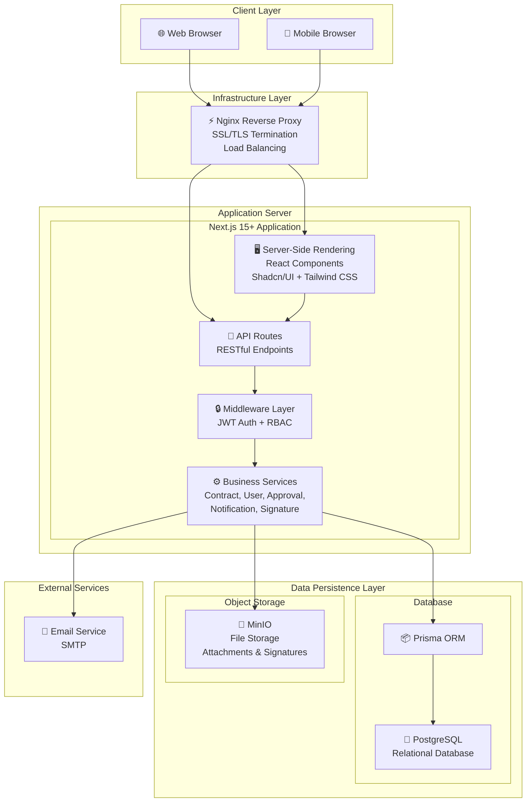
```mermaid
graph TB
    subgraph "Client Layer"
        Browser["🌐 Web Browser"]
        Mobile["📱 Mobile Browser"]
    end

    subgraph "Infrastructure Layer"
        Nginx["⚡ Nginx Reverse Proxy<br/>SSL/TLS Termination<br/>Load Balancing"]
    end

    subgraph "Application Server"
        subgraph "Next.js 15+ Application"
            SSR["🖥️ Server-Side Rendering<br/>React Components<br/>Shadcn/UI + Tailwind CSS"]
            APIRoutes["🔌 API Routes<br/>RESTful Endpoints"]
            Middleware["🔒 Middleware Layer<br/>JWT Auth + RBAC"]
            Services["⚙️ Business Services<br/>Contract, User, Approval,<br/>Notification, Signature"]
        end
    end

    subgraph "Data Persistence Layer"
        subgraph "Database"
            Prisma["📦 Prisma ORM"]
            PostgreSQL["🐘 PostgreSQL<br/>Relational Database"]
        end
        subgraph "Object Storage"
            MinIO["📁 MinIO<br/>File Storage<br/>Attachments & Signatures"]
        end
    end

    subgraph "External Services"
        Email["📧 Email Service<br/>SMTP"]
    end

    Browser --> Nginx
    Mobile --> Nginx
    Nginx --> SSR
    Nginx --> APIRoutes
    SSR --> APIRoutes
    APIRoutes --> Middleware
    Middleware --> Services
    Services --> Prisma
    Prisma --> PostgreSQL
    Services --> MinIO
    Services --> Email
```

### 2.1.3 Luồng xử lý tổng quát

Khi người dùng truy cập hệ thống ECMS, luồng xử lý diễn ra theo trình tự sau:

1. **Người dùng gửi yêu cầu:** Người dùng mở trình duyệt và truy cập URL của hệ thống. Request được gửi qua giao thức HTTPS đến Nginx Reverse Proxy.

2. **Nginx xử lý và chuyển tiếp:** Nginx thực hiện SSL/TLS termination, giải mã request và chuyển tiếp đến Next.js Application Server. Nginx cũng đảm nhận vai trò cache các tài nguyên tĩnh (CSS, JS, hình ảnh) để giảm tải cho Application Server.

3. **Next.js xử lý request:** Tùy thuộc vào loại request:
   - **Page request:** Next.js thực hiện Server-Side Rendering, gọi API nội bộ để lấy dữ liệu, render HTML hoàn chỉnh và trả về cho client.
   - **API request:** Request được chuyển đến API Routes tương ứng, đi qua Middleware Layer để xác thực và phân quyền.

4. **Middleware xác thực:** JWT Middleware kiểm tra token trong header Authorization, giải mã và xác thực danh tính người dùng. RBAC Middleware kiểm tra quyền truy cập của người dùng dựa trên vai trò (Role) và tài nguyên (Resource) được yêu cầu.

5. **Service xử lý nghiệp vụ:** Business Service tương ứng nhận request đã được xác thực, thực hiện validation dữ liệu đầu vào, áp dụng business logic và tương tác với tầng dữ liệu.

6. **Truy cập dữ liệu:** Prisma ORM chuyển đổi các thao tác nghiệp vụ thành câu truy vấn SQL tối ưu và thực thi trên PostgreSQL. Đối với các thao tác file (upload/download), Service tương tác trực tiếp với MinIO thông qua S3-compatible API.

7. **Trả kết quả:** Kết quả được trả ngược lại theo chuỗi xử lý, từ Service → API Route → Client, dưới dạng JSON response hoặc HTML page.

### 2.1.4 Các nguyên tắc thiết kế

Hệ thống ECMS được thiết kế tuân thủ các nguyên tắc sau:

| STT | Nguyên tắc | Mô tả | Áp dụng trong ECMS |
|-----|-----------|-------|---------------------|
| 1 | **Separation of Concerns** | Phân tách rõ ràng trách nhiệm giữa các tầng | Mỗi tầng (Presentation, Business, Data) có trách nhiệm riêng biệt |
| 2 | **DRY (Don't Repeat Yourself)** | Tránh lặp lại code | Sử dụng shared components, utility functions, custom hooks |
| 3 | **KISS (Keep It Simple, Stupid)** | Giữ thiết kế đơn giản | Monolithic architecture thay vì microservices cho quy mô dự án |
| 4 | **Security by Design** | Bảo mật được tích hợp ngay từ thiết kế | JWT auth, RBAC, input validation, SQL injection prevention qua Prisma |
| 5 | **Single Responsibility** | Mỗi module chỉ đảm nhận một nhiệm vụ | Mỗi API route xử lý một resource, mỗi service xử lý một domain |
| 6 | **Convention over Configuration** | Ưu tiên quy ước thay vì cấu hình | File-based routing của Next.js, Prisma schema conventions |

### 2.1.5 Các thành phần công nghệ chính

Bảng dưới đây tổng hợp các thành phần công nghệ được sử dụng trong hệ thống ECMS cùng vai trò và lý do lựa chọn:

| Thành phần | Công nghệ | Phiên bản | Vai trò | Lý do lựa chọn |
|-----------|-----------|-----------|---------|-----------------|
| Frontend Framework | Next.js | 15+ | SSR, Routing, API | Full-stack framework, hiệu suất cao, SEO tốt |
| UI Library | Shadcn/UI | Latest | Component library | Accessible, customizable, đẹp mắt |
| CSS Framework | Tailwind CSS | 3.x | Styling | Utility-first, responsive, nhất quán |
| Language | TypeScript | 5.x | Type safety | Phát hiện lỗi sớm, code dễ bảo trì |
| ORM | Prisma | 5.x | Database access | Type-safe queries, migration, schema management |
| Database | PostgreSQL | 16 | Data storage | Robust, ACID compliant, JSON support |
| Object Storage | MinIO | Latest | File storage | S3-compatible, self-hosted, miễn phí |
| Authentication | JWT | - | User auth | Stateless, scalable, phổ biến |
| Containerization | Docker | 24+ | Deployment | Consistent environment, dễ triển khai |
| Reverse Proxy | Nginx | 1.24+ | Load balancing | Hiệu suất cao, cấu hình linh hoạt |

---

## 2.2 Kiến trúc hệ thống

### 2.2.1 Mô hình kiến trúc phân tầng

Hệ thống ECMS áp dụng mô hình kiến trúc phân tầng (Layered Architecture) gồm **4 tầng chính**, mỗi tầng đảm nhận một nhóm trách nhiệm riêng biệt và giao tiếp với các tầng liền kề thông qua các interface được định nghĩa rõ ràng. Mô hình phân tầng giúp tăng tính module hóa, dễ bảo trì, dễ kiểm thử và cho phép thay đổi công nghệ ở một tầng mà không ảnh hưởng đến các tầng khác.

### 2.2.2 Sơ đồ kiến trúc phân tầng

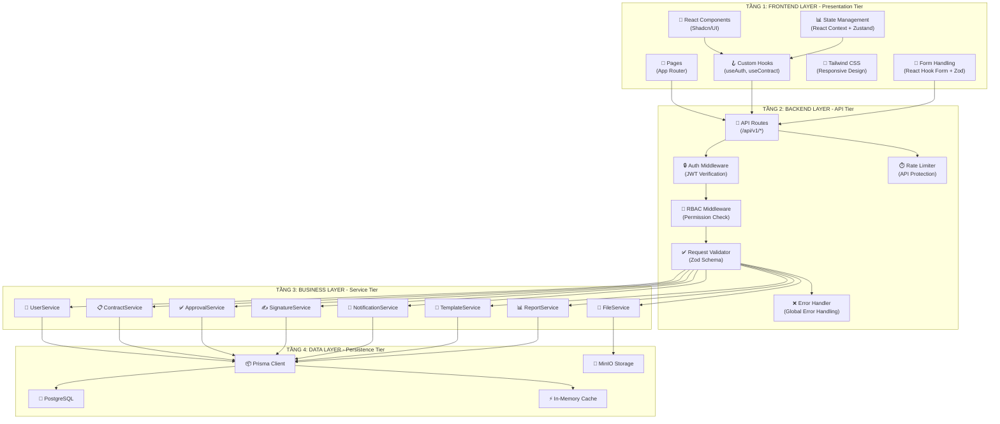
```mermaid
graph TB
    subgraph "TẦNG 1: FRONTEND LAYER - Presentation Tier"
        direction LR
        Pages["📄 Pages<br/>(App Router)"]
        Components["🧩 React Components<br/>(Shadcn/UI)"]
        Hooks["🪝 Custom Hooks<br/>(useAuth, useContract)"]
        State["📊 State Management<br/>(React Context + Zustand)"]
        Styles["🎨 Tailwind CSS<br/>(Responsive Design)"]
        Forms["📝 Form Handling<br/>(React Hook Form + Zod)"]
    end

    subgraph "TẦNG 2: BACKEND LAYER - API Tier"
        direction LR
        Routes["🔌 API Routes<br/>(/api/v1/*)"]
        AuthMW["🔒 Auth Middleware<br/>(JWT Verification)"]
        RBACMW["👥 RBAC Middleware<br/>(Permission Check)"]
        Validator["✅ Request Validator<br/>(Zod Schema)"]
        ErrorHandler["❌ Error Handler<br/>(Global Error Handling)"]
        RateLimit["⏱️ Rate Limiter<br/>(API Protection)"]
    end

    subgraph "TẦNG 3: BUSINESS LAYER - Service Tier"
        direction LR
        UserSvc["👤 UserService"]
        ContractSvc["📋 ContractService"]
        ApprovalSvc["✅ ApprovalService"]
        SignatureSvc["✍️ SignatureService"]
        NotifSvc["🔔 NotificationService"]
        TemplateSvc["📄 TemplateService"]
        ReportSvc["📊 ReportService"]
        FileSvc["📁 FileService"]
    end

    subgraph "TẦNG 4: DATA LAYER - Persistence Tier"
        direction LR
        PrismaClient["📦 Prisma Client"]
        PostgreSQL2["🐘 PostgreSQL"]
        MinIO2["📁 MinIO Storage"]
        Cache["⚡ In-Memory Cache"]
    end

    Pages --> Routes
    Components --> Hooks
    Hooks --> Routes
    State --> Hooks
    Forms --> Routes

    Routes --> AuthMW
    AuthMW --> RBACMW
    RBACMW --> Validator
    Validator --> ErrorHandler
    Routes --> RateLimit

    Validator --> UserSvc
    Validator --> ContractSvc
    Validator --> ApprovalSvc
    Validator --> SignatureSvc
    Validator --> NotifSvc
    Validator --> TemplateSvc
    Validator --> ReportSvc
    Validator --> FileSvc

    UserSvc --> PrismaClient
    ContractSvc --> PrismaClient
    ApprovalSvc --> PrismaClient
    SignatureSvc --> PrismaClient
    NotifSvc --> PrismaClient
    TemplateSvc --> PrismaClient
    ReportSvc --> PrismaClient
    FileSvc --> MinIO2

    PrismaClient --> PostgreSQL2
    PrismaClient --> Cache
```

### 2.2.3 Tầng 1: Frontend Layer (Presentation Tier)

Tầng Frontend chịu trách nhiệm hiển thị giao diện người dùng, thu nhận tương tác và trình bày dữ liệu từ Backend. Tầng này được xây dựng trên nền tảng **Next.js 15+** với **App Router**, sử dụng **TypeScript** làm ngôn ngữ chính, **Tailwind CSS** cho styling và **Shadcn/UI** làm thư viện component.

#### a) App Router và cấu trúc trang (Pages)

Next.js 15+ sử dụng **App Router** với cơ chế file-based routing, cho phép tổ chức cấu trúc trang theo thư mục. Mỗi thư mục trong `/app` tương ứng với một route URL, và file `page.tsx` trong mỗi thư mục định nghĩa nội dung trang:

| Route | Trang | Mô tả | Quyền truy cập |
|-------|-------|-------|-----------------|
| `/` | Trang chủ | Landing page, giới thiệu hệ thống | Public |
| `/login` | Đăng nhập | Form đăng nhập với email/password | Public |
| `/dashboard` | Dashboard | Thống kê tổng quan, biểu đồ | Authenticated |
| `/contracts` | Danh sách hợp đồng | Bảng danh sách, tìm kiếm, lọc | Authenticated |
| `/contracts/new` | Tạo hợp đồng | Form tạo hợp đồng mới | Employee+ |
| `/contracts/[id]` | Chi tiết hợp đồng | Xem, sửa, ký, phê duyệt | Authenticated |
| `/templates` | Quản lý mẫu | Danh sách mẫu hợp đồng | Manager+ |
| `/users` | Quản lý người dùng | CRUD người dùng | Administrator |
| `/approvals` | Phê duyệt | Danh sách chờ phê duyệt | Manager+ |
| `/notifications` | Thông báo | Danh sách thông báo | Authenticated |
| `/reports` | Báo cáo | Báo cáo thống kê | Manager+ |
| `/settings` | Cài đặt | Cài đặt hệ thống | Administrator |

#### b) React Components và Shadcn/UI

Hệ thống sử dụng kiến trúc **Component-Based** với hai loại component chính:

- **UI Components (Shadcn/UI):** Các component giao diện cơ bản được tùy biến từ thư viện Shadcn/UI, bao gồm Button, Input, Select, Dialog, Table, Card, Badge, Tabs, Toast,... Các component này tuân thủ chuẩn WAI-ARIA về accessibility và được style thống nhất bằng Tailwind CSS.

- **Feature Components:** Các component nghiệp vụ được xây dựng riêng cho ECMS, bao gồm ContractForm, ContractTable, SignatureCanvas, ApprovalTimeline, NotificationDropdown, DashboardCharts,... Các component này kết hợp nhiều UI component và chứa logic nghiệp vụ phía client.

#### c) Custom Hooks

Custom Hooks đóng gói các logic tái sử dụng và tương tác với API:

| Hook | Chức năng |
|------|-----------|
| `useAuth()` | Quản lý trạng thái đăng nhập, token, thông tin user |
| `useContracts()` | CRUD hợp đồng, tìm kiếm, phân trang |
| `useApproval()` | Xử lý quy trình phê duyệt |
| `useNotifications()` | Lấy danh sách thông báo, đánh dấu đã đọc |
| `useFileUpload()` | Upload file lên MinIO, theo dõi tiến trình |
| `useDebounce()` | Debounce input cho tìm kiếm |
| `usePagination()` | Quản lý phân trang |

#### d) State Management

Hệ thống sử dụng kết hợp nhiều phương pháp quản lý state:

- **React Context:** Quản lý global state đơn giản như theme, locale, thông tin user đang đăng nhập.
- **Zustand:** Quản lý state phức tạp hơn như danh sách hợp đồng, bộ lọc, trạng thái form.
- **React Query (TanStack Query):** Quản lý server state, caching API response, refetching tự động.

#### e) Form Handling và Validation

Sử dụng **React Hook Form** kết hợp **Zod** cho form validation:

- React Hook Form cung cấp quản lý form hiệu suất cao với ít re-render.
- Zod schema được chia sẻ giữa Frontend và Backend, đảm bảo validation nhất quán.
- Hỗ trợ validation realtime, hiển thị lỗi inline, multi-step form.

### 2.2.4 Tầng 2: Backend Layer (API Tier)

Tầng Backend đóng vai trò cầu nối giữa Frontend và tầng nghiệp vụ, cung cấp các RESTful API endpoint, xử lý xác thực, phân quyền và validation đầu vào.

#### a) API Routes Structure

Hệ thống sử dụng **Next.js API Routes** với cấu trúc RESTful, tuân thủ các quy ước đặt tên và HTTP methods chuẩn:

| HTTP Method | Endpoint | Chức năng | Mô tả |
|-------------|----------|-----------|-------|
| POST | `/api/v1/auth/login` | Đăng nhập | Xác thực và trả về JWT token |
| POST | `/api/v1/auth/logout` | Đăng xuất | Hủy token session |
| POST | `/api/v1/auth/refresh` | Làm mới token | Cấp lại access token |
| GET | `/api/v1/users` | Danh sách users | Phân trang, tìm kiếm, lọc |
| GET | `/api/v1/users/:id` | Chi tiết user | Thông tin một user |
| POST | `/api/v1/users` | Tạo user | Tạo tài khoản mới |
| PUT | `/api/v1/users/:id` | Cập nhật user | Sửa thông tin user |
| DELETE | `/api/v1/users/:id` | Xóa user | Soft delete user |
| GET | `/api/v1/contracts` | Danh sách hợp đồng | Phân trang, tìm kiếm, lọc theo status |
| GET | `/api/v1/contracts/:id` | Chi tiết hợp đồng | Thông tin đầy đủ hợp đồng |
| POST | `/api/v1/contracts` | Tạo hợp đồng | Tạo hợp đồng mới |
| PUT | `/api/v1/contracts/:id` | Cập nhật hợp đồng | Sửa nội dung hợp đồng |
| DELETE | `/api/v1/contracts/:id` | Xóa hợp đồng | Soft delete hợp đồng |
| POST | `/api/v1/contracts/:id/sign` | Ký hợp đồng | Thêm chữ ký điện tử |
| POST | `/api/v1/contracts/:id/approve` | Phê duyệt | Phê duyệt hợp đồng |
| POST | `/api/v1/contracts/:id/reject` | Từ chối | Từ chối phê duyệt |
| GET | `/api/v1/contracts/:id/versions` | Lịch sử phiên bản | Danh sách các phiên bản |
| GET | `/api/v1/templates` | Danh sách mẫu | Mẫu hợp đồng |
| POST | `/api/v1/templates` | Tạo mẫu | Tạo mẫu hợp đồng mới |
| GET | `/api/v1/notifications` | Danh sách thông báo | Thông báo của user |
| PUT | `/api/v1/notifications/:id/read` | Đánh dấu đã đọc | Cập nhật trạng thái |
| POST | `/api/v1/attachments/upload` | Upload file | Tải file đính kèm |
| GET | `/api/v1/attachments/:id/download` | Download file | Tải file về |
| GET | `/api/v1/dashboard/stats` | Thống kê | Dữ liệu dashboard |
| GET | `/api/v1/activity-logs` | Nhật ký hoạt động | Lịch sử thao tác |
| GET | `/api/v1/departments` | Danh sách phòng ban | Phòng ban trong tổ chức |
| GET | `/api/v1/workflows` | Quy trình phê duyệt | Danh sách workflow |
| POST | `/api/v1/workflows` | Tạo workflow | Tạo quy trình mới |

#### b) Authentication Middleware (JWT)

Middleware xác thực JWT hoạt động theo quy trình:

1. Trích xuất Bearer token từ header `Authorization`.
2. Giải mã và xác thực token bằng secret key.
3. Kiểm tra thời hạn (expiration) của token.
4. Truy vấn thông tin user từ database dựa trên `userId` trong token payload.
5. Gắn thông tin user vào request context để các handler phía sau sử dụng.
6. Nếu token không hợp lệ hoặc hết hạn, trả về HTTP 401 Unauthorized.

#### c) RBAC Middleware (Role-Based Access Control)

Sau khi xác thực thành công, RBAC Middleware kiểm tra quyền truy cập:

1. Lấy thông tin role của user từ request context.
2. Xác định resource và action được yêu cầu (ví dụ: `contract:create`, `user:delete`).
3. Truy vấn bảng Permission để kiểm tra role có quyền thực hiện action trên resource không.
4. Nếu có quyền, cho phép request đi tiếp; ngược lại, trả về HTTP 403 Forbidden.

Ma trận phân quyền RBAC:

| Resource | Action | Administrator | Manager | Employee | Customer/Partner |
|----------|--------|:---:|:---:|:---:|:---:|
| User | create | ✅ | ❌ | ❌ | ❌ |
| User | read | ✅ | ✅ | ❌ | ❌ |
| User | update | ✅ | ❌ | ❌ | ❌ |
| User | delete | ✅ | ❌ | ❌ | ❌ |
| Contract | create | ✅ | ✅ | ✅ | ❌ |
| Contract | read | ✅ | ✅ | ✅ | ✅ |
| Contract | update | ✅ | ✅ | ✅ | ❌ |
| Contract | delete | ✅ | ✅ | ❌ | ❌ |
| Contract | approve | ✅ | ✅ | ❌ | ❌ |
| Contract | sign | ✅ | ✅ | ✅ | ✅ |
| Template | create | ✅ | ✅ | ❌ | ❌ |
| Template | read | ✅ | ✅ | ✅ | ❌ |
| Template | update | ✅ | ✅ | ❌ | ❌ |
| Template | delete | ✅ | ❌ | ❌ | ❌ |
| Workflow | manage | ✅ | ✅ | ❌ | ❌ |
| Report | view | ✅ | ✅ | ❌ | ❌ |
| Settings | manage | ✅ | ❌ | ❌ | ❌ |
| Notification | read | ✅ | ✅ | ✅ | ✅ |
| ActivityLog | read | ✅ | ✅ | ❌ | ❌ |

#### d) Request Validation (Zod)

Mỗi API endpoint đều có schema validation tương ứng được định nghĩa bằng Zod. Quá trình validation bao gồm:

- **Params validation:** Kiểm tra tham số URL (ví dụ: id phải là UUID hợp lệ).
- **Query validation:** Kiểm tra query parameters (ví dụ: page phải là số nguyên dương).
- **Body validation:** Kiểm tra request body (ví dụ: email phải đúng định dạng, title không được rỗng).
- **File validation:** Kiểm tra file upload (kích thước tối đa, định dạng cho phép).

#### e) Error Handling

Hệ thống áp dụng Global Error Handler thống nhất với cấu trúc response lỗi chuẩn:

| HTTP Status | Error Type | Mô tả |
|-------------|-----------|-------|
| 400 | Bad Request | Dữ liệu đầu vào không hợp lệ |
| 401 | Unauthorized | Chưa đăng nhập hoặc token hết hạn |
| 403 | Forbidden | Không có quyền truy cập |
| 404 | Not Found | Tài nguyên không tồn tại |
| 409 | Conflict | Xung đột dữ liệu (ví dụ: email đã tồn tại) |
| 422 | Unprocessable Entity | Validation thất bại |
| 429 | Too Many Requests | Vượt quá giới hạn request |
| 500 | Internal Server Error | Lỗi hệ thống nội bộ |

### 2.2.5 Tầng 3: Business Layer (Service Tier)

Tầng Business chứa toàn bộ logic nghiệp vụ của hệ thống, được tổ chức thành các Service class độc lập. Mỗi Service đảm nhận một domain nghiệp vụ cụ thể:

| Service | Trách nhiệm | Các phương thức chính |
|---------|-------------|----------------------|
| **UserService** | Quản lý người dùng | `createUser()`, `updateUser()`, `deleteUser()`, `getUserById()`, `listUsers()`, `changePassword()` |
| **AuthService** | Xác thực, phân quyền | `login()`, `logout()`, `refreshToken()`, `verifyToken()`, `hashPassword()` |
| **ContractService** | Quản lý hợp đồng | `createContract()`, `updateContract()`, `deleteContract()`, `getContractById()`, `listContracts()`, `searchContracts()` |
| **ApprovalService** | Quy trình phê duyệt | `submitForApproval()`, `approveContract()`, `rejectContract()`, `getApprovalHistory()`, `createWorkflow()` |
| **SignatureService** | Chữ ký điện tử | `signContract()`, `verifySignature()`, `getSignaturesByContract()` |
| **TemplateService** | Quản lý mẫu hợp đồng | `createTemplate()`, `updateTemplate()`, `deleteTemplate()`, `listTemplates()`, `applyTemplate()` |
| **NotificationService** | Quản lý thông báo | `createNotification()`, `markAsRead()`, `listNotifications()`, `sendEmailNotification()` |
| **FileService** | Quản lý file đính kèm | `uploadFile()`, `downloadFile()`, `deleteFile()`, `getFileMetadata()` |
| **VersionService** | Quản lý phiên bản | `createVersion()`, `getVersionHistory()`, `compareVersions()`, `restoreVersion()` |
| **ReportService** | Báo cáo thống kê | `getDashboardStats()`, `getContractReport()`, `getActivityReport()`, `exportReport()` |
| **ActivityLogService** | Nhật ký hoạt động | `logActivity()`, `getActivityLogs()`, `filterLogs()` |

### 2.2.6 Tầng 4: Data Layer (Persistence Tier)

Tầng Data chịu trách nhiệm tương tác với các hệ thống lưu trữ dữ liệu, bao gồm PostgreSQL (thông qua Prisma ORM) và MinIO (thông qua S3 Client).

#### a) Prisma ORM

Prisma ORM đóng vai trò trung gian giữa Business Layer và PostgreSQL, cung cấp:

- **Type-safe queries:** Mọi truy vấn đều được kiểm tra kiểu tại compile-time, giảm thiểu lỗi runtime.
- **Auto-generated client:** Prisma Client được tự động sinh từ schema, cung cấp API truy vấn trực quan.
- **Migration management:** Prisma Migrate quản lý version của database schema, cho phép rollback khi cần.
- **Relation loading:** Hỗ trợ eager loading và lazy loading cho các quan hệ giữa các bảng.
- **Query optimization:** Tự động tối ưu câu truy vấn SQL, hỗ trợ batch operations.

#### b) PostgreSQL Database

PostgreSQL được chọn làm hệ quản trị cơ sở dữ liệu chính vì:

- **ACID Compliance:** Đảm bảo tính toàn vẹn dữ liệu trong các giao dịch phức tạp (ví dụ: tạo hợp đồng kèm nhiều bên tham gia và file đính kèm).
- **JSON/JSONB Support:** Hỗ trợ lưu trữ dữ liệu bán cấu trúc (metadata, cấu hình template) dưới dạng JSON.
- **Full-text Search:** Tìm kiếm toàn văn trong nội dung hợp đồng.
- **Indexing:** Hỗ trợ nhiều loại index (B-tree, GIN, GiST) cho tối ưu truy vấn.
- **Scalability:** Hỗ trợ replication, partitioning cho mở rộng trong tương lai.

#### c) MinIO Object Storage

MinIO được sử dụng để lưu trữ các file đính kèm của hợp đồng:

- **S3 Compatible API:** Tương thích hoàn toàn với Amazon S3 API, dễ dàng chuyển sang cloud khi cần.
- **Self-hosted:** Triển khai nội bộ, kiểm soát hoàn toàn dữ liệu, không phụ thuộc cloud provider.
- **Bucket Organization:** Tổ chức file theo bucket (contracts, signatures, templates, avatars).
- **Access Control:** Hỗ trợ phân quyền truy cập file ở mức bucket và object.

---

## 2.3 ERD Diagram

### 2.3.1 Tổng quan mô hình dữ liệu

Mô hình dữ liệu của hệ thống ECMS bao gồm **14 thực thể (entity)** chính, phản ánh đầy đủ các đối tượng nghiệp vụ trong quy trình quản lý hợp đồng điện tử. Các entity được chia thành 5 nhóm chức năng:

**Nhóm 1 – Quản lý người dùng và phân quyền:**
- **User:** Lưu trữ thông tin tài khoản người dùng.
- **Role:** Định nghĩa các vai trò trong hệ thống.
- **Permission:** Quy định quyền truy cập cụ thể cho từng vai trò.
- **Department:** Quản lý cơ cấu phòng ban.

**Nhóm 2 – Quản lý hợp đồng:**
- **Contract:** Thông tin chính của hợp đồng.
- **ContractVersion:** Lịch sử các phiên bản nội dung hợp đồng.
- **ContractTemplate:** Mẫu hợp đồng.
- **ContractParty:** Các bên tham gia hợp đồng.
- **Attachment:** File đính kèm của hợp đồng.

**Nhóm 3 – Ký kết:**
- **Signature:** Thông tin chữ ký điện tử.

**Nhóm 4 – Quy trình phê duyệt:**
- **ApprovalWorkflow:** Quy trình phê duyệt.
- **ApprovalStep:** Các bước trong quy trình phê duyệt.

**Nhóm 5 – Hệ thống:**
- **Notification:** Thông báo cho người dùng.
- **ActivityLog:** Nhật ký hoạt động hệ thống.

### 2.3.2 Sơ đồ ERD (Entity-Relationship Diagram)

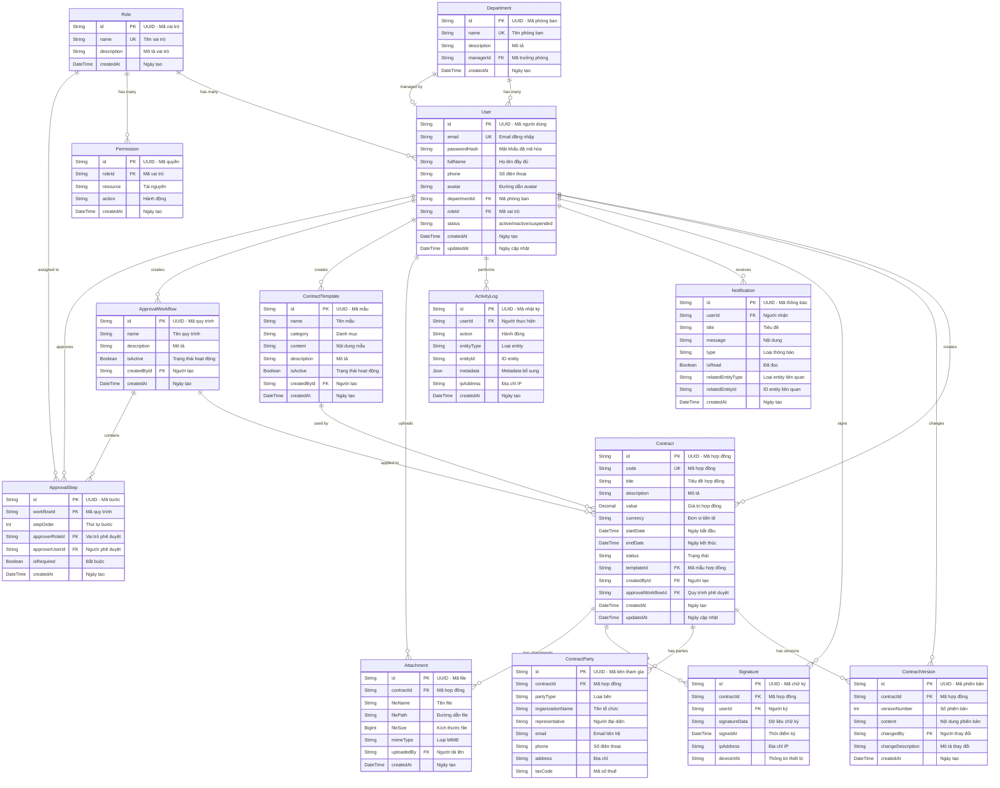
```mermaid
erDiagram
    User {
        String id PK "UUID - Mã người dùng"
        String email UK "Email đăng nhập"
        String passwordHash "Mật khẩu đã mã hóa"
        String fullName "Họ tên đầy đủ"
        String phone "Số điện thoại"
        String avatar "Đường dẫn avatar"
        String departmentId FK "Mã phòng ban"
        String roleId FK "Mã vai trò"
        String status "active/inactive/suspended"
        DateTime createdAt "Ngày tạo"
        DateTime updatedAt "Ngày cập nhật"
    }

    Role {
        String id PK "UUID - Mã vai trò"
        String name UK "Tên vai trò"
        String description "Mô tả vai trò"
        DateTime createdAt "Ngày tạo"
    }

    Permission {
        String id PK "UUID - Mã quyền"
        String roleId FK "Mã vai trò"
        String resource "Tài nguyên"
        String action "Hành động"
        DateTime createdAt "Ngày tạo"
    }

    Department {
        String id PK "UUID - Mã phòng ban"
        String name UK "Tên phòng ban"
        String description "Mô tả"
        String managerId FK "Mã trưởng phòng"
        DateTime createdAt "Ngày tạo"
    }

    Contract {
        String id PK "UUID - Mã hợp đồng"
        String code UK "Mã hợp đồng"
        String title "Tiêu đề hợp đồng"
        String description "Mô tả"
        Decimal value "Giá trị hợp đồng"
        String currency "Đơn vị tiền tệ"
        DateTime startDate "Ngày bắt đầu"
        DateTime endDate "Ngày kết thúc"
        String status "Trạng thái"
        String templateId FK "Mã mẫu hợp đồng"
        String createdById FK "Người tạo"
        String approvalWorkflowId FK "Quy trình phê duyệt"
        DateTime createdAt "Ngày tạo"
        DateTime updatedAt "Ngày cập nhật"
    }

    ContractVersion {
        String id PK "UUID - Mã phiên bản"
        String contractId FK "Mã hợp đồng"
        Int versionNumber "Số phiên bản"
        String content "Nội dung phiên bản"
        String changedBy FK "Người thay đổi"
        String changeDescription "Mô tả thay đổi"
        DateTime createdAt "Ngày tạo"
    }

    ContractTemplate {
        String id PK "UUID - Mã mẫu"
        String name "Tên mẫu"
        String category "Danh mục"
        String content "Nội dung mẫu"
        String description "Mô tả"
        Boolean isActive "Trạng thái hoạt động"
        String createdById FK "Người tạo"
        DateTime createdAt "Ngày tạo"
    }

    ContractParty {
        String id PK "UUID - Mã bên tham gia"
        String contractId FK "Mã hợp đồng"
        String partyType "Loại bên"
        String organizationName "Tên tổ chức"
        String representative "Người đại diện"
        String email "Email liên hệ"
        String phone "Số điện thoại"
        String address "Địa chỉ"
        String taxCode "Mã số thuế"
    }

    Signature {
        String id PK "UUID - Mã chữ ký"
        String contractId FK "Mã hợp đồng"
        String userId FK "Người ký"
        String signatureData "Dữ liệu chữ ký"
        DateTime signedAt "Thời điểm ký"
        String ipAddress "Địa chỉ IP"
        String deviceInfo "Thông tin thiết bị"
    }

    Notification {
        String id PK "UUID - Mã thông báo"
        String userId FK "Người nhận"
        String title "Tiêu đề"
        String message "Nội dung"
        String type "Loại thông báo"
        Boolean isRead "Đã đọc"
        String relatedEntityType "Loại entity liên quan"
        String relatedEntityId "ID entity liên quan"
        DateTime createdAt "Ngày tạo"
    }

    ActivityLog {
        String id PK "UUID - Mã nhật ký"
        String userId FK "Người thực hiện"
        String action "Hành động"
        String entityType "Loại entity"
        String entityId "ID entity"
        Json metadata "Metadata bổ sung"
        String ipAddress "Địa chỉ IP"
        DateTime createdAt "Ngày tạo"
    }

    Attachment {
        String id PK "UUID - Mã file"
        String contractId FK "Mã hợp đồng"
        String fileName "Tên file"
        String filePath "Đường dẫn file"
        BigInt fileSize "Kích thước file"
        String mimeType "Loại MIME"
        String uploadedBy FK "Người tải lên"
        DateTime createdAt "Ngày tạo"
    }

    ApprovalWorkflow {
        String id PK "UUID - Mã quy trình"
        String name "Tên quy trình"
        String description "Mô tả"
        Boolean isActive "Trạng thái hoạt động"
        String createdById FK "Người tạo"
        DateTime createdAt "Ngày tạo"
    }

    ApprovalStep {
        String id PK "UUID - Mã bước"
        String workflowId FK "Mã quy trình"
        Int stepOrder "Thứ tự bước"
        String approverRoleId FK "Vai trò phê duyệt"
        String approverUserId FK "Người phê duyệt"
        Boolean isRequired "Bắt buộc"
        DateTime createdAt "Ngày tạo"
    }

    Role ||--o{ User : "has many"
    Role ||--o{ Permission : "has many"
    Department ||--o{ User : "has many"
    Department ||--o| User : "managed by"
    User ||--o{ Contract : "creates"
    User ||--o{ ContractVersion : "changes"
    User ||--o{ Signature : "signs"
    User ||--o{ Notification : "receives"
    User ||--o{ ActivityLog : "performs"
    User ||--o{ Attachment : "uploads"
    User ||--o{ ContractTemplate : "creates"
    User ||--o{ ApprovalWorkflow : "creates"
    User ||--o{ ApprovalStep : "approves"
    ContractTemplate ||--o{ Contract : "used by"
    ApprovalWorkflow ||--o{ Contract : "applied to"
    ApprovalWorkflow ||--o{ ApprovalStep : "contains"
    Contract ||--o{ ContractVersion : "has versions"
    Contract ||--o{ ContractParty : "has parties"
    Contract ||--o{ Signature : "has signatures"
    Contract ||--o{ Attachment : "has attachments"
    Role ||--o{ ApprovalStep : "assigned to"
```

### 2.3.3 Giải thích các Entity và Relationship

#### a) Entity User (Người dùng)

Entity **User** là thực thể trung tâm của hệ thống, đại diện cho tất cả người dùng bao gồm Administrator, Manager, Employee và Customer/Partner. Mỗi User thuộc một Role (vai trò) duy nhất và có thể thuộc một Department (phòng ban).

**Các mối quan hệ:**
- User **N:1** Role – Mỗi user có một vai trò, một vai trò có nhiều user.
- User **N:1** Department – Mỗi user thuộc một phòng ban, một phòng ban có nhiều user.
- User **1:N** Contract – Một user có thể tạo nhiều hợp đồng.
- User **1:N** Signature – Một user có thể ký nhiều hợp đồng.
- User **1:N** Notification – Một user nhận nhiều thông báo.
- User **1:N** ActivityLog – Một user có nhiều bản ghi hoạt động.

#### b) Entity Role (Vai trò) và Permission (Quyền)

Entity **Role** định nghĩa các vai trò trong hệ thống. Hệ thống ECMS có 4 vai trò chính: Administrator (quản trị viên), Manager (quản lý), Employee (nhân viên) và Customer/Partner (khách hàng/đối tác).

**Các mối quan hệ:**
- Role **1:N** User – Một vai trò được gán cho nhiều user.
- Role **1:N** Permission – Một vai trò có nhiều quyền.
- Role **1:N** ApprovalStep – Một vai trò có thể được chỉ định là người phê duyệt trong các bước phê duyệt.

#### c) Entity Department (Phòng ban)

Entity **Department** đại diện cho các phòng ban trong tổ chức. Mỗi phòng ban có một trưởng phòng (managerId tham chiếu đến User).

**Các mối quan hệ:**
- Department **1:N** User – Một phòng ban có nhiều nhân viên.
- Department **N:1** User (managerId) – Mỗi phòng ban có một trưởng phòng.

#### d) Entity Contract (Hợp đồng)

Entity **Contract** là thực thể nghiệp vụ cốt lõi, lưu trữ thông tin chính của hợp đồng bao gồm mã hợp đồng, tiêu đề, giá trị, thời hạn, trạng thái,... Mỗi hợp đồng được tạo bởi một user, có thể sử dụng một mẫu hợp đồng (template) và thuộc một quy trình phê duyệt (workflow).

Trạng thái hợp đồng (status) bao gồm: `DRAFT` (bản nháp), `PENDING_APPROVAL` (chờ phê duyệt), `APPROVED` (đã duyệt), `REJECTED` (bị từ chối), `PENDING_SIGNATURE` (chờ ký), `ACTIVE` (đang hiệu lực), `EXPIRED` (hết hạn), `TERMINATED` (chấm dứt), `CANCELLED` (đã hủy).

**Các mối quan hệ:**
- Contract **N:1** User (createdById) – Mỗi hợp đồng do một user tạo.
- Contract **N:1** ContractTemplate (templateId) – Mỗi hợp đồng có thể dựa trên một mẫu.
- Contract **N:1** ApprovalWorkflow (approvalWorkflowId) – Mỗi hợp đồng thuộc một quy trình phê duyệt.
- Contract **1:N** ContractVersion – Một hợp đồng có nhiều phiên bản.
- Contract **1:N** ContractParty – Một hợp đồng có nhiều bên tham gia.
- Contract **1:N** Signature – Một hợp đồng có nhiều chữ ký.
- Contract **1:N** Attachment – Một hợp đồng có nhiều file đính kèm.

#### e) Entity ContractVersion (Phiên bản hợp đồng)

Entity **ContractVersion** ghi lại lịch sử các phiên bản nội dung của hợp đồng. Mỗi khi nội dung hợp đồng được chỉnh sửa, một bản ghi mới được tạo trong ContractVersion với số phiên bản tăng dần, nội dung mới, người thay đổi và mô tả thay đổi.

#### f) Entity ContractTemplate (Mẫu hợp đồng)

Entity **ContractTemplate** lưu trữ các mẫu hợp đồng tiêu chuẩn, giúp tạo hợp đồng nhanh chóng và đảm bảo tính nhất quán. Mỗi mẫu thuộc một danh mục (category) như: hợp đồng lao động, hợp đồng dịch vụ, hợp đồng mua bán, hợp đồng thuê mướn,...

#### g) Entity ContractParty (Bên tham gia hợp đồng)

Entity **ContractParty** lưu thông tin các bên tham gia hợp đồng, bao gồm loại bên (bên A, bên B, bên thứ ba), tên tổ chức, người đại diện, thông tin liên hệ và mã số thuế. Một hợp đồng có thể có nhiều bên tham gia.

#### h) Entity Signature (Chữ ký)

Entity **Signature** ghi nhận thông tin chữ ký điện tử trên hợp đồng, bao gồm dữ liệu chữ ký (signature data dạng base64), thời điểm ký, địa chỉ IP và thông tin thiết bị. Đây là bằng chứng pháp lý cho việc đồng ý và xác nhận nội dung hợp đồng.

#### i) Entity Notification (Thông báo)

Entity **Notification** quản lý các thông báo gửi đến người dùng. Các loại thông báo bao gồm: hợp đồng cần phê duyệt, hợp đồng được phê duyệt/từ chối, hợp đồng cần ký, hợp đồng sắp hết hạn, mốc gia hạn,...

#### j) Entity ActivityLog (Nhật ký hoạt động)

Entity **ActivityLog** ghi lại toàn bộ hoạt động trong hệ thống phục vụ mục đích kiểm toán (audit trail). Mỗi thao tác của người dùng (tạo, sửa, xóa, ký, phê duyệt,...) đều được ghi nhận kèm metadata bổ sung dưới dạng JSON.

#### k) Entity Attachment (File đính kèm)

Entity **Attachment** quản lý metadata của các file đính kèm trong hợp đồng. Nội dung file thực tế được lưu trữ trên MinIO, còn Attachment chỉ lưu metadata (tên file, đường dẫn, kích thước, loại MIME, người tải lên).

#### l) Entity ApprovalWorkflow và ApprovalStep (Quy trình phê duyệt)

Entity **ApprovalWorkflow** định nghĩa các quy trình phê duyệt hợp đồng. Mỗi workflow bao gồm nhiều **ApprovalStep** (bước phê duyệt) được sắp xếp theo thứ tự (stepOrder).

---

## 2.5 Thiết kế bảng dữ liệu

### 2.5.1 Bảng User (Người dùng)

Bảng **User** lưu trữ thông tin tài khoản và cá nhân của tất cả người dùng trong hệ thống ECMS, bao gồm quản trị viên, quản lý, nhân viên và khách hàng/đối tác.

| Tên trường | Kiểu dữ liệu | Ràng buộc | Mô tả |
|-----------|--------------|-----------|-------|
| id | UUID | PRIMARY KEY, DEFAULT uuid_generate_v4() | Mã định danh duy nhất của người dùng, tự sinh bằng UUID v4 |
| email | VARCHAR(255) | NOT NULL, UNIQUE | Địa chỉ email của người dùng, dùng làm tên đăng nhập, không được trùng lặp |
| passwordHash | VARCHAR(255) | NOT NULL | Mật khẩu đã được mã hóa bằng thuật toán bcrypt với salt rounds = 12 |
| fullName | VARCHAR(100) | NOT NULL | Họ và tên đầy đủ của người dùng |
| phone | VARCHAR(20) | NULL | Số điện thoại liên hệ, hỗ trợ định dạng quốc tế |
| avatar | VARCHAR(500) | NULL | Đường dẫn URL đến ảnh đại diện trên MinIO storage |
| departmentId | UUID | FOREIGN KEY → Department(id), NULL | Mã phòng ban mà người dùng thuộc về, có thể NULL nếu chưa phân phòng ban |
| roleId | UUID | FOREIGN KEY → Role(id), NOT NULL | Mã vai trò của người dùng trong hệ thống |
| status | VARCHAR(20) | NOT NULL, DEFAULT 'active', CHECK IN ('active', 'inactive', 'suspended') | Trạng thái tài khoản: active (hoạt động), inactive (ngừng hoạt động), suspended (tạm khóa) |
| createdAt | TIMESTAMP | NOT NULL, DEFAULT NOW() | Thời điểm tạo tài khoản |
| updatedAt | TIMESTAMP | NOT NULL, DEFAULT NOW(), ON UPDATE NOW() | Thời điểm cập nhật lần cuối |

**Indexes:**
- `idx_user_email` – UNIQUE index trên cột email (tăng tốc đăng nhập)
- `idx_user_department` – B-tree index trên cột departmentId (tăng tốc truy vấn theo phòng ban)
- `idx_user_role` – B-tree index trên cột roleId (tăng tốc truy vấn theo vai trò)
- `idx_user_status` – B-tree index trên cột status (tăng tốc lọc theo trạng thái)

---

### 2.5.2 Bảng Role (Vai trò)

Bảng **Role** định nghĩa các vai trò trong hệ thống RBAC. Hệ thống ECMS có 4 vai trò được cài sẵn: Administrator, Manager, Employee, Customer/Partner.

| Tên trường | Kiểu dữ liệu | Ràng buộc | Mô tả |
|-----------|--------------|-----------|-------|
| id | UUID | PRIMARY KEY, DEFAULT uuid_generate_v4() | Mã định danh duy nhất của vai trò |
| name | VARCHAR(50) | NOT NULL, UNIQUE | Tên vai trò (Administrator, Manager, Employee, Customer) |
| description | VARCHAR(255) | NULL | Mô tả chi tiết về vai trò và quyền hạn |
| createdAt | TIMESTAMP | NOT NULL, DEFAULT NOW() | Thời điểm tạo vai trò |

**Indexes:**
- `idx_role_name` – UNIQUE index trên cột name

**Dữ liệu khởi tạo (Seed data):**

| id | name | description |
|----|------|-------------|
| uuid-1 | Administrator | Quản trị viên hệ thống, có toàn quyền |
| uuid-2 | Manager | Quản lý, có quyền phê duyệt và quản lý hợp đồng |
| uuid-3 | Employee | Nhân viên, có quyền tạo và chỉnh sửa hợp đồng |
| uuid-4 | Customer | Khách hàng/Đối tác, có quyền xem và ký hợp đồng |

---

### 2.5.3 Bảng Permission (Quyền)

Bảng **Permission** quy định chi tiết quyền truy cập cho từng vai trò trên từng tài nguyên và hành động cụ thể.

| Tên trường | Kiểu dữ liệu | Ràng buộc | Mô tả |
|-----------|--------------|-----------|-------|
| id | UUID | PRIMARY KEY, DEFAULT uuid_generate_v4() | Mã định danh duy nhất của quyền |
| roleId | UUID | FOREIGN KEY → Role(id) ON DELETE CASCADE, NOT NULL | Mã vai trò được gán quyền |
| resource | VARCHAR(50) | NOT NULL | Tên tài nguyên (user, contract, template, workflow, report, notification, activity_log, attachment, department, settings) |
| action | VARCHAR(50) | NOT NULL | Hành động được phép (create, read, update, delete, approve, sign, export) |
| createdAt | TIMESTAMP | NOT NULL, DEFAULT NOW() | Thời điểm tạo quyền |

**Indexes:**
- `idx_permission_role` – B-tree index trên cột roleId
- `idx_permission_unique` – UNIQUE index trên (roleId, resource, action)

---

### 2.5.4 Bảng Department (Phòng ban)

Bảng **Department** quản lý cơ cấu tổ chức phòng ban trong doanh nghiệp.

| Tên trường | Kiểu dữ liệu | Ràng buộc | Mô tả |
|-----------|--------------|-----------|-------|
| id | UUID | PRIMARY KEY, DEFAULT uuid_generate_v4() | Mã định danh duy nhất của phòng ban |
| name | VARCHAR(100) | NOT NULL, UNIQUE | Tên phòng ban (VD: Phòng Kinh doanh, Phòng Pháp chế,...) |
| description | VARCHAR(500) | NULL | Mô tả chức năng và nhiệm vụ của phòng ban |
| managerId | UUID | FOREIGN KEY → User(id) ON DELETE SET NULL, NULL | Mã người dùng là trưởng phòng ban |
| createdAt | TIMESTAMP | NOT NULL, DEFAULT NOW() | Thời điểm tạo phòng ban |

**Indexes:**
- `idx_department_name` – UNIQUE index trên cột name
- `idx_department_manager` – B-tree index trên cột managerId

---

### 2.5.5 Bảng Contract (Hợp đồng)

Bảng **Contract** là bảng trung tâm của hệ thống, lưu trữ toàn bộ thông tin chính của hợp đồng điện tử.

| Tên trường | Kiểu dữ liệu | Ràng buộc | Mô tả |
|-----------|--------------|-----------|-------|
| id | UUID | PRIMARY KEY, DEFAULT uuid_generate_v4() | Mã định danh duy nhất của hợp đồng |
| code | VARCHAR(50) | NOT NULL, UNIQUE | Mã hợp đồng theo quy tắc đặt mã (VD: HD-2026-0001). Mã được sinh tự động và không trùng lặp |
| title | VARCHAR(255) | NOT NULL | Tiêu đề hợp đồng (VD: Hợp đồng cung cấp dịch vụ CNTT) |
| description | TEXT | NULL | Mô tả tóm tắt nội dung, mục đích của hợp đồng |
| value | DECIMAL(18,2) | NULL, DEFAULT 0 | Giá trị hợp đồng (số tiền). Sử dụng DECIMAL để đảm bảo độ chính xác tài chính |
| currency | VARCHAR(3) | DEFAULT 'VND' | Đơn vị tiền tệ theo chuẩn ISO 4217 (VND, USD, EUR,...) |
| startDate | DATE | NULL | Ngày bắt đầu hiệu lực hợp đồng |
| endDate | DATE | NULL | Ngày kết thúc hiệu lực hợp đồng |
| status | VARCHAR(30) | NOT NULL, DEFAULT 'DRAFT' | Trạng thái hợp đồng: DRAFT, PENDING_APPROVAL, APPROVED, REJECTED, PENDING_SIGNATURE, ACTIVE, EXPIRED, TERMINATED, CANCELLED |
| templateId | UUID | FOREIGN KEY → ContractTemplate(id) ON DELETE SET NULL, NULL | Mã mẫu hợp đồng đã sử dụng (nếu có) |
| createdById | UUID | FOREIGN KEY → User(id), NOT NULL | Mã người dùng tạo hợp đồng |
| approvalWorkflowId | UUID | FOREIGN KEY → ApprovalWorkflow(id) ON DELETE SET NULL, NULL | Mã quy trình phê duyệt được áp dụng |
| createdAt | TIMESTAMP | NOT NULL, DEFAULT NOW() | Thời điểm tạo hợp đồng |
| updatedAt | TIMESTAMP | NOT NULL, DEFAULT NOW(), ON UPDATE NOW() | Thời điểm cập nhật lần cuối |

**Indexes:**
- `idx_contract_code` – UNIQUE index trên cột code
- `idx_contract_status` – B-tree index trên cột status (lọc theo trạng thái)
- `idx_contract_created_by` – B-tree index trên cột createdById (truy vấn hợp đồng theo người tạo)
- `idx_contract_dates` – B-tree index trên (startDate, endDate) (truy vấn hợp đồng theo khoảng thời gian)
- `idx_contract_template` – B-tree index trên cột templateId
- `idx_contract_workflow` – B-tree index trên cột approvalWorkflowId
- `idx_contract_title_search` – GIN index trên cột title (hỗ trợ full-text search)

---

### 2.5.6 Bảng ContractVersion (Phiên bản hợp đồng)

Bảng **ContractVersion** ghi lại lịch sử thay đổi nội dung hợp đồng qua từng phiên bản, hỗ trợ theo dõi và khôi phục.

| Tên trường | Kiểu dữ liệu | Ràng buộc | Mô tả |
|-----------|--------------|-----------|-------|
| id | UUID | PRIMARY KEY, DEFAULT uuid_generate_v4() | Mã định danh duy nhất của phiên bản |
| contractId | UUID | FOREIGN KEY → Contract(id) ON DELETE CASCADE, NOT NULL | Mã hợp đồng mà phiên bản thuộc về |
| versionNumber | INTEGER | NOT NULL | Số thứ tự phiên bản, tăng dần từ 1 |
| content | TEXT | NOT NULL | Nội dung đầy đủ của hợp đồng tại phiên bản này (lưu dạng HTML hoặc Markdown) |
| changedBy | UUID | FOREIGN KEY → User(id), NOT NULL | Mã người dùng đã thực hiện thay đổi |
| changeDescription | VARCHAR(500) | NULL | Mô tả tóm tắt những thay đổi so với phiên bản trước |
| createdAt | TIMESTAMP | NOT NULL, DEFAULT NOW() | Thời điểm tạo phiên bản |

**Indexes:**
- `idx_version_contract` – B-tree index trên cột contractId
- `idx_version_unique` – UNIQUE index trên (contractId, versionNumber)

---

### 2.5.7 Bảng ContractTemplate (Mẫu hợp đồng)

Bảng **ContractTemplate** lưu trữ các mẫu hợp đồng tiêu chuẩn, giúp người dùng tạo hợp đồng nhanh chóng.

| Tên trường | Kiểu dữ liệu | Ràng buộc | Mô tả |
|-----------|--------------|-----------|-------|
| id | UUID | PRIMARY KEY, DEFAULT uuid_generate_v4() | Mã định danh duy nhất của mẫu |
| name | VARCHAR(200) | NOT NULL | Tên mẫu hợp đồng (VD: Mẫu hợp đồng lao động toàn thời gian) |
| category | VARCHAR(100) | NULL | Danh mục phân loại mẫu (lao_dong, dich_vu, mua_ban, thue_muon, hop_tac,...) |
| content | TEXT | NOT NULL | Nội dung mẫu hợp đồng với các placeholder (VD: {{ten_cong_ty}}, {{gia_tri}}) |
| description | VARCHAR(500) | NULL | Mô tả mục đích sử dụng và phạm vi áp dụng của mẫu |
| isActive | BOOLEAN | NOT NULL, DEFAULT TRUE | Trạng thái hoạt động: TRUE = đang sử dụng, FALSE = ngừng sử dụng |
| createdById | UUID | FOREIGN KEY → User(id), NOT NULL | Mã người dùng tạo mẫu |
| createdAt | TIMESTAMP | NOT NULL, DEFAULT NOW() | Thời điểm tạo mẫu |

**Indexes:**
- `idx_template_category` – B-tree index trên cột category
- `idx_template_active` – B-tree index trên cột isActive
- `idx_template_created_by` – B-tree index trên cột createdById

---

### 2.5.8 Bảng ContractParty (Bên tham gia hợp đồng)

Bảng **ContractParty** lưu thông tin các bên tham gia trong mỗi hợp đồng.

| Tên trường | Kiểu dữ liệu | Ràng buộc | Mô tả |
|-----------|--------------|-----------|-------|
| id | UUID | PRIMARY KEY, DEFAULT uuid_generate_v4() | Mã định danh duy nhất của bên tham gia |
| contractId | UUID | FOREIGN KEY → Contract(id) ON DELETE CASCADE, NOT NULL | Mã hợp đồng mà bên tham gia thuộc về |
| partyType | VARCHAR(20) | NOT NULL, CHECK IN ('PARTY_A', 'PARTY_B', 'THIRD_PARTY') | Loại bên tham gia: PARTY_A (Bên A), PARTY_B (Bên B), THIRD_PARTY (Bên thứ ba) |
| organizationName | VARCHAR(200) | NOT NULL | Tên tổ chức/công ty |
| representative | VARCHAR(100) | NOT NULL | Họ tên người đại diện theo pháp luật |
| email | VARCHAR(255) | NOT NULL | Email liên hệ chính thức |
| phone | VARCHAR(20) | NULL | Số điện thoại liên hệ |
| address | VARCHAR(500) | NULL | Địa chỉ trụ sở chính |
| taxCode | VARCHAR(20) | NULL | Mã số thuế doanh nghiệp |

**Indexes:**
- `idx_party_contract` – B-tree index trên cột contractId
- `idx_party_type` – B-tree index trên cột partyType

---

### 2.5.9 Bảng Signature (Chữ ký)

Bảng **Signature** ghi nhận thông tin chữ ký điện tử trên hợp đồng, đóng vai trò bằng chứng pháp lý.

| Tên trường | Kiểu dữ liệu | Ràng buộc | Mô tả |
|-----------|--------------|-----------|-------|
| id | UUID | PRIMARY KEY, DEFAULT uuid_generate_v4() | Mã định danh duy nhất của chữ ký |
| contractId | UUID | FOREIGN KEY → Contract(id) ON DELETE CASCADE, NOT NULL | Mã hợp đồng được ký |
| userId | UUID | FOREIGN KEY → User(id), NOT NULL | Mã người dùng thực hiện ký |
| signatureData | TEXT | NOT NULL | Dữ liệu chữ ký dạng Base64 encoded (hình ảnh chữ ký hoặc chữ ký số) |
| signedAt | TIMESTAMP | NOT NULL, DEFAULT NOW() | Thời điểm chính xác thực hiện ký |
| ipAddress | VARCHAR(45) | NULL | Địa chỉ IP của thiết bị ký (hỗ trợ IPv4 và IPv6) |
| deviceInfo | VARCHAR(500) | NULL | Thông tin thiết bị ký (User-Agent, OS, Browser) |

**Indexes:**
- `idx_signature_contract` – B-tree index trên cột contractId
- `idx_signature_user` – B-tree index trên cột userId
- `idx_signature_unique` – UNIQUE index trên (contractId, userId) – Mỗi user chỉ ký một lần trên mỗi hợp đồng

---

### 2.5.10 Bảng Notification (Thông báo)

Bảng **Notification** quản lý các thông báo gửi đến người dùng về trạng thái hợp đồng, phê duyệt, gia hạn,...

| Tên trường | Kiểu dữ liệu | Ràng buộc | Mô tả |
|-----------|--------------|-----------|-------|
| id | UUID | PRIMARY KEY, DEFAULT uuid_generate_v4() | Mã định danh duy nhất của thông báo |
| userId | UUID | FOREIGN KEY → User(id) ON DELETE CASCADE, NOT NULL | Mã người dùng nhận thông báo |
| title | VARCHAR(200) | NOT NULL | Tiêu đề thông báo (VD: "Hợp đồng HD-2026-0001 cần phê duyệt") |
| message | TEXT | NOT NULL | Nội dung chi tiết của thông báo |
| type | VARCHAR(30) | NOT NULL | Loại thông báo: CONTRACT_APPROVAL, CONTRACT_SIGNED, CONTRACT_EXPIRY, CONTRACT_RENEWAL, SYSTEM, GENERAL |
| isRead | BOOLEAN | NOT NULL, DEFAULT FALSE | Trạng thái đã đọc: FALSE = chưa đọc, TRUE = đã đọc |
| relatedEntityType | VARCHAR(50) | NULL | Loại entity liên quan (contract, approval_workflow, user,...) |
| relatedEntityId | UUID | NULL | ID của entity liên quan, cho phép chuyển hướng khi click thông báo |
| createdAt | TIMESTAMP | NOT NULL, DEFAULT NOW() | Thời điểm tạo thông báo |

**Indexes:**
- `idx_notification_user` – B-tree index trên cột userId
- `idx_notification_read` – B-tree index trên (userId, isRead) – Tối ưu truy vấn thông báo chưa đọc
- `idx_notification_type` – B-tree index trên cột type
- `idx_notification_created` – B-tree index trên cột createdAt (sắp xếp theo thời gian)

---

### 2.5.11 Bảng ActivityLog (Nhật ký hoạt động)

Bảng **ActivityLog** ghi nhận toàn bộ hoạt động của người dùng trong hệ thống phục vụ mục đích kiểm toán và theo dõi.

| Tên trường | Kiểu dữ liệu | Ràng buộc | Mô tả |
|-----------|--------------|-----------|-------|
| id | UUID | PRIMARY KEY, DEFAULT uuid_generate_v4() | Mã định danh duy nhất của bản ghi nhật ký |
| userId | UUID | FOREIGN KEY → User(id) ON DELETE SET NULL, NULL | Mã người dùng thực hiện hành động (NULL nếu user đã bị xóa) |
| action | VARCHAR(50) | NOT NULL | Hành động đã thực hiện: CREATE, UPDATE, DELETE, APPROVE, REJECT, SIGN, LOGIN, LOGOUT, UPLOAD, DOWNLOAD |
| entityType | VARCHAR(50) | NOT NULL | Loại entity bị tác động: user, contract, template, workflow, attachment,... |
| entityId | UUID | NOT NULL | ID của entity bị tác động |
| metadata | JSONB | NULL | Dữ liệu bổ sung dạng JSON (VD: giá trị cũ và mới khi update, thông tin file khi upload) |
| ipAddress | VARCHAR(45) | NULL | Địa chỉ IP của người thực hiện |
| createdAt | TIMESTAMP | NOT NULL, DEFAULT NOW() | Thời điểm ghi nhận hoạt động |

**Indexes:**
- `idx_actlog_user` – B-tree index trên cột userId
- `idx_actlog_entity` – B-tree index trên (entityType, entityId) – Truy vấn lịch sử của một entity
- `idx_actlog_action` – B-tree index trên cột action
- `idx_actlog_created` – B-tree index trên cột createdAt (sắp xếp theo thời gian)
- `idx_actlog_metadata` – GIN index trên cột metadata (tìm kiếm trong JSON)

---

### 2.5.12 Bảng Attachment (File đính kèm)

Bảng **Attachment** lưu metadata của các file đính kèm trong hợp đồng. Nội dung file thực tế được lưu trên MinIO.

| Tên trường | Kiểu dữ liệu | Ràng buộc | Mô tả |
|-----------|--------------|-----------|-------|
| id | UUID | PRIMARY KEY, DEFAULT uuid_generate_v4() | Mã định danh duy nhất của file đính kèm |
| contractId | UUID | FOREIGN KEY → Contract(id) ON DELETE CASCADE, NOT NULL | Mã hợp đồng mà file đính kèm thuộc về |
| fileName | VARCHAR(255) | NOT NULL | Tên gốc của file khi upload (VD: hop-dong-scan.pdf) |
| filePath | VARCHAR(500) | NOT NULL | Đường dẫn lưu trữ trên MinIO (VD: contracts/uuid/filename.pdf) |
| fileSize | BIGINT | NOT NULL | Kích thước file tính bằng bytes |
| mimeType | VARCHAR(100) | NOT NULL | Loại MIME của file (VD: application/pdf, image/png, application/docx) |
| uploadedBy | UUID | FOREIGN KEY → User(id), NOT NULL | Mã người dùng đã tải file lên |
| createdAt | TIMESTAMP | NOT NULL, DEFAULT NOW() | Thời điểm tải file lên |

**Indexes:**
- `idx_attachment_contract` – B-tree index trên cột contractId
- `idx_attachment_uploaded_by` – B-tree index trên cột uploadedBy
- `idx_attachment_mime` – B-tree index trên cột mimeType

---

### 2.5.13 Bảng ApprovalWorkflow (Quy trình phê duyệt)

Bảng **ApprovalWorkflow** định nghĩa các quy trình phê duyệt hợp đồng, mỗi quy trình bao gồm nhiều bước phê duyệt tuần tự.

| Tên trường | Kiểu dữ liệu | Ràng buộc | Mô tả |
|-----------|--------------|-----------|-------|
| id | UUID | PRIMARY KEY, DEFAULT uuid_generate_v4() | Mã định danh duy nhất của quy trình phê duyệt |
| name | VARCHAR(200) | NOT NULL | Tên quy trình (VD: Quy trình phê duyệt hợp đồng dịch vụ) |
| description | VARCHAR(500) | NULL | Mô tả chi tiết quy trình, điều kiện áp dụng |
| isActive | BOOLEAN | NOT NULL, DEFAULT TRUE | Trạng thái hoạt động: TRUE = đang sử dụng, FALSE = ngừng sử dụng |
| createdById | UUID | FOREIGN KEY → User(id), NOT NULL | Mã người dùng tạo quy trình |
| createdAt | TIMESTAMP | NOT NULL, DEFAULT NOW() | Thời điểm tạo quy trình |

**Indexes:**
- `idx_workflow_active` – B-tree index trên cột isActive
- `idx_workflow_created_by` – B-tree index trên cột createdById

---

### 2.5.14 Bảng ApprovalStep (Bước phê duyệt)

Bảng **ApprovalStep** chi tiết các bước trong quy trình phê duyệt, mỗi bước chỉ định người phê duyệt và thứ tự thực hiện.

| Tên trường | Kiểu dữ liệu | Ràng buộc | Mô tả |
|-----------|--------------|-----------|-------|
| id | UUID | PRIMARY KEY, DEFAULT uuid_generate_v4() | Mã định danh duy nhất của bước phê duyệt |
| workflowId | UUID | FOREIGN KEY → ApprovalWorkflow(id) ON DELETE CASCADE, NOT NULL | Mã quy trình phê duyệt mà bước này thuộc về |
| stepOrder | INTEGER | NOT NULL | Thứ tự thực hiện bước trong quy trình (1, 2, 3,...) |
| approverRoleId | UUID | FOREIGN KEY → Role(id), NULL | Mã vai trò được phân công phê duyệt (phê duyệt theo vai trò) |
| approverUserId | UUID | FOREIGN KEY → User(id) ON DELETE SET NULL, NULL | Mã người dùng cụ thể được phân công phê duyệt (nếu chỉ định cụ thể) |
| isRequired | BOOLEAN | NOT NULL, DEFAULT TRUE | Bước bắt buộc hay tùy chọn: TRUE = bắt buộc phải qua, FALSE = có thể bỏ qua |
| createdAt | TIMESTAMP | NOT NULL, DEFAULT NOW() | Thời điểm tạo bước phê duyệt |

**Indexes:**
- `idx_step_workflow` – B-tree index trên cột workflowId
- `idx_step_unique_order` – UNIQUE index trên (workflowId, stepOrder)
- `idx_step_approver_role` – B-tree index trên cột approverRoleId
- `idx_step_approver_user` – B-tree index trên cột approverUserId

**Ghi chú:** Mỗi bước phê duyệt có thể chỉ định người phê duyệt theo hai cách: (1) theo vai trò (approverRoleId) – bất kỳ user nào có vai trò đó đều có thể phê duyệt, hoặc (2) theo user cụ thể (approverUserId) – chỉ user được chỉ định mới có thể phê duyệt. Ít nhất một trong hai trường phải có giá trị.

---

## 2.6 Use Case Diagram

### 2.6.1 Sơ đồ Use Case tổng quát

Sơ đồ Use Case dưới đây mô tả toàn bộ các chức năng chính của hệ thống ECMS và mối quan hệ giữa 4 nhóm tác nhân (Actor) với các trường hợp sử dụng (Use Case).

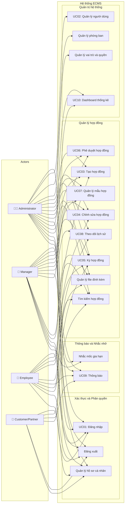
```mermaid
graph LR
    subgraph "Actors"
        Admin["👨‍💼 Administrator"]
        Manager["👔 Manager"]
        Employee["👤 Employee"]
        Customer["🤝 Customer/Partner"]
    end

    subgraph "Hệ thống ECMS"
        subgraph "Xác thực và Phân quyền"
            UC01["UC01: Đăng nhập"]
            UC_Logout["Đăng xuất"]
            UC_Profile["Quản lý hồ sơ cá nhân"]
        end

        subgraph "Quản trị hệ thống"
            UC02["UC02: Quản lý người dùng"]
            UC_Dept["Quản lý phòng ban"]
            UC_Role["Quản lý vai trò và quyền"]
            UC10["UC10: Dashboard thống kê"]
        end

        subgraph "Quản lý hợp đồng"
            UC03["UC03: Tạo hợp đồng"]
            UC04["UC04: Chỉnh sửa hợp đồng"]
            UC05["UC05: Ký hợp đồng"]
            UC06["UC06: Phê duyệt hợp đồng"]
            UC07["UC07: Quản lý mẫu hợp đồng"]
            UC08["UC08: Theo dõi lịch sử"]
            UC_Attach["Quản lý file đính kèm"]
            UC_Search["Tìm kiếm hợp đồng"]
        end

        subgraph "Thông báo và Nhắc nhở"
            UC09["UC09: Thông báo"]
            UC_Remind["Nhắc mốc gia hạn"]
        end
    end

    Admin --> UC01
    Admin --> UC02
    Admin --> UC_Dept
    Admin --> UC_Role
    Admin --> UC03
    Admin --> UC04
    Admin --> UC05
    Admin --> UC06
    Admin --> UC07
    Admin --> UC08
    Admin --> UC09
    Admin --> UC10
    Admin --> UC_Attach
    Admin --> UC_Search
    Admin --> UC_Logout
    Admin --> UC_Profile
    Admin --> UC_Remind

    Manager --> UC01
    Manager --> UC03
    Manager --> UC04
    Manager --> UC05
    Manager --> UC06
    Manager --> UC07
    Manager --> UC08
    Manager --> UC09
    Manager --> UC10
    Manager --> UC_Attach
    Manager --> UC_Search
    Manager --> UC_Logout
    Manager --> UC_Profile
    Manager --> UC_Remind

    Employee --> UC01
    Employee --> UC03
    Employee --> UC04
    Employee --> UC05
    Employee --> UC08
    Employee --> UC09
    Employee --> UC_Attach
    Employee --> UC_Search
    Employee --> UC_Logout
    Employee --> UC_Profile

    Customer --> UC01
    Customer --> UC05
    Customer --> UC09
    Customer --> UC_Search
    Customer --> UC_Logout
    Customer --> UC_Profile
```

### 2.6.2 Ma trận Actor – Use Case

Bảng dưới đây tổng hợp quyền truy cập của từng Actor đối với các Use Case:

| Use Case | Administrator | Manager | Employee | Customer/Partner |
|----------|:---:|:---:|:---:|:---:|
| UC01: Đăng nhập | ✅ | ✅ | ✅ | ✅ |
| UC02: Quản lý người dùng | ✅ | ❌ | ❌ | ❌ |
| UC03: Tạo hợp đồng | ✅ | ✅ | ✅ | ❌ |
| UC04: Chỉnh sửa hợp đồng | ✅ | ✅ | ✅ | ❌ |
| UC05: Ký hợp đồng | ✅ | ✅ | ✅ | ✅ |
| UC06: Phê duyệt hợp đồng | ✅ | ✅ | ❌ | ❌ |
| UC07: Quản lý mẫu hợp đồng | ✅ | ✅ | ❌ | ❌ |
| UC08: Theo dõi lịch sử | ✅ | ✅ | ✅ | ❌ |
| UC09: Thông báo | ✅ | ✅ | ✅ | ✅ |
| UC10: Dashboard thống kê | ✅ | ✅ | ❌ | ❌ |

## 2.7 Sequence Diagram

### 2.7.1 Sequence Diagram: Đăng nhập hệ thống

Sơ đồ tuần tự dưới đây mô tả chi tiết luồng xử lý khi người dùng đăng nhập vào hệ thống ECMS.

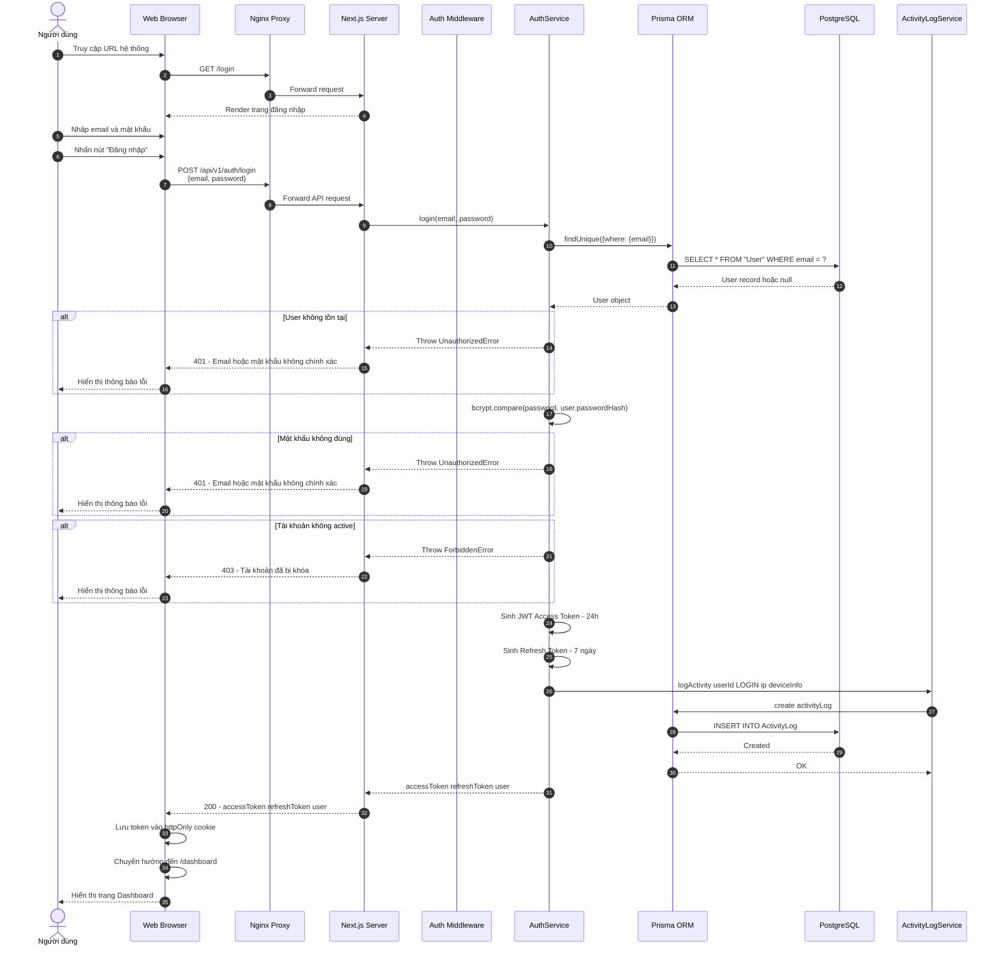
```mermaid
sequenceDiagram
    autonumber
    actor User as Người dùng
    participant Browser as Web Browser
    participant Nginx as Nginx Proxy
    participant NextJS as Next.js Server
    participant AuthMW as Auth Middleware
    participant AuthSvc as AuthService
    participant Prisma as Prisma ORM
    participant DB as PostgreSQL
    participant Logger as ActivityLogService

    User->>Browser: Truy cập URL hệ thống
    Browser->>Nginx: GET /login
    Nginx->>NextJS: Forward request
    NextJS-->>Browser: Render trang đăng nhập

    User->>Browser: Nhập email và mật khẩu
    User->>Browser: Nhấn nút "Đăng nhập"
    Browser->>Nginx: POST /api/v1/auth/login<br/>{email, password}
    Nginx->>NextJS: Forward API request

    NextJS->>AuthSvc: login(email, password)
    
    AuthSvc->>Prisma: findUnique({where: {email}})
    Prisma->>DB: SELECT * FROM "User" WHERE email = ?
    DB-->>Prisma: User record hoặc null
    Prisma-->>AuthSvc: User object

    alt User không tồn tại
        AuthSvc-->>NextJS: Throw UnauthorizedError
        NextJS-->>Browser: 401 - Email hoặc mật khẩu không chính xác
        Browser-->>User: Hiển thị thông báo lỗi
    end

    AuthSvc->>AuthSvc: bcrypt.compare(password, user.passwordHash)

    alt Mật khẩu không đúng
        AuthSvc-->>NextJS: Throw UnauthorizedError
        NextJS-->>Browser: 401 - Email hoặc mật khẩu không chính xác
        Browser-->>User: Hiển thị thông báo lỗi
    end

    alt Tài khoản không active
        AuthSvc-->>NextJS: Throw ForbiddenError
        NextJS-->>Browser: 403 - Tài khoản đã bị khóa
        Browser-->>User: Hiển thị thông báo lỗi
    end

    AuthSvc->>AuthSvc: Sinh JWT Access Token - 24h
    AuthSvc->>AuthSvc: Sinh Refresh Token - 7 ngày

    AuthSvc->>Logger: logActivity userId LOGIN ip deviceInfo
    Logger->>Prisma: create activityLog
    Prisma->>DB: INSERT INTO ActivityLog
    DB-->>Prisma: Created
    Prisma-->>Logger: OK

    AuthSvc-->>NextJS: accessToken refreshToken user
    NextJS-->>Browser: 200 - accessToken refreshToken user
    
    Browser->>Browser: Lưu token vào httpOnly cookie
    Browser->>Browser: Chuyển hướng đến /dashboard
    Browser-->>User: Hiển thị trang Dashboard
```

**Mô tả các bước:**

1. **Bước 1-4:** Người dùng truy cập hệ thống qua trình duyệt. Request đi qua Nginx Reverse Proxy đến Next.js Server, server render trang đăng nhập và trả về HTML cho browser.

2. **Bước 5-8:** Người dùng nhập thông tin đăng nhập và submit form. Browser gửi POST request chứa email và password đến API endpoint.

3. **Bước 9-13:** AuthService nhận request, sử dụng Prisma ORM để truy vấn thông tin user từ PostgreSQL theo email.

4. **Bước 14-20:** Hệ thống thực hiện chuỗi kiểm tra: user tồn tại → password đúng → account active. Nếu bất kỳ kiểm tra nào thất bại, trả về lỗi tương ứng.

5. **Bước 21-22:** Nếu xác thực thành công, sinh JWT access token (hạn 24 giờ) và refresh token (hạn 7 ngày).

6. **Bước 23-27:** Ghi nhận sự kiện đăng nhập vào ActivityLog với thông tin IP và device.

7. **Bước 28-32:** Trả kết quả về browser, lưu token vào httpOnly cookie và chuyển hướng đến Dashboard.

---

### 2.7.2 Sequence Diagram: Tạo hợp đồng

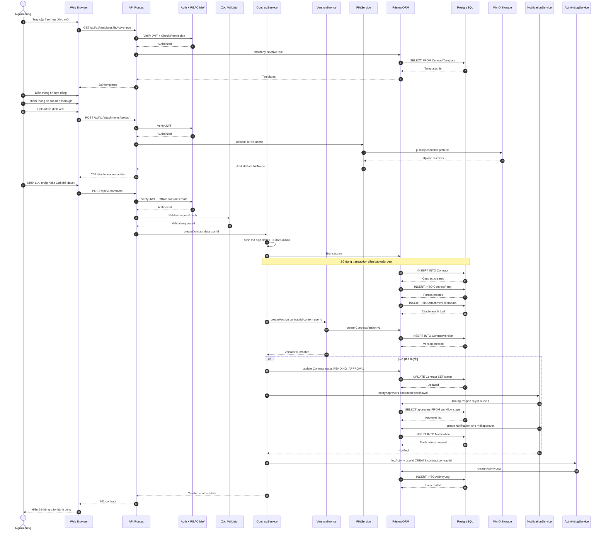
```mermaid
sequenceDiagram
    autonumber
    actor User as Người dùng
    participant Browser as Web Browser
    participant API as API Routes
    participant AuthMW as Auth + RBAC MW
    participant Validator as Zod Validator
    participant ContSvc as ContractService
    participant VerSvc as VersionService
    participant FileSvc as FileService
    participant Prisma as Prisma ORM
    participant DB as PostgreSQL
    participant MinIO as MinIO Storage
    participant NotifSvc as NotificationService
    participant Logger as ActivityLogService

    User->>Browser: Truy cập Tạo hợp đồng mới
    Browser->>API: GET /api/v1/templates?isActive=true
    API->>AuthMW: Verify JWT + Check Permission
    AuthMW-->>API: Authorized
    API->>Prisma: findMany isActive true
    Prisma->>DB: SELECT FROM ContractTemplate
    DB-->>Prisma: Templates list
    Prisma-->>API: Templates
    API-->>Browser: 200 templates

    User->>Browser: Điền thông tin hợp đồng
    User->>Browser: Thêm thông tin các bên tham gia
    User->>Browser: Upload file đính kèm

    Browser->>API: POST /api/v1/attachments/upload
    API->>AuthMW: Verify JWT
    AuthMW-->>API: Authorized
    API->>FileSvc: uploadFile file userId
    FileSvc->>MinIO: putObject bucket path file
    MinIO-->>FileSvc: Upload success
    FileSvc-->>API: fileId filePath fileName
    API-->>Browser: 200 attachment metadata

    User->>Browser: Nhấn Lưu nháp hoặc Gửi phê duyệt
    Browser->>API: POST /api/v1/contracts
    
    API->>AuthMW: Verify JWT + RBAC contract:create
    AuthMW-->>API: Authorized
    
    API->>Validator: Validate request body
    Validator-->>API: Validation passed

    API->>ContSvc: createContract data userId
    
    ContSvc->>ContSvc: Sinh mã hợp đồng HD-2026-XXXX
    
    ContSvc->>Prisma: $transaction
    Note over ContSvc,DB: Sử dụng transaction đảm bảo toàn vẹn

    Prisma->>DB: INSERT INTO Contract
    DB-->>Prisma: Contract created
    
    Prisma->>DB: INSERT INTO ContractParty
    DB-->>Prisma: Parties created
    
    Prisma->>DB: INSERT INTO Attachment metadata
    DB-->>Prisma: Attachment linked

    ContSvc->>VerSvc: createVersion contractId content userId
    VerSvc->>Prisma: create ContractVersion v1
    Prisma->>DB: INSERT INTO ContractVersion
    DB-->>Prisma: Version created
    VerSvc-->>ContSvc: Version v1 created

    alt Gửi phê duyệt
        ContSvc->>Prisma: update Contract status PENDING_APPROVAL
        Prisma->>DB: UPDATE Contract SET status
        DB-->>Prisma: Updated
        
        ContSvc->>NotifSvc: notifyApprovers contractId workflowId
        NotifSvc->>Prisma: Tìm người phê duyệt bước 1
        Prisma->>DB: SELECT approvers FROM workflow steps
        DB-->>Prisma: Approver list
        NotifSvc->>Prisma: create Notification cho mỗi approver
        Prisma->>DB: INSERT INTO Notification
        DB-->>Prisma: Notifications created
        NotifSvc-->>ContSvc: Notified
    end

    ContSvc->>Logger: logActivity userId CREATE contract contractId
    Logger->>Prisma: create ActivityLog
    Prisma->>DB: INSERT INTO ActivityLog
    DB-->>Prisma: Log created

    ContSvc-->>API: Created contract data
    API-->>Browser: 201 contract
    Browser-->>User: Hiển thị thông báo thành công
```

**Mô tả các bước:**

1. **Bước 1-9:** Hệ thống tải danh sách mẫu hợp đồng đang hoạt động để người dùng chọn.

2. **Bước 10-12:** Người dùng điền thông tin hợp đồng qua multi-step form.

3. **Bước 13-19:** Xử lý upload file đính kèm lên MinIO Storage và lưu metadata.

4. **Bước 20-25:** Submit dữ liệu hợp đồng, đi qua Authentication, RBAC và Validation.

5. **Bước 26-36:** ContractService xử lý logic tạo hợp đồng trong transaction: tạo Contract → ContractParty → Attachment → ContractVersion v1.

6. **Bước 37-47:** Nếu chọn "Gửi phê duyệt", cập nhật trạng thái và gửi thông báo đến người phê duyệt bước đầu tiên.

7. **Bước 48-52:** Ghi ActivityLog và trả kết quả về client.

---

### 2.7.3 Sequence Diagram: Phê duyệt hợp đồng

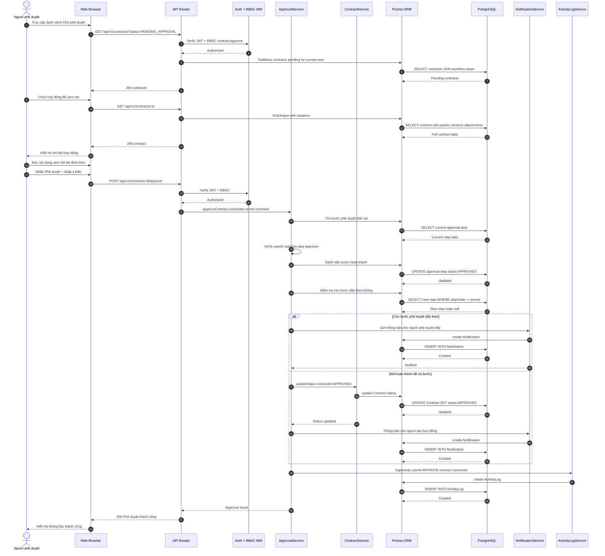
```mermaid
sequenceDiagram
    autonumber
    actor Approver as Người phê duyệt
    participant Browser as Web Browser
    participant API as API Routes
    participant AuthMW as Auth + RBAC MW
    participant ApprSvc as ApprovalService
    participant ContSvc as ContractService
    participant Prisma as Prisma ORM
    participant DB as PostgreSQL
    participant NotifSvc as NotificationService
    participant Logger as ActivityLogService

    Approver->>Browser: Truy cập danh sách Chờ phê duyệt
    Browser->>API: GET /api/v1/contracts?status=PENDING_APPROVAL
    API->>AuthMW: Verify JWT + RBAC contract:approve
    AuthMW-->>API: Authorized
    API->>Prisma: findMany contracts pending for current user
    Prisma->>DB: SELECT contracts JOIN workflow steps
    DB-->>Prisma: Pending contracts
    API-->>Browser: 200 contracts

    Approver->>Browser: Chọn hợp đồng để xem xét
    Browser->>API: GET /api/v1/contracts/:id
    API->>Prisma: findUnique with relations
    Prisma->>DB: SELECT contract with parties versions attachments
    DB-->>Prisma: Full contract data
    API-->>Browser: 200 contract
    Browser-->>Approver: Hiển thị chi tiết hợp đồng

    Approver->>Browser: Đọc nội dung xem xét file đính kèm
    Approver->>Browser: Nhấn Phê duyệt + nhập ý kiến

    Browser->>API: POST /api/v1/contracts/:id/approve
    API->>AuthMW: Verify JWT + RBAC
    AuthMW-->>API: Authorized

    API->>ApprSvc: approveContract contractId userId comment
    
    ApprSvc->>Prisma: Tìm bước phê duyệt hiện tại
    Prisma->>DB: SELECT current approval step
    DB-->>Prisma: Current step data

    ApprSvc->>ApprSvc: Verify userId matches step approver

    ApprSvc->>Prisma: Đánh dấu bước hoàn thành
    Prisma->>DB: UPDATE approval step status APPROVED
    DB-->>Prisma: Updated

    ApprSvc->>Prisma: Kiểm tra còn bước tiếp theo không
    Prisma->>DB: SELECT next step WHERE stepOrder > current
    DB-->>Prisma: Next step hoặc null

    alt Còn bước phê duyệt tiếp theo
        ApprSvc->>NotifSvc: Gửi thông báo cho người phê duyệt tiếp
        NotifSvc->>Prisma: create Notification
        Prisma->>DB: INSERT INTO Notification
        DB-->>Prisma: Created
        NotifSvc-->>ApprSvc: Notified
    else Đã hoàn thành tất cả bước
        ApprSvc->>ContSvc: updateStatus contractId APPROVED
        ContSvc->>Prisma: update Contract status
        Prisma->>DB: UPDATE Contract SET status APPROVED
        DB-->>Prisma: Updated
        ContSvc-->>ApprSvc: Status updated

        ApprSvc->>NotifSvc: Thông báo cho người tạo hợp đồng
        NotifSvc->>Prisma: create Notification
        Prisma->>DB: INSERT INTO Notification
        DB-->>Prisma: Created
    end

    ApprSvc->>Logger: logActivity userId APPROVE contract contractId
    Logger->>Prisma: create ActivityLog
    Prisma->>DB: INSERT INTO ActivityLog
    DB-->>Prisma: Created

    ApprSvc-->>API: Approval result
    API-->>Browser: 200 Phê duyệt thành công
    Browser-->>Approver: Hiển thị thông báo thành công
```

**Mô tả các bước:**

1. **Bước 1-8:** Người phê duyệt truy cập danh sách hợp đồng chờ phê duyệt, hệ thống truy vấn các hợp đồng mà user hiện tại được chỉ định phê duyệt ở bước hiện tại.

2. **Bước 9-16:** Người phê duyệt xem chi tiết hợp đồng với đầy đủ thông tin: nội dung, các bên tham gia, file đính kèm, lịch sử phiên bản.

3. **Bước 17-22:** Người phê duyệt đưa ra quyết định phê duyệt kèm ý kiến, request được gửi qua Auth và RBAC Middleware.

4. **Bước 23-28:** ApprovalService tìm bước phê duyệt hiện tại, xác minh người phê duyệt, đánh dấu bước hoàn thành.

5. **Bước 29-42:** Kiểm tra logic tiếp theo: nếu còn bước → thông báo người phê duyệt tiếp; nếu hết bước → chuyển trạng thái APPROVED và thông báo người tạo.

6. **Bước 43-48:** Ghi ActivityLog và trả kết quả về client.

---

## Tổng kết Chương 2

Chương 2 đã trình bày chi tiết quá trình phân tích và thiết kế Hệ thống Quản lý Hợp đồng Điện tử (ECMS), bao gồm:

1. **High Level Design:** Kiến trúc tổng quan hệ thống với các thành phần chính (Client, Application Server, Data Persistence, Infrastructure) và luồng xử lý tổng quát.

2. **Kiến trúc hệ thống:** Mô hình phân tầng 4 lớp (Frontend, Backend, Business, Data) với công nghệ cụ thể cho từng tầng, ma trận phân quyền RBAC chi tiết cho 4 vai trò.

3. **ERD Diagram:** Mô hình thực thể-quan hệ gồm 14 entity được phân thành 5 nhóm chức năng, với đầy đủ thuộc tính và mối quan hệ.

4. **Mô hình quan hệ:** Chuyển đổi ERD sang lược đồ quan hệ với 14 bảng, xác định rõ khóa chính, khóa ngoại, ràng buộc UNIQUE và NOT NULL, bảng tổng hợp 21 mối quan hệ khóa ngoại.

5. **Thiết kế bảng dữ liệu:** Chi tiết 14 bảng với đầy đủ thông tin: tên trường, kiểu dữ liệu, ràng buộc, mô tả, indexes tối ưu.

6. **Use Case Diagram:** 10 Use Case chính với mô tả chi tiết bao gồm: actor, mô tả, tiền/hậu điều kiện, luồng chính và luồng ngoại lệ.

7. **Sequence Diagram:** 7 sơ đồ tuần tự chi tiết cho các luồng nghiệp vụ quan trọng: đăng nhập, tạo hợp đồng, phê duyệt, ký kết, tải file, thông báo và quản lý phiên bản.

Toàn bộ thiết kế đảm bảo tính nhất quán, bảo mật, khả năng mở rộng và tuân thủ các best practices trong phát triển phần mềm hiện đại.

<div style="page-break-after: always;"></div>

# CHƯƠNG 3: CHUẨN HÓA DỮ LIỆU

---

## 3.1 Định nghĩa chuẩn hóa dữ liệu

### 3.1.1 Khái niệm chuẩn hóa trong cơ sở dữ liệu quan hệ

Chuẩn hóa dữ liệu (Data Normalization) là một kỹ thuật thiết kế cơ sở dữ liệu quan hệ được đề xuất lần đầu tiên bởi nhà khoa học máy tính Edgar F. Codd vào năm 1970.

Trong ngữ cảnh của hệ thống Quản lý Hợp đồng Điện tử (ECMS), chuẩn hóa dữ liệu đóng vai trò đặc biệt quan trọng. Hệ thống ECMS quản lý nhiều loại thông tin phức tạp và có mối liên hệ chặt chẽ với nhau: thông tin người dùng, hợp đồng, đối tác, quy trình phê duyệt, lịch sử nhắc nhở, nhật ký kiểm toán, và thông báo.

Về mặt toán học, chuẩn hóa dựa trên lý thuyết phụ thuộc hàm (functional dependency). Cho một quan hệ R với tập thuộc tính U = {A₁, A₂, ..., Aₙ}, một phụ thuộc hàm X → Y (X xác định Y) có nghĩa là với mọi hai bộ (tuple) t₁ và t₂ trong R, nếu t₁[X] = t₂[X] thì t₁[Y] = t₂[Y].

### 3.1.2 Tại sao cần chuẩn hóa dữ liệu

Việc chuẩn hóa dữ liệu là bước không thể bỏ qua trong quá trình thiết kế cơ sở dữ liệu cho bất kỳ hệ thống thông tin nào, đặc biệt là đối với hệ thống ECMS có độ phức tạp cao. Dưới đây là các lý do chính:

**a) Loại bỏ dư thừa dữ liệu (Eliminating Data Redundancy)**

Dữ liệu dư thừa xảy ra khi cùng một thông tin được lưu trữ tại nhiều vị trí khác nhau trong cơ sở dữ liệu. Trong hệ thống ECMS, nếu không chuẩn hóa, thông tin về đối tác (tên công ty, mã số thuế, địa chỉ, email, người đại diện) có thể bị lặp lại trong mỗi bản ghi hợp đồng.

**b) Đảm bảo toàn vẹn dữ liệu (Ensuring Data Integrity)**

Toàn vẹn dữ liệu đảm bảo rằng dữ liệu trong cơ sở dữ liệu luôn chính xác, nhất quán và đáng tin cậy. Chuẩn hóa giúp loại bỏ các bất thường (anomalies) có thể xảy ra khi thao tác trên cơ sở dữ liệu:

| Loại bất thường | Mô tả | Ví dụ trong ECMS |
|---|---|---|
| **Bất thường chèn (Insert Anomaly)** | Không thể thêm dữ liệu mới vì thiếu thông tin bắt buộc của thực thể khác | Không thể thêm đối tác mới nếu chưa có hợp đồng nào |
| **Bất thường cập nhật (Update Anomaly)** | Cập nhật thông tin ở một nơi nhưng bỏ sót các nơi khác | Đổi email đối tác trong một hợp đồng nhưng quên cập nhật ở 49 hợp đồng còn lại |
| **Bất thường xóa (Delete Anomaly)** | Xóa dữ liệu dẫn đến mất thông tin quan trọng khác | Xóa hợp đồng cuối cùng của đối tác dẫn đến mất toàn bộ thông tin đối tác |

**c) Cải thiện hiệu suất truy vấn (Improving Query Performance)**

Khi dữ liệu được tổ chức hợp lý trong các bảng nhỏ hơn, các truy vấn SQL sẽ hoạt động hiệu quả hơn. Các chỉ mục (indexes) có thể được tạo trên các bảng nhỏ với chi phí thấp hơn, và các phép nối (JOIN) có thể được tối ưu hóa bởi bộ tối ưu truy vấn (query optimizer) của PostgreSQL.

**d) Tăng tính linh hoạt và khả năng mở rộng (Flexibility and Scalability)**

Một cơ sở dữ liệu được chuẩn hóa tốt dễ dàng mở rộng khi yêu cầu nghiệp vụ thay đổi. Trong hệ thống ECMS, việc thêm các thuộc tính mới cho đối tác hoặc thêm loại hợp đồng mới sẽ không ảnh hưởng đến cấu trúc của các bảng khác.

**e) Giảm chi phí bảo trì (Reducing Maintenance Costs)**

Cơ sở dữ liệu được chuẩn hóa giúp giảm đáng kể chi phí bảo trì và phát triển tiếp theo. Các lập trình viên và quản trị viên cơ sở dữ liệu có thể hiểu và làm việc với cấu trúc dữ liệu một cách dễ dàng hơn.

### 3.1.3 Mục đích chuẩn hóa trong hệ thống ECMS

Đối với hệ thống Quản lý Hợp đồng Điện tử, việc chuẩn hóa dữ liệu hướng đến các mục đích cụ thể sau:

| STT | Mục đích | Giải thích chi tiết |
|-----|----------|---------------------|
| 1 | Tách biệt các thực thể nghiệp vụ | Mỗi thực thể (User, Contract, Partner, ContractType,...) được lưu trữ trong bảng riêng biệt với các thuộc tính đặc trưng |
| 2 | Thiết lập mối quan hệ rõ ràng | Sử dụng khóa ngoại để liên kết các bảng, đảm bảo tính toàn vẹn tham chiếu |
| 3 | Tối ưu lưu trữ | Giảm thiểu việc lưu trữ trùng lặp thông tin đối tác, loại hợp đồng, người dùng |
| 4 | Hỗ trợ quy trình phê duyệt | Tách riêng lịch sử phê duyệt (ContractApprovalHistory) khỏi bảng hợp đồng chính |
| 5 | Quản lý phiên bản và gia hạn | Sử dụng quan hệ tự tham chiếu (self-referencing) cho chuỗi gia hạn hợp đồng |
| 6 | Đảm bảo truy vết | Tách riêng nhật ký kiểm toán (AuditLog) và thông báo (Notification) |
| 7 | Quản lý nhắc nhở linh hoạt | Tách bảng ReminderJob và ReminderLog cho quy trình nhắc mốc gia hạn |

### 3.1.4 Các nguyên tắc chuẩn hóa áp dụng

Trong quá trình thiết kế cơ sở dữ liệu cho hệ thống ECMS, nhóm phát triển tuân thủ các nguyên tắc chuẩn hóa sau:

1. **Nguyên tắc nguyên tử (Atomicity)**: Mỗi ô trong bảng chỉ chứa một giá trị duy nhất, không chứa danh sách hay tập hợp các giá trị.

2. **Nguyên tắc phụ thuộc hoàn toàn (Full Dependency)**: Mọi thuộc tính không khóa phải phụ thuộc hoàn toàn vào toàn bộ khóa chính, không phụ thuộc vào một phần của khóa.

3. **Nguyên tắc loại bỏ phụ thuộc bắc cầu (Transitive Dependency Elimination)**: Không có thuộc tính không khóa nào phụ thuộc vào một thuộc tính không khóa khác.

4. **Nguyên tắc cân bằng (Balance Principle)**: Cân bằng giữa mức độ chuẩn hóa và hiệu suất thực tế của hệ thống – trong một số trường hợp, phi chuẩn hóa có chủ đích (deliberate denormalization) được chấp nhận khi cần tối ưu hiệu suất truy vấn.

---

## 3.2 Các dạng chuẩn

### 3.2.1 Dạng chuẩn 1 (First Normal Form – 1NF)

#### Định nghĩa

Một quan hệ R ở dạng chuẩn 1 (1NF) khi và chỉ khi thỏa mãn tất cả các điều kiện sau:

- Mỗi ô (cell) trong bảng chứa một giá trị nguyên tử (atomic value) duy nhất – không chứa tập hợp, danh sách hay bảng lồng nhau.
- Mỗi cột có một tên duy nhất và chứa dữ liệu cùng một kiểu.
- Mỗi hàng là duy nhất (có thể phân biệt bởi khóa chính).
- Thứ tự của các hàng và cột không ảnh hưởng đến ngữ nghĩa của dữ liệu.

Nói cách khác, 1NF yêu cầu loại bỏ các nhóm lặp (repeating groups) và đảm bảo mỗi trường chỉ chứa một giá trị đơn.

#### Ví dụ áp dụng trong hệ thống ECMS

**Trường hợp 1: Tách trường reminderOffsets**

Trong thiết kế ban đầu, bảng Contract có trường `reminderOffsets` lưu trữ nhiều mốc nhắc nhở dưới dạng chuỗi "7,15,30" – đây là vi phạm 1NF vì một ô chứa nhiều giá trị. Tuy nhiên, trong thiết kế cuối cùng, trường này được giữ lại như một quyết định phi chuẩn hóa có chủ đích, vì mốc nhắc nhở được xử lý bởi lớp ứng dụng và chuyển thành các bản ghi ReminderJob riêng biệt.

**Bảng Contract trước khi áp dụng 1NF:**

Trong bảng trên, ta nhận thấy các vi phạm 1NF:
- Cột `partnerInfo` chứa nhiều thông tin (tên, mã số thuế, số điện thoại) trong một ô.
- Cột `reminderOffsets` chứa danh sách các giá trị số ngăn cách bởi dấu phẩy.
- Cột `fileAttachments` chứa danh sách tên file.

**Bảng Contract sau khi áp dụng 1NF:**

**Bảng Contract (đã tách):**

**Bảng Partner (mới tạo):**

**Bảng ContractFile (mới tạo):**

**Trường hợp 2: Tách thông tin thông báo**

Ban đầu, thông tin thông báo có thể được lưu chung trong bảng User dưới dạng chuỗi JSON hoặc danh sách. Sau khi áp dụng 1NF, bảng Notification được tạo riêng:

> [!IMPORTANT]
> **Quyết định thiết kế**: Trường `reminderOffsets` trong bảng Contract vẫn lưu dạng chuỗi "7,15,30" – đây là phi chuẩn hóa có chủ đích (deliberate denormalization). Giá trị này chỉ là cấu hình (configuration) và được lớp ứng dụng parse để tạo các bản ghi ReminderJob riêng biệt, mỗi bản ghi chứa một mốc nhắc duy nhất. Do đó, dữ liệu thực tế vẫn đảm bảo tính nguyên tử ở tầng nghiệp vụ.

#### Kết quả áp dụng 1NF cho hệ thống ECMS

Sau khi áp dụng 1NF, hệ thống ECMS đã tách các thông tin đa giá trị thành các bảng riêng biệt:

---

### 3.2.2 Dạng chuẩn 2 (Second Normal Form – 2NF)

#### Định nghĩa

Một quan hệ R ở dạng chuẩn 2 (2NF) khi và chỉ khi:

1. R đã ở dạng chuẩn 1 (1NF).
2. Mọi thuộc tính không khóa (non-prime attribute) phụ thuộc hoàn toàn (fully functionally dependent) vào khóa chính – tức là không tồn tại phụ thuộc hàm bộ phận (partial dependency).

Phụ thuộc hàm bộ phận xảy ra khi một thuộc tính không khóa chỉ phụ thuộc vào một phần của khóa chính (trong trường hợp khóa chính là khóa phức hợp – composite key). Nếu khóa chính là khóa đơn (single-column primary key), thì quan hệ đã thỏa 1NF sẽ tự động thỏa 2NF.

**Công thức**: Cho quan hệ R(A, B, C) với khóa chính (A, B):
- Nếu C phụ thuộc vào (A, B) → Thỏa 2NF
- Nếu C chỉ phụ thuộc vào A hoặc chỉ B → Vi phạm 2NF (phụ thuộc bộ phận)

#### Ví dụ áp dụng trong hệ thống ECMS

**Trường hợp: Tách thông tin bên tham gia hợp đồng (ContractParty)**

Giả sử trong thiết kế ban đầu, thông tin về các bên tham gia hợp đồng được lưu trong một bảng chung với khóa phức hợp:

**Bảng ContractPartyInfo trước 2NF (vi phạm):**

**Phân tích phụ thuộc hàm:**
- Khóa chính: (contractId, partyEmail)
- contractTitle, contractValue → phụ thuộc vào contractId (chỉ một phần khóa) → **Vi phạm 2NF**
- partyName, partyPhone → phụ thuộc vào partyEmail (chỉ một phần khóa) → **Vi phạm 2NF**
- partyRole → phụ thuộc vào (contractId, partyEmail) (toàn bộ khóa) → Thỏa 2NF

**Sau khi áp dụng 2NF, tách thành 3 bảng:**

**Bảng Contract:**

**Bảng Partner:**

**Bảng ContractParticipation (nếu cần nhiều bên):**

**Trường hợp 2: Tách loại hợp đồng (ContractType)**

**Trước 2NF (vi phạm):**

Ở đây, `contractTypeName` và `contractTypeDescription` bị lặp lại khi nhiều hợp đồng cùng loại.

**Sau 2NF:**

**Bảng ContractType:**

**Bảng Contract (cập nhật):**

#### Tổng kết áp dụng 2NF

Trong hệ thống ECMS, hầu hết các bảng sử dụng khóa chính đơn (single-column primary key) dạng `id` (CUID), do đó vấn đề phụ thuộc bộ phận ít xuất hiện. Tuy nhiên, nguyên tắc 2NF vẫn được áp dụng nghiêm ngặt trong các tình huống:

---

### 3.2.3 Dạng chuẩn 3 (Third Normal Form – 3NF)

#### Định nghĩa

Một quan hệ R ở dạng chuẩn 3 (3NF) khi và chỉ khi:

1. R đã ở dạng chuẩn 2 (2NF).
2. Không tồn tại phụ thuộc hàm bắc cầu (transitive dependency) – tức là không có thuộc tính không khóa nào phụ thuộc vào một thuộc tính không khóa khác.

**Phụ thuộc bắc cầu**: Nếu A → B và B → C (với B không phải là khóa ứng viên), thì A → C là phụ thuộc bắc cầu. Để đạt 3NF, cần loại bỏ phụ thuộc bắc cầu bằng cách tách bảng.

#### Ví dụ áp dụng trong hệ thống ECMS

**Trường hợp 1: Phân tích bảng User ban đầu**

Giả sử trong thiết kế ban đầu, bảng User chứa cả thông tin phòng ban:

**Bảng User trước 3NF (vi phạm):**

**Phân tích phụ thuộc hàm:**
- userId → name, email, role, departmentName, departmentHead, departmentPhone
- departmentName → departmentHead, departmentPhone

**Phụ thuộc bắc cầu:**
- userId → departmentName → departmentHead (vi phạm 3NF)
- userId → departmentName → departmentPhone (vi phạm 3NF)

Ở đây, `departmentHead` và `departmentPhone` phụ thuộc vào `departmentName` (thuộc tính không khóa) chứ không phụ thuộc trực tiếp vào `userId`. Điều này dẫn đến:
- **Dư thừa**: Thông tin "Phòng CNTT - Trần Văn B - 0281234567" bị lặp lại 2 lần.
- **Bất thường cập nhật**: Nếu đổi trưởng phòng CNTT, phải cập nhật tất cả các bản ghi User thuộc phòng CNTT.

**Sau khi áp dụng 3NF:**

**Bảng User (sau 3NF):**

> [!NOTE]
> Trong thiết kế thực tế hiện tại của hệ thống ECMS, bảng User không lưu trữ thông tin phòng ban trực tiếp. Thay vào đó, nếu cần quản lý phòng ban, sẽ tạo bảng Department riêng và liên kết qua khóa ngoại departmentId.

**Trường hợp 2: Phân tích bảng Contract**

Trong bảng Contract hiện tại, có các trường `partnerName` và `partnerEmail` ngoài khóa ngoại `partnerId`. Đây là trường hợp phi chuẩn hóa có chủ đích:

**Phân tích:**
- contractId → partnerId → partnerName, partnerEmail (phụ thuộc bắc cầu)

Tuy nhiên, trường `partnerName` được giữ lại trong bảng Contract vì:

**Trường hợp 3: Tách thông tin phê duyệt ra bảng lịch sử**

**Bảng Contract trước 3NF (nếu chứa toàn bộ lịch sử phê duyệt):**

**Sau 3NF:**

**Bảng ContractApprovalHistory:**

#### Tổng kết áp dụng 3NF cho hệ thống ECMS

---

### 3.2.4 Dạng chuẩn Boyce-Codd (BCNF)

#### Định nghĩa

Dạng chuẩn Boyce-Codd (BCNF) là phiên bản mạnh hơn của 3NF, được đề xuất bởi Raymond F. Boyce và Edgar F.

- Với mọi phụ thuộc hàm không tầm thường X → Y trong R, X phải là siêu khóa (superkey) của R.

Nói cách khác, trong BCNF, vế trái của mọi phụ thuộc hàm phải chứa khóa ứng viên (candidate key). Sự khác biệt giữa 3NF và BCNF nằm ở chỗ: 3NF cho phép phụ thuộc hàm mà vế phải là thuộc tính khóa (prime attribute), trong khi BCNF không cho phép.

**So sánh 3NF và BCNF:**

#### Phân tích áp dụng BCNF cho hệ thống ECMS

**Phân tích từng bảng:**

**1. Bảng User:**
- Khóa ứng viên: {id}, {email}, {username} (username có thể null)
- Phụ thuộc hàm: id → tất cả thuộc tính, email → tất cả thuộc tính
- **Kết luận**: Thỏa BCNF vì vế trái của mọi phụ thuộc hàm đều là siêu khóa.

**2. Bảng Contract:**
- Khóa ứng viên: {id}, {code}
- Phụ thuộc hàm: id → tất cả thuộc tính, code → tất cả thuộc tính
- **Kết luận**: Thỏa BCNF.

**3. Bảng Partner:**
- Khóa ứng viên: {id}
- Phụ thuộc hàm: id → tất cả thuộc tính
- **Kết luận**: Thỏa BCNF.

**4. Bảng ContractType:**
- Khóa ứng viên: {id}
- Phụ thuộc hàm: id → tất cả thuộc tính
- **Kết luận**: Thỏa BCNF.

**5. Bảng ContractFile:**
- Khóa ứng viên: {id}
- Phụ thuộc hàm: id → tất cả thuộc tính
- **Kết luận**: Thỏa BCNF.

**6. Bảng ReminderJob:**
- Khóa ứng viên: {id}
- Phụ thuộc hàm: id → tất cả thuộc tính
- **Kết luận**: Thỏa BCNF.

**7. Bảng ReminderLog:**
- Khóa ứng viên: {id}
- Phụ thuộc hàm: id → tất cả thuộc tính
- **Kết luận**: Thỏa BCNF.

**8. Bảng AuditLog:**
- Khóa ứng viên: {id}
- Phụ thuộc hàm: id → tất cả thuộc tính
- **Kết luận**: Thỏa BCNF.

**9. Bảng Notification:**
- Khóa ứng viên: {id}
- Phụ thuộc hàm: id → tất cả thuộc tính
- **Kết luận**: Thỏa BCNF.

**10. Bảng ContractApprovalHistory:**
- Khóa ứng viên: {id}
- Phụ thuộc hàm: id → tất cả thuộc tính
- **Kết luận**: Thỏa BCNF.

**Tổng kết BCNF:**

> [!TIP]
> Tất cả các bảng trong hệ thống ECMS đều thỏa mãn BCNF. Điều này đạt được nhờ thiết kế sử dụng khóa chính đơn (surrogate key) dạng CUID cho mỗi bảng, tránh khóa phức hợp và các phụ thuộc hàm phức tạp giữa các khóa ứng viên.

---

## 3.3 Phương thức chuẩn hóa

### 3.3.1 Quy trình chuẩn hóa tổng quát

Quá trình chuẩn hóa cơ sở dữ liệu cho hệ thống ECMS được thực hiện theo quy trình có hệ thống gồm 8 bước chính:

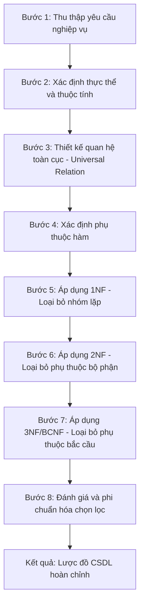
```mermaid
flowchart TD
    A["Bước 1: Thu thập yêu cầu nghiệp vụ"] --> B["Bước 2: Xác định thực thể và thuộc tính"]
    B --> C["Bước 3: Thiết kế quan hệ toàn cục - Universal Relation"]
    C --> D["Bước 4: Xác định phụ thuộc hàm"]
    D --> E["Bước 5: Áp dụng 1NF - Loại bỏ nhóm lặp"]
    E --> F["Bước 6: Áp dụng 2NF - Loại bỏ phụ thuộc bộ phận"]
    F --> G["Bước 7: Áp dụng 3NF/BCNF - Loại bỏ phụ thuộc bắc cầu"]
    G --> H["Bước 8: Đánh giá và phi chuẩn hóa chọn lọc"]
    H --> I["Kết quả: Lược đồ CSDL hoàn chỉnh"]
```

### 3.3.2 Chi tiết từng bước

**Bước 1: Thu thập yêu cầu nghiệp vụ**

Nhóm phát triển tiến hành phân tích yêu cầu nghiệp vụ của hệ thống ECMS, xác định các quy trình chính:

| STT | Quy trình nghiệp vụ | Dữ liệu liên quan |
|-----|---------------------|-------------------|
| 1 | Quản lý người dùng | Thông tin cá nhân, vai trò, trạng thái |
| 2 | Quản lý đối tác | Tên, mã thuế, địa chỉ, liên hệ, loại đối tác |
| 3 | Quản lý hợp đồng | Mã HĐ, tiêu đề, giá trị, ngày hiệu lực, trạng thái |
| 4 | Phân loại hợp đồng | Loại hợp đồng, mô tả |
| 5 | Quy trình phê duyệt | Trạng thái phê duyệt, người phê duyệt, lý do |
| 6 | Gia hạn hợp đồng | HĐ gốc, HĐ gia hạn, phiên bản |
| 7 | Nhắc nhở mốc gia hạn | Mốc nhắc, lịch gửi, trạng thái gửi |
| 8 | Quản lý file đính kèm | Tên file, đường dẫn, kích thước |
| 9 | Ghi nhật ký hoạt động | Hành động, đối tượng, thời gian |
| 10 | Thông báo hệ thống | Nội dung, loại, trạng thái đọc |

**Bước 2: Xác định thực thể và thuộc tính**

Từ yêu cầu nghiệp vụ, xác định các thực thể chính và thuộc tính tương ứng:

| Thực thể | Thuộc tính ban đầu |
|---|---|
| User | id, username, name, email, phone, passwordHash, role, status, createdAt, updatedAt |
| Partner | id, name, partnerType, taxCode, address, email, phone, representative, description, status, createdAt, updatedAt |
| ContractType | id, name, description, createdAt, updatedAt |
| Contract | id, code, title, partnerId, contractTypeId, partnerName, partnerEmail, description, value, startDate, endDate, signedDate, status, renewalReminderDays, reminderOffsets, autoRenew, fileUrl, fileName, originalFileName, fileMimeType, fileSize, uploadedAt, note, ownerId, approvalStatus, submittedForApprovalAt, approvedAt, rejectedAt, approvedById, rejectionReason, parentContractId, renewalVersion, renewedAt, createdAt, updatedAt |

**Bước 3: Thiết kế quan hệ toàn cục**

Trước khi chuẩn hóa, tất cả thông tin có thể được biểu diễn trong một bảng toàn cục (universal relation) duy nhất. Trong thực tế, bảng toàn cục này sẽ chứa hàng trăm cột và có sự dư thừa rất lớn.

```
UniversalRelation(userId, userName, userEmail, userRole, userStatus, 
    partnerId, partnerName, partnerType, partnerTaxCode, partnerAddress,
    contractId, contractCode, contractTitle, contractValue, 
    contractStartDate, contractEndDate, contractStatus,
    contractTypeId, contractTypeName, contractTypeDescription,
    approvalHistoryId, approvalAction, approvalActorId, approvalStep,
    reminderJobId, reminderType, reminderStatus, scheduledAt,
    reminderLogId, reminderSentTo, reminderSentAt,
    auditLogId, auditAction, auditEntityType,
    notificationId, notificationType, notificationTitle, notificationMessage,
    fileId, fileName, filePath, fileSize, ...)
```

**Bước 4: Xác định phụ thuộc hàm**

Liệt kê tất cả các phụ thuộc hàm (chi tiết ở mục 3.4).

**Bước 5: Áp dụng 1NF**

- Loại bỏ thuộc tính đa giá trị: tách file đính kèm, lịch sử nhắc nhở
- Đảm bảo mỗi ô chứa giá trị nguyên tử
- Kết quả: 10 bảng sơ bộ

**Bước 6: Áp dụng 2NF**

- Kiểm tra phụ thuộc bộ phận (không áp dụng vì dùng khóa đơn)
- Tách các nhóm thông tin phụ thuộc vào thực thể khác
- Kết quả: Cấu trúc bảng giữ nguyên 10 bảng

**Bước 7: Áp dụng 3NF/BCNF**

- Loại bỏ phụ thuộc bắc cầu
- Tách Partner, ContractType khỏi Contract
- Tách lịch sử phê duyệt thành bảng riêng
- Kết quả: 10 bảng cuối cùng, tất cả thỏa BCNF

**Bước 8: Đánh giá và phi chuẩn hóa chọn lọc**

Sau khi hoàn thành chuẩn hóa, nhóm phát triển đánh giá và quyết định phi chuẩn hóa một số trường hợp:

| Trường phi chuẩn hóa | Bảng | Lý do |
|---|---|---|
| partnerName | Contract | Lưu snapshot tên đối tác tại thời điểm ký kết |
| partnerEmail | Contract | Lưu email liên hệ tại thời điểm ký kết |
| reminderOffsets | Contract | Cấu hình đơn giản, parse bởi ứng dụng |
| recipientEmail | ReminderJob | Lưu email nhận nhắc nhở tại thời điểm tạo job |
| sentTo | ReminderLog | Lưu email thực tế đã gửi, có thể khác email hiện tại |

## 3.4 Phân tích phụ thuộc hàm

Phần này trình bày chi tiết các phụ thuộc hàm (functional dependencies) cho toàn bộ 10 bảng trong hệ thống ECMS. Mỗi bảng được phân tích với tập thuộc tính đầy đủ, các phụ thuộc hàm, khóa ứng viên và khóa chính.

> [!NOTE]
> Hệ thống ECMS sử dụng 10 bảng chính theo Prisma schema thực tế: User, Partner, ContractType, Contract, ContractFile, ReminderJob, ReminderLog, AuditLog, Notification, ContractApprovalHistory. Các tên bảng và thuộc tính được lấy trực tiếp từ schema Prisma đã thiết kế.

### 3.4.11 Bảng tổng hợp phụ thuộc hàm

| STT | Bảng | Khóa chính | Khóa ứng viên | Số phụ thuộc hàm | Dạng chuẩn |
|-----|------|-----------|---------------|-------------------|------------|
| 1 | User | id | {id}, {email}, {username} | 3 | BCNF |
| 2 | Partner | id | {id} | 1 | BCNF |
| 3 | ContractType | id | {id} | 1 | BCNF |
| 4 | Contract | id | {id}, {code} | 2 | BCNF |
| 5 | ContractFile | id | {id} | 1 | BCNF |
| 6 | ReminderJob | id | {id} | 1 | BCNF |
| 7 | ReminderLog | id | {id} | 1 | BCNF |
| 8 | AuditLog | id | {id} | 1 | BCNF |
| 9 | Notification | id | {id} | 1 | BCNF |
| 10 | ContractApprovalHistory | id | {id} | 1 | BCNF |

---

## 3.5 Các thực thể sau chuẩn hóa

Sau quá trình chuẩn hóa, hệ thống ECMS bao gồm 10 bảng chính, tất cả đều đạt dạng chuẩn BCNF. Dưới đây là lược đồ quan hệ hoàn chỉnh của từng bảng.

### 3.5.11 Tổng quan các thực thể sau chuẩn hóa

| STT | Bảng | Số cột | Khóa chính | Khóa ngoại | Dạng chuẩn | Vai trò |
|-----|------|--------|-----------|------------|------------|---------|
| 1 | User | 10 | id | – | BCNF | Quản lý tài khoản người dùng |
| 2 | Partner | 12 | id | – | BCNF | Quản lý thông tin đối tác |
| 3 | ContractType | 5 | id | – | BCNF | Phân loại hợp đồng |
| 4 | Contract | 35 | id | partnerId, contractTypeId, ownerId, approvedById, parentContractId | BCNF | Quản lý hợp đồng chính |
| 5 | ContractFile | 8 | id | contractId | BCNF | File đính kèm |
| 6 | ReminderJob | 16 | id | contractId | BCNF | Công việc nhắc nhở |
| 7 | ReminderLog | 9 | id | contractId | BCNF | Log gửi nhắc nhở |
| 8 | AuditLog | 8 | id | userId, contractId | BCNF | Nhật ký kiểm toán |
| 9 | Notification | 10 | id | userId | BCNF | Thông báo hệ thống |
| 10 | ContractApprovalHistory | 7 | id | contractId, actorId | BCNF | Lịch sử phê duyệt |

**Tổng số:** 10 bảng, 120 cột, 12 khóa ngoại, tất cả đạt BCNF.

---

# CHƯƠNG 4: GIAO DIỆN WEBSITE

Chương này trình bày chi tiết toàn bộ giao diện người dùng (User Interface – UI) của Hệ thống Quản lý Hợp đồng Điện tử (ECMS). Mỗi giao diện được mô tả đầy đủ về mục đích, chức năng, bố cục thành phần, và luồng hoạt động của người dùng khi tương tác với trang.

Toàn bộ giao diện tuân thủ các nguyên tắc thiết kế sau:
- **Consistency (Nhất quán):** Sử dụng hệ thống design tokens thống nhất về màu sắc, typography, spacing trên toàn bộ ứng dụng.
- **Accessibility (Khả năng tiếp cận):** Hỗ trợ keyboard navigation, ARIA labels, và contrast ratio đạt chuẩn WCAG 2.1 AA.
- **Responsive Design:** Giao diện tương thích tốt trên desktop (≥1024px), tablet (768px–1023px) và mobile (< 768px).
- **Feedback (Phản hồi):** Mọi hành động của người dùng đều có phản hồi trực quan thông qua toast notifications, loading states, và skeleton screens.

---

## 4.1. Trang chủ (Landing Page)

### 4.1.1. Mục đích

Trang chủ (Landing Page) là trang đầu tiên người dùng nhìn thấy khi truy cập vào hệ thống ECMS. Trang này đóng vai trò quan trọng trong việc giới thiệu tổng quan về hệ thống, truyền tải giá trị cốt lõi của sản phẩm đến người dùng tiềm năng, và hướng dẫn người dùng thực hiện các hành động tiếp theo như đăng nhập hoặc tìm hiểu thêm về các tính năng.

### 4.1.2. Chức năng chi tiết

| STT | Chức năng | Mô tả |
|-----|-----------|-------|
| 1 | Giới thiệu hệ thống | Hiển thị thông tin tổng quan, slogan và mô tả ngắn gọn về ECMS |
| 2 | Trình bày tính năng nổi bật | Liệt kê các tính năng chính của hệ thống dưới dạng feature cards |
| 3 | Điều hướng đăng nhập | Cung cấp nút CTA (Call-to-Action) để chuyển đến trang đăng nhập |
| 4 | Thông tin liên hệ | Hiển thị thông tin liên hệ và footer navigation |
| 5 | Responsive navigation | Thanh điều hướng co giãn linh hoạt trên các kích thước màn hình |

## 4.2. Trang Đăng nhập

### 4.2.1. Mục đích

Trang đăng nhập là cổng xác thực người dùng trước khi truy cập vào các chức năng nội bộ của hệ thống. Trang này đảm bảo chỉ những người dùng có tài khoản hợp lệ mới có thể truy cập vào hệ thống, đồng thời cung cấp trải nghiệm đăng nhập nhanh chóng, trực quan và bảo mật.

### 4.2.2. Chức năng chi tiết

| STT | Chức năng | Mô tả |
|-----|-----------|-------|
| 1 | Đăng nhập bằng email/password | Xác thực người dùng thông qua email và mật khẩu |
| 2 | Ghi nhớ đăng nhập | Tùy chọn "Remember me" để lưu phiên đăng nhập |
| 3 | Quên mật khẩu | Liên kết đến trang khôi phục mật khẩu |
| 4 | Hiển thị/ẩn mật khẩu | Toggle hiển thị mật khẩu dạng plain text hoặc ẩn |
| 5 | Validation real-time | Kiểm tra định dạng email và độ dài mật khẩu ngay khi nhập |
| 6 | Thông báo lỗi | Hiển thị lỗi cụ thể khi đăng nhập thất bại |
| 7 | Redirect sau đăng nhập | Chuyển hướng đến Dashboard sau khi đăng nhập thành công |

## 4.3. Dashboard (Bảng điều khiển)

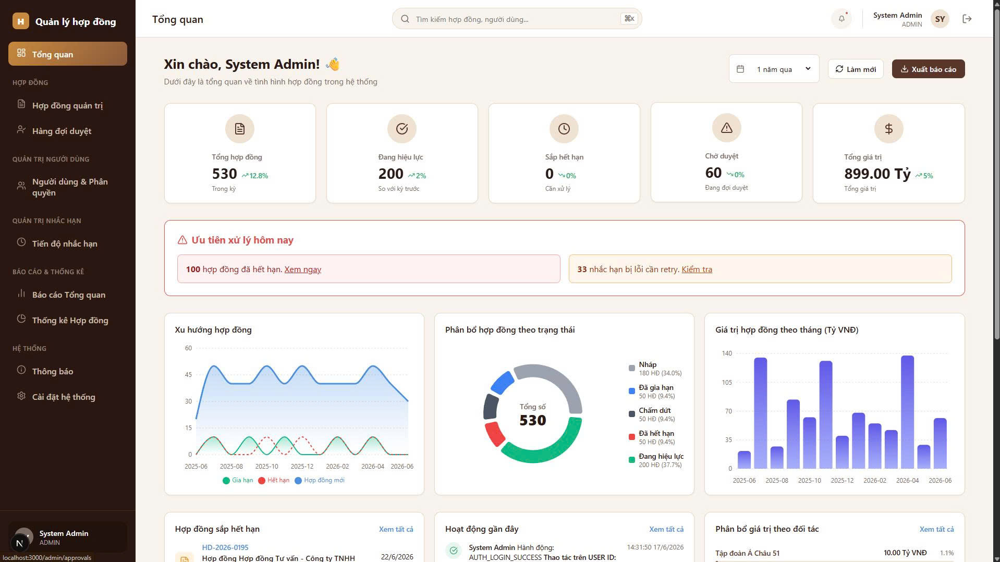

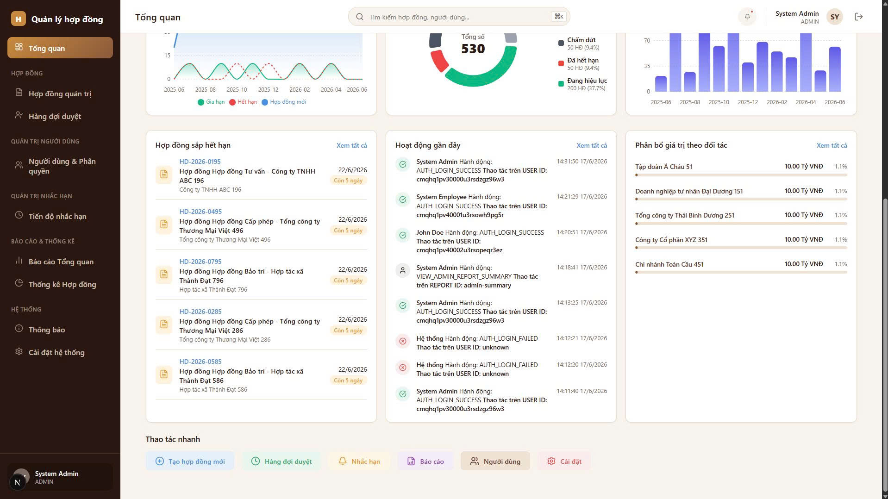

### 4.3.1. Mục đích

Dashboard là trang tổng quan chính của hệ thống, được hiển thị ngay sau khi người dùng đăng nhập thành công. Trang này cung cấp cái nhìn toàn diện về tình hình quản lý hợp đồng thông qua các chỉ số thống kê, biểu đồ trực quan và danh sách các hợp đồng cần chú ý.

### 4.3.2. Chức năng chi tiết

| STT | Chức năng | Mô tả |
|-----|-----------|-------|
| 1 | Hiển thị thống kê tổng quan | Các stat cards hiển thị số liệu chính về hợp đồng |
| 2 | Biểu đồ phân bố trạng thái | Pie chart hiển thị tỷ lệ hợp đồng theo trạng thái |
| 3 | Biểu đồ xu hướng theo thời gian | Line chart/Bar chart hiển thị số lượng hợp đồng theo tháng |
| 4 | Danh sách hợp đồng sắp hết hạn | Table hiển thị các hợp đồng có ngày hết hạn gần nhất |
| 5 | Hoạt động gần đây | Timeline hiển thị các hành động mới nhất trên hệ thống |
| 6 | Hợp đồng chờ phê duyệt | Danh sách hợp đồng đang chờ người dùng hiện tại phê duyệt |
| 7 | Lọc theo khoảng thời gian | Bộ lọc ngày cho phép xem dữ liệu theo khoảng thời gian tùy chọn |

## 4.4. Danh sách hợp đồng

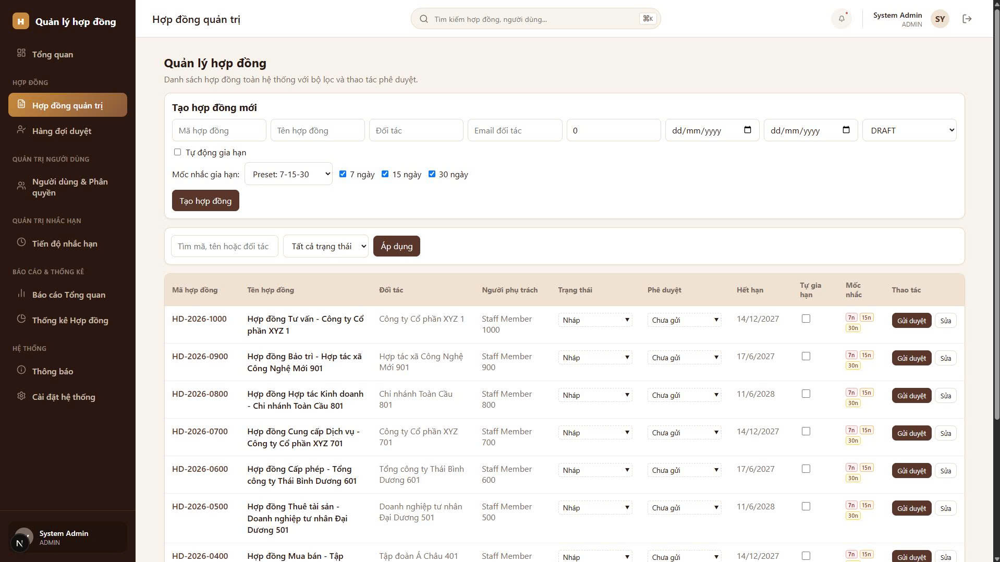

### 4.4.1. Mục đích

Trang danh sách hợp đồng là giao diện quản lý tập trung toàn bộ hợp đồng trong hệ thống. Đây là trang được sử dụng thường xuyên nhất bởi tất cả vai trò người dùng.

### 4.4.2. Chức năng chi tiết

| STT | Chức năng | Mô tả |
|-----|-----------|-------|
| 1 | Hiển thị danh sách hợp đồng | Data table với các cột thông tin chính |
| 2 | Tìm kiếm | Search bar tìm kiếm theo mã HĐ, tiêu đề, đối tác |
| 3 | Lọc nâng cao | Filter theo trạng thái, loại HĐ, phòng ban, khoảng thời gian |
| 4 | Sắp xếp | Sort theo các cột: ngày tạo, giá trị, ngày hết hạn, trạng thái |
| 5 | Phân trang | Pagination với tùy chọn số dòng/trang (10, 20, 50, 100) |
| 6 | Tạo hợp đồng mới | Nút CTA chuyển đến form tạo hợp đồng |
| 7 | Xuất dữ liệu | Export danh sách ra file CSV/Excel |
| 8 | Xem nhanh | Hover hoặc click icon để xem thông tin tóm tắt hợp đồng |
| 9 | Hành động hàng loạt | Chọn nhiều hợp đồng để thực hiện hành động bulk |

## 4.5. Chi tiết hợp đồng

### 4.5.1. Mục đích

Trang chi tiết hợp đồng hiển thị toàn bộ thông tin liên quan đến một hợp đồng cụ thể. Đây là trang trung tâm cho mọi hoạt động liên quan đến hợp đồng bao gồm xem thông tin, theo dõi trạng thái, phê duyệt, ký kết và quản lý tài liệu đính kèm.

### 4.5.2. Chức năng chi tiết

| STT | Chức năng | Mô tả |
|-----|-----------|-------|
| 1 | Xem thông tin tổng quan | Hiển thị đầy đủ thông tin cơ bản của hợp đồng |
| 2 | Timeline trạng thái | Hiển thị lịch sử thay đổi trạng thái theo dạng timeline |
| 3 | Quản lý phê duyệt | Xem và thực hiện phê duyệt/từ chối hợp đồng |
| 4 | Quản lý file đính kèm | Upload, xem, tải xuống các file tài liệu đính kèm |
| 5 | Xem các bên liên quan | Danh sách các bên tham gia hợp đồng |
| 6 | Lịch sử phiên bản | Xem các phiên bản trước và so sánh thay đổi |
| 7 | Hành động trên hợp đồng | Các nút: Chỉnh sửa, Gửi duyệt, Ký, Gia hạn, Hủy |
| 8 | Nhật ký hoạt động | Xem log hoạt động liên quan đến hợp đồng này |

## 4.6. Tạo hợp đồng

### 4.6.1. Mục đích

Trang tạo hợp đồng cung cấp giao diện form nhập liệu đầy đủ và có cấu trúc rõ ràng để người dùng tạo một hợp đồng mới trong hệ thống. Form được thiết kế theo dạng multi-step (nhiều bước) nhằm giảm tải thông tin trên mỗi bước, hướng dẫn người dùng hoàn thành tuần tự và tránh sai sót.

### 4.6.2. Chức năng chi tiết

| STT | Chức năng | Mô tả |
|-----|-----------|-------|
| 1 | Form nhập thông tin cơ bản | Nhập tiêu đề, loại HĐ, mô tả, phòng ban |
| 2 | Chọn/tạo đối tác | Chọn đối tác có sẵn hoặc nhập thông tin mới |
| 3 | Nhập giá trị và thời hạn | Giá trị HĐ, ngày bắt đầu, ngày kết thúc, điều khoản thanh toán |
| 4 | Upload tài liệu | Đính kèm file hợp đồng và tài liệu liên quan |
| 5 | Chọn mẫu hợp đồng | Chọn từ danh sách template có sẵn để tự động điền |
| 6 | Chọn quy trình phê duyệt | Chọn workflow phê duyệt phù hợp |
| 7 | Xem trước và xác nhận | Review toàn bộ thông tin trước khi tạo |
| 8 | Lưu nháp | Lưu hợp đồng dưới dạng Draft để hoàn thiện sau |

## 4.7. Chỉnh sửa hợp đồng

### 4.7.1. Mục đích

Trang chỉnh sửa hợp đồng cho phép người dùng cập nhật thông tin của một hợp đồng đã tồn tại trong hệ thống. Giao diện tương tự form tạo mới nhưng được pre-fill với dữ liệu hiện tại của hợp đồng.

### 4.7.2. Chức năng chi tiết

| STT | Chức năng | Mô tả |
|-----|-----------|-------|
| 1 | Load dữ liệu cũ | Tự động điền form với dữ liệu hiện tại của HĐ |
| 2 | Chỉnh sửa thông tin | Cập nhật các trường thông tin, đối tác, file |
| 3 | Version tracking | Tạo phiên bản mới khi lưu thay đổi |
| 4 | So sánh thay đổi | Hiển thị diff giữa phiên bản hiện tại và trước đó |
| 5 | Ghi chú thay đổi | Yêu cầu nhập lý do/ghi chú khi lưu chỉnh sửa |
| 6 | Lịch sử phiên bản | Xem danh sách tất cả phiên bản trước |

## 4.8. Ký hợp đồng

### 4.8.1. Mục đích

Trang ký hợp đồng cung cấp giao diện cho phép các bên liên quan thực hiện ký kết hợp đồng điện tử. Người dùng có thể xem toàn bộ nội dung hợp đồng, sau đó ký bằng cách vẽ chữ ký trên canvas hoặc upload hình ảnh chữ ký đã có.

### 4.8.2. Chức năng chi tiết

| STT | Chức năng | Mô tả |
|-----|-----------|-------|
| 1 | Xem nội dung hợp đồng | Hiển thị nội dung HĐ dưới dạng PDF viewer |
| 2 | Vẽ chữ ký | Canvas cho phép vẽ chữ ký bằng chuột/touchscreen |
| 3 | Upload chữ ký | Upload hình ảnh chữ ký (PNG/JPG) |
| 4 | Nhập chữ ký | Gõ tên và chọn font chữ ký |
| 5 | Xem trước chữ ký | Preview chữ ký trước khi xác nhận |
| 6 | Xác nhận ký | Xác nhận và ghi nhận chữ ký vào hệ thống |
| 7 | Ghi log ký kết | Lưu metadata: thời gian, IP, device, user agent |

## 4.9. Quản lý người dùng

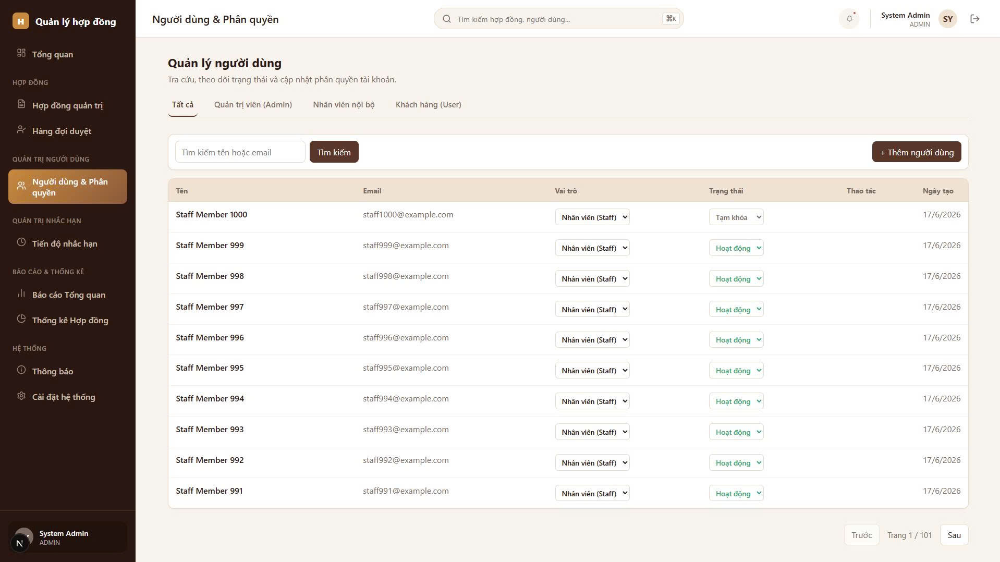

### 4.9.1. Mục đích

Trang quản lý người dùng dành riêng cho Administrator, cung cấp giao diện CRUD (Create, Read, Update, Delete) đầy đủ để quản lý tất cả tài khoản người dùng trong hệ thống. Administrator có thể tạo tài khoản mới, gán vai trò (Role), phân công phòng ban, khóa/mở tài khoản và xem lịch sử hoạt động của từng người dùng.

### 4.9.2. Chức năng chi tiết

| STT | Chức năng | Mô tả |
|-----|-----------|-------|
| 1 | Xem danh sách người dùng | Data table hiển thị tất cả users với filter và search |
| 2 | Tạo người dùng mới | Form tạo tài khoản với thông tin đầy đủ |
| 3 | Chỉnh sửa người dùng | Cập nhật thông tin, vai trò, phòng ban |
| 4 | Khóa/Mở tài khoản | Toggle trạng thái active/inactive |
| 5 | Xóa người dùng | Soft delete (đánh dấu deleted) |
| 6 | Gán vai trò | Assign Role (Administrator, Manager, Employee, Customer) |
| 7 | Reset mật khẩu | Gửi email reset password cho user |
| 8 | Filter và tìm kiếm | Lọc theo vai trò, trạng thái, phòng ban |

## 4.10. Quản lý phòng ban

### 4.10.1. Mục đích

Trang quản lý phòng ban cho phép Administrator tổ chức cơ cấu phòng ban trong doanh nghiệp, bao gồm tạo mới, chỉnh sửa, xóa phòng ban, gán trưởng phòng (Manager) và xem danh sách thành viên thuộc từng phòng ban. Thông tin phòng ban được sử dụng trong nhiều chức năng khác như phân công hợp đồng, phân quyền truy cập, và báo cáo thống kê theo đơn vị.

### 4.10.2. Chức năng chi tiết

| STT | Chức năng | Mô tả |
|-----|-----------|-------|
| 1 | Xem danh sách phòng ban | Hiển thị tất cả phòng ban dưới dạng table hoặc card grid |
| 2 | Tạo phòng ban mới | Form nhập tên, mã, mô tả, chọn trưởng phòng |
| 3 | Chỉnh sửa phòng ban | Cập nhật thông tin phòng ban |
| 4 | Xóa phòng ban | Xóa phòng ban (chỉ khi không còn thành viên) |
| 5 | Gán Manager | Chọn/thay đổi trưởng phòng |
| 6 | Xem thành viên | Hiển thị danh sách nhân viên thuộc phòng ban |

## 4.11. Quản lý mẫu hợp đồng

### 4.11.1. Mục đích

Trang quản lý mẫu hợp đồng (Contract Templates) cho phép Administrator và Manager tạo, quản lý và phân loại các mẫu hợp đồng thường dùng. Khi tạo hợp đồng mới, người dùng có thể chọn từ các mẫu có sẵn để tự động điền thông tin, tiết kiệm thời gian và đảm bảo tính nhất quán.

### 4.11.2. Chức năng chi tiết

| STT | Chức năng | Mô tả |
|-----|-----------|-------|
| 1 | Xem danh sách mẫu | Hiển thị tất cả templates với filter và search |
| 2 | Tạo mẫu mới | Form nhập tên, loại, nội dung, các trường mặc định |
| 3 | Chỉnh sửa mẫu | Cập nhật nội dung và cấu hình template |
| 4 | Xem trước mẫu | Preview nội dung template trước khi sử dụng |
| 5 | Kích hoạt/Vô hiệu hóa | Toggle trạng thái active/inactive |
| 6 | Sao chép mẫu | Duplicate template để tạo biến thể |
| 7 | Phân loại | Gán category cho mỗi template |
| 8 | Xóa mẫu | Xóa template không sử dụng |

## 4.12. Thông báo

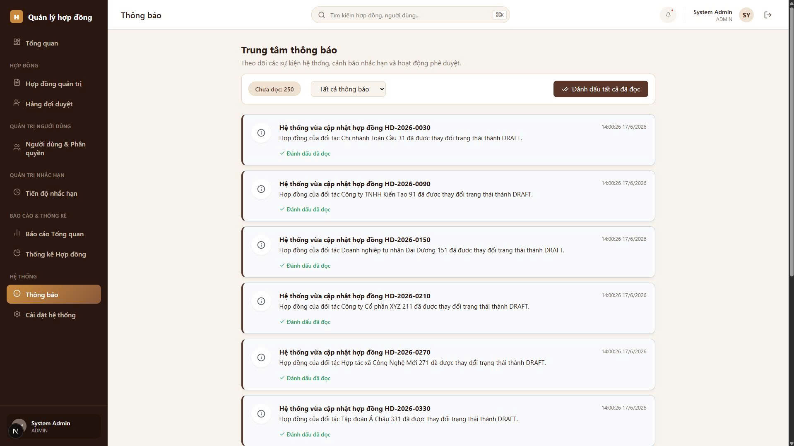

### 4.12.1. Mục đích

Hệ thống thông báo (Notifications) giữ vai trò quan trọng trong việc cập nhật thông tin kịp thời cho người dùng về các sự kiện liên quan đến hợp đồng. Thông báo bao gồm: hợp đồng cần phê duyệt, hợp đồng đã được duyệt/từ chối, hợp đồng sắp hết hạn, file mới được upload, và các hoạt động liên quan khác.

### 4.12.2. Chức năng chi tiết

| STT | Chức năng | Mô tả |
|-----|-----------|-------|
| 1 | Hiển thị danh sách thông báo | Liệt kê tất cả thông báo, mới nhất lên trước |
| 2 | Đánh dấu đã đọc | Click vào thông báo hoặc nút "Đánh dấu đã đọc" |
| 3 | Đánh dấu tất cả đã đọc | Nút "Đánh dấu tất cả đã đọc" |
| 4 | Lọc theo loại | Filter: Tất cả, Phê duyệt, Hết hạn, Hệ thống, Khác |
| 5 | Lọc theo trạng thái | Filter: Tất cả, Chưa đọc, Đã đọc |
| 6 | Bell icon badge | Hiển thị số thông báo chưa đọc trên icon chuông |
| 7 | Quick preview | Dropdown hiển thị 5 thông báo gần nhất |
| 8 | Điều hướng | Click thông báo chuyển đến entity liên quan |

## 4.13. Nhật ký hoạt động

### 4.13.1. Mục đích

Trang nhật ký hoạt động (Activity Log / Audit Trail) cung cấp cái nhìn toàn diện về mọi hành động đã diễn ra trong hệ thống. Đây là công cụ quan trọng cho Administrator trong việc giám sát, kiểm tra và truy vết các hoạt động của người dùng, đảm bảo tính minh bạch và an toàn cho hệ thống.

### 4.13.2. Chức năng chi tiết

| STT | Chức năng | Mô tả |
|-----|-----------|-------|
| 1 | Xem danh sách nhật ký | Hiển thị toàn bộ activity logs với pagination |
| 2 | Lọc theo người dùng | Filter logs theo user cụ thể |
| 3 | Lọc theo hành động | Filter theo action type (CREATE, UPDATE, DELETE, APPROVE, SIGN...) |
| 4 | Lọc theo đối tượng | Filter theo entity type (Contract, User, Template...) |
| 5 | Lọc theo thời gian | DateRangePicker cho khoảng thời gian |
| 6 | Xem chi tiết thay đổi | Expand log entry để xem detail/diff |
| 7 | Xuất nhật ký | Export ra CSV cho mục đích audit |
| 8 | Timeline view | Hiển thị dạng timeline theo ngày |

## 4.14. Quản lý quy trình phê duyệt

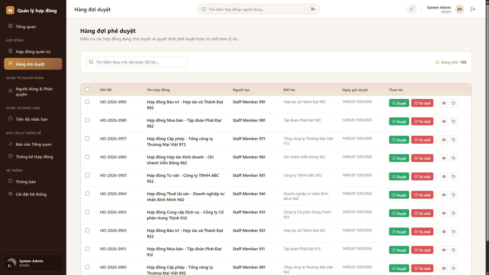

### 4.14.1. Mục đích

Trang quản lý quy trình phê duyệt (Approval Workflow) cho phép Administrator và Manager thiết lập các quy trình phê duyệt đa cấp cho hợp đồng. Mỗi workflow bao gồm nhiều bước (steps) được sắp xếp theo thứ tự, mỗi bước chỉ định một hoặc nhiều người phê duyệt (approver).

### 4.14.2. Chức năng chi tiết

| STT | Chức năng | Mô tả |
|-----|-----------|-------|
| 1 | Xem danh sách workflow | Hiển thị tất cả workflows với thông tin tóm tắt |
| 2 | Tạo workflow mới | Form tạo tên, mô tả, thêm các bước phê duyệt |
| 3 | Thêm bước phê duyệt | Thêm step mới: chọn approver, đặt tên bước |
| 4 | Sắp xếp thứ tự bước | Drag & drop hoặc nút lên/xuống để sắp xếp |
| 5 | Gán approver | Chọn người phê duyệt cho mỗi bước |
| 6 | Chỉnh sửa workflow | Cập nhật tên, mô tả, thêm/bớt/sắp xếp bước |
| 7 | Kích hoạt/Vô hiệu hóa | Toggle trạng thái active |
| 8 | Xóa workflow | Xóa workflow không sử dụng |

## 4.15. Hồ sơ cá nhân

### 4.15.1. Mục đích

Trang hồ sơ cá nhân (Profile) cho phép người dùng xem và cập nhật thông tin cá nhân của mình, bao gồm họ tên, ảnh đại diện, số điện thoại và mật khẩu. Mọi vai trò người dùng đều có quyền truy cập trang này.

### 4.15.2. Chức năng chi tiết

| STT | Chức năng | Mô tả |
|-----|-----------|-------|
| 1 | Xem thông tin cá nhân | Hiển thị thông tin hồ sơ hiện tại |
| 2 | Cập nhật thông tin | Chỉnh sửa họ tên, số điện thoại |
| 3 | Thay đổi avatar | Upload ảnh đại diện mới |
| 4 | Đổi mật khẩu | Form đổi mật khẩu (cũ → mới → xác nhận) |
| 5 | Xem thông tin tài khoản | Hiển thị email, vai trò, phòng ban (read-only) |

## 4.16. Báo cáo thống kê

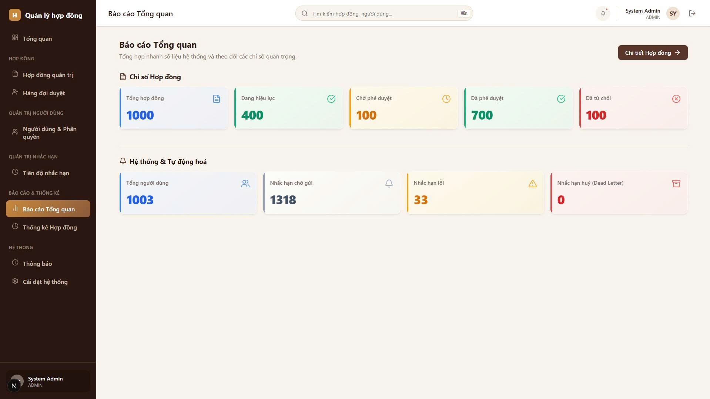

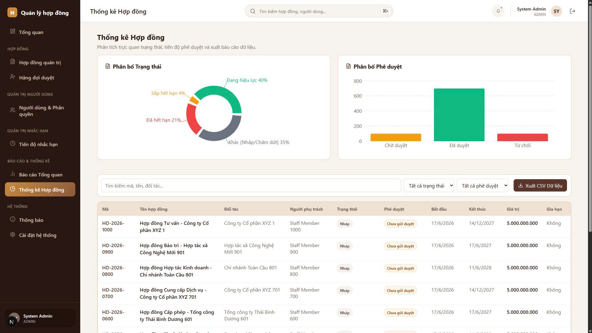

### 4.16.1. Mục đích

Trang báo cáo thống kê cung cấp các biểu đồ và báo cáo nâng cao hơn so với Dashboard, cho phép Administrator và Manager phân tích sâu dữ liệu hợp đồng theo nhiều chiều khác nhau. Người dùng có thể tùy chỉnh khoảng thời gian, lọc theo phòng ban, loại hợp đồng, và xuất báo cáo ra các định dạng PDF hoặc CSV để phục vụ cho công tác quản lý và báo cáo lãnh đạo.

### 4.16.2. Chức năng chi tiết

| STT | Chức năng | Mô tả |
|-----|-----------|-------|
| 1 | Biểu đồ xu hướng hợp đồng | Line chart theo tháng/quý/năm |
| 2 | Biểu đồ phân bố theo loại | Pie/Donut chart phân bố loại HĐ |
| 3 | Biểu đồ giá trị theo phòng ban | Bar chart giá trị HĐ theo phòng ban |
| 4 | Biểu đồ tỷ lệ hoàn thành | Stacked bar chart trạng thái theo tháng |
| 5 | Bảng tổng hợp | Summary table với tổng số, tổng giá trị, trung bình |
| 6 | Filter đa chiều | Lọc theo thời gian, phòng ban, loại HĐ, trạng thái |
| 7 | Xuất PDF | Generate và download báo cáo PDF |
| 8 | Xuất CSV | Export dữ liệu raw ra CSV |
| 9 | So sánh kỳ | So sánh dữ liệu giữa 2 khoảng thời gian |

## 4.17. Quản lý nhắc hạn (Jobs & Logs)

Màn hình theo dõi cơ chế nhắc hạn tự động. Tab **Lịch nhắc sắp tới (Jobs)** liệt kê các công việc nhắc hạn sắp được gửi kèm thời điểm dự kiến, loại nhắc và số lần thử lại; tab **Lịch sử đã gửi (Logs)** hiển thị kết quả gửi thực tế cùng trạng thái và phản hồi từ máy chủ thư điện tử.

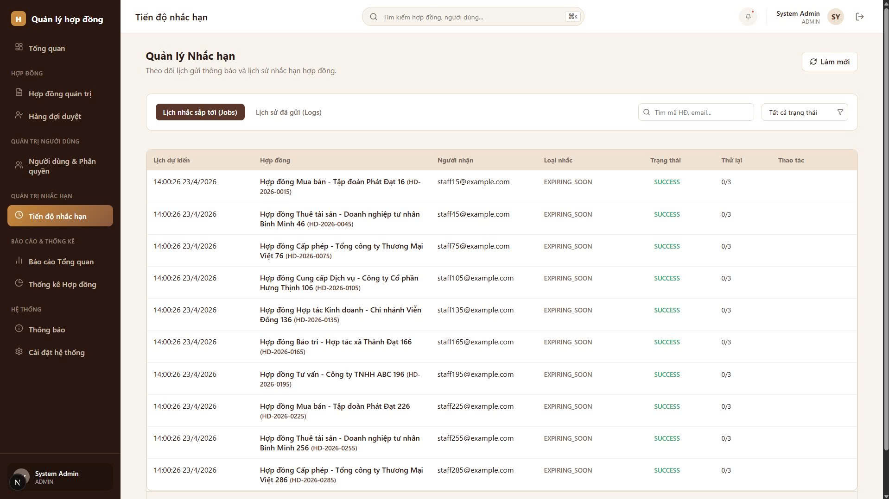

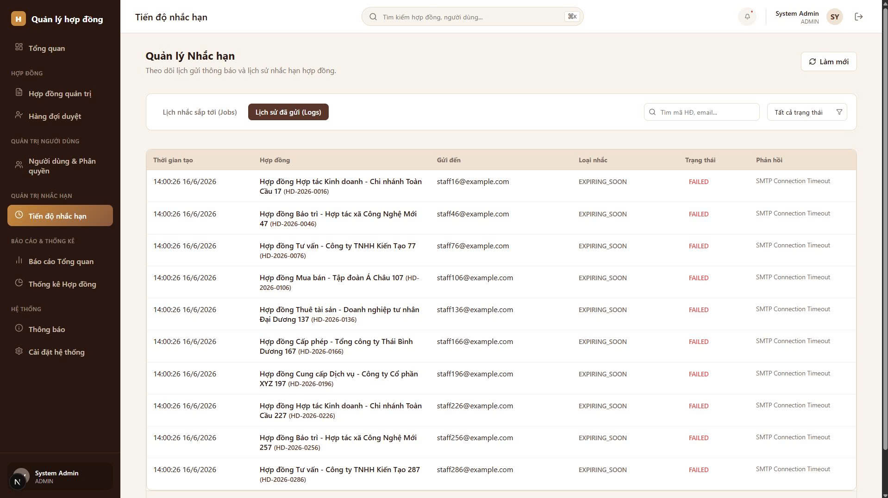

## 4.18. Cài đặt hệ thống

Màn hình cấu hình toàn hệ thống gồm: thông tin doanh nghiệp, cảnh báo & nhắc hạn, phân quyền & bảo mật, tích hợp & sao lưu dữ liệu.

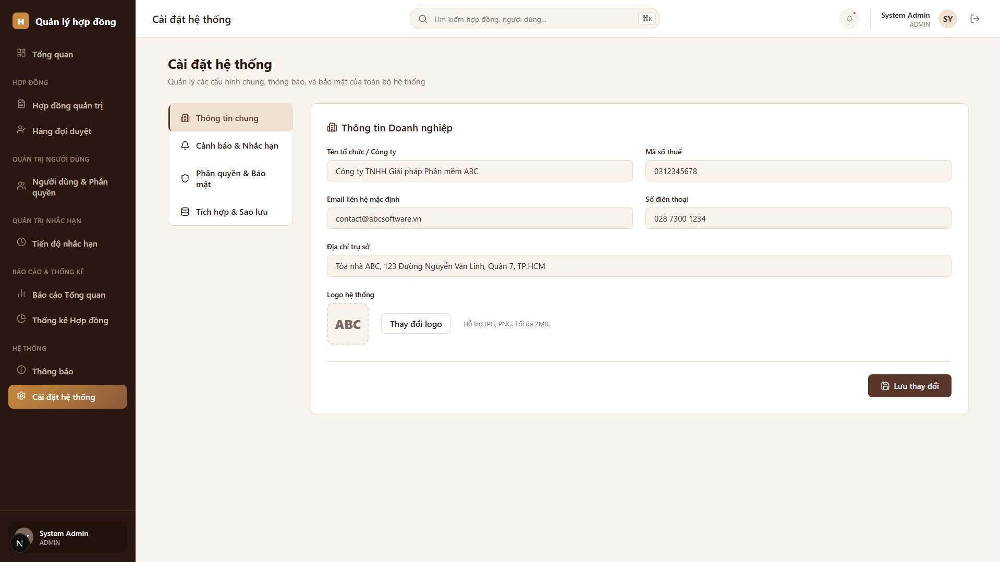

## 4.19. Tổng kết giao diện hệ thống

Bảng dưới đây tổng hợp toàn bộ các giao diện chính đã trình bày trong chương này, bao gồm route URL, vai trò có quyền truy cập, và số lượng component chính trên mỗi trang:

| STT | Giao diện | Route | Vai trò truy cập | Components chính |
|-----|-----------|-------|-------------------|-----------------|
| 1 | Trang chủ | `/` | Public | Header, Hero, Features, Footer |
| 2 | Đăng nhập | `/login` | Public | Login Form, Branding Panel |
| 3 | Dashboard | `/dashboard` | All authenticated | Stat Cards, Charts, Tables |
| 4 | Danh sách HĐ | `/contracts` | All authenticated | DataTable, Filters, Search |
| 5 | Chi tiết HĐ | `/contracts/:id` | All authenticated | Tabs, Timeline, Actions |
| 6 | Tạo HĐ | `/contracts/new` | Admin, Manager, Employee | Multi-step Form, Upload |
| 7 | Sửa HĐ | `/contracts/:id/edit` | Admin, Manager, Employee | Form, Version Compare |
| 8 | Ký HĐ | `/contracts/:id/sign` | Authorized parties | PDF Viewer, Signature Canvas |
| 9 | Quản lý Users | `/admin/users` | Administrator | DataTable, CRUD Dialogs |
| 10 | Quản lý Phòng ban | `/admin/departments` | Administrator | Card Grid, Members Sheet |
| 11 | Mẫu HĐ | `/templates` | Admin, Manager | Table/Grid, Editor |
| 12 | Thông báo | `/notifications` | All authenticated | Notification List, Filters |
| 13 | Nhật ký | `/admin/activity-logs` | Administrator | Log Table, Timeline |
| 14 | Quy trình phê duyệt | `/admin/workflows` | Admin, Manager | Workflow Builder, Steps |
| 15 | Hồ sơ cá nhân | `/profile` | All authenticated | Profile Form, Password |
| 16 | Báo cáo | `/reports` | Admin, Manager | Charts, Summary Table |

Toàn bộ giao diện được xây dựng với tiêu chuẩn cao về tính nhất quán, khả năng sử dụng, và hiệu năng. Việc sử dụng Shadcn/UI làm thư viện thành phần nền tảng đảm bảo mọi component đều có chất lượng cao, hỗ trợ accessibility, và dễ dàng tùy biến theo yêu cầu thiết kế cụ thể.

---

# CHƯƠNG 5: KẾT LUẬN

Chương này trình bày tổng kết quá trình nghiên cứu, thiết kế và xây dựng Hệ thống Quản lý Hợp đồng Điện tử (ECMS).

---

## 5.1. Ưu điểm

Hệ thống Quản lý Hợp đồng Điện tử (ECMS) đã đạt được nhiều kết quả tích cực, đáp ứng được các mục tiêu đề ra ban đầu.

### 5.1.1. Kiến trúc hiện đại và đồng nhất với Next.js 15 Full-stack

Hệ thống được xây dựng trên nền tảng Next.js 15 – framework React tiên tiến nhất hiện nay, cho phép triển khai cả Frontend và Backend trong cùng một codebase.

- **Đồng nhất công nghệ:** Sử dụng một ngôn ngữ (TypeScript) và một framework (Next.js) cho cả client và server, giảm thiểu sự phức tạp trong quản lý dự án và đào tạo nhân sự.
- **Server-Side Rendering (SSR) và Static Site Generation (SSG):** Tận dụng cơ chế rendering linh hoạt của Next.js để tối ưu SEO cho trang Landing Page và cải thiện thời gian tải trang (First Contentful Paint).
- **API Routes tích hợp:** API Routes của Next.js đóng vai trò Backend API, loại bỏ nhu cầu thiết lập và duy trì server riêng biệt (Express.js, NestJS), giảm chi phí vận hành hạ tầng.
- **App Router:** Sử dụng App Router (cấu trúc thư mục `app/`) – hệ thống routing mới nhất của Next.js với hỗ trợ layouts lồng nhau, loading states, error boundaries, và parallel routes.

### 5.1.2. Type-safe toàn diện với TypeScript và Prisma

Tính an toàn kiểu dữ liệu (Type Safety) được đảm bảo xuyên suốt từ tầng Database đến tầng UI:

- **TypeScript strict mode:** Toàn bộ codebase sử dụng TypeScript với `strict: true`, phát hiện lỗi tại compile-time thay vì runtime, giảm đáng kể số lượng bugs trong production.
- **Prisma ORM với auto-generated types:** Prisma tự động sinh ra TypeScript types từ schema database, đảm bảo mọi truy vấn database đều type-safe.
- **Zod validation:** Sử dụng Zod schema để validate dữ liệu đầu vào ở cả client và server, với inference TypeScript types trực tiếp từ schema validation, đảm bảo tính nhất quán.
- **End-to-end type safety:** Từ form input (React Hook Form + Zod) → API request → API route handler (Zod validation) → Prisma query → Database, mọi bước đều được kiểm tra kiểu dữ liệu tự động.

### 5.1.3. Bảo mật đa lớp

Hệ thống triển khai chiến lược bảo mật nhiều tầng (Defense-in-Depth) bao gồm:

- **JWT HttpOnly Cookies:** Access token được lưu trong HttpOnly Cookie, ngăn chặn XSS attack đọc token qua JavaScript.
- **CSRF Protection:** Sử dụng CSRF token cho các request mutation (POST, PUT, DELETE), ngăn chặn Cross-Site Request Forgery.
- **RBAC (Role-Based Access Control):** Hệ thống phân quyền 4 vai trò (Administrator, Manager, Employee, Customer/Partner) với bảng Permission granular, kiểm tra quyền ở cả API middleware và UI component level.
- **Input Validation:** Mọi dữ liệu đầu vào đều được sanitize và validate bằng Zod trước khi xử lý, ngăn chặn SQL Injection và XSS.
- **Password Hashing:** Mật khẩu được hash bằng bcrypt với salt rounds phù hợp, đảm bảo an toàn ngay cả khi database bị leak.
- **Rate Limiting:** API endpoints nhạy cảm (login, forgot password) có rate limiting để ngăn chặn brute force attacks.

### 5.1.4. Giao diện người dùng chuyên nghiệp và đáp ứng

UI/UX của hệ thống đạt chuẩn chuyên nghiệp nhờ sự kết hợp của:

- **Tailwind CSS:** Utility-first CSS framework cho phép styling nhanh chóng, nhất quán, và dễ maintain.
- **Shadcn/UI:** Thư viện component chất lượng cao, built on Radix UI primitives, đảm bảo accessibility (WCAG 2.1 AA), keyboard navigation, và screen reader compatibility.
- **Responsive Design:** Giao diện tương thích tốt trên Desktop, Tablet và Mobile thông qua Tailwind responsive breakpoints (`sm`, `md`, `lg`, `xl`).
- **Dark/Light Mode:** Hỗ trợ chế độ tối/sáng với `next-themes`, tự động phát hiện system preference.
- **Skeleton Loading:** Sử dụng skeleton screens thay vì spinner truyền thống, cải thiện perceived performance.
- **Toast Notifications:** Feedback trực quan cho mọi hành động của người dùng thông qua Sonner toast library.

### 5.1.5. Quy trình phê duyệt đa cấp linh hoạt

Hệ thống ApprovalWorkflow và ApprovalStep cho phép:

- **Thiết lập workflow tùy chỉnh:** Administrator có thể tạo nhiều workflow khác nhau phù hợp với từng loại hợp đồng (VD: hợp đồng giá trị lớn cần nhiều cấp duyệt hơn).
- **Sequential approval:** Các bước phê duyệt được thực hiện tuần tự, đảm bảo đúng trình tự cấp bậc.
- **AND/OR logic:** Mỗi bước có thể yêu cầu tất cả approver phải duyệt (AND) hoặc chỉ cần một approver (OR).
- **Notification tự động:** Khi đến lượt phê duyệt, approver nhận thông báo qua hệ thống và email.
- **Audit trail:** Mọi quyết định phê duyệt/từ chối đều được ghi log với ghi chú và timestamp.

### 5.1.6. Hệ thống nhắc nhở tự động

Hệ thống tích hợp cơ chế nhắc nhở tự động thông qua cron job:

- **Nhắc hợp đồng sắp hết hạn:** Tự động gửi thông báo trước 30, 15, 7, 3 ngày trước khi hợp đồng hết hạn.
- **Nhắc phê duyệt:** Nhắc nhở approver về hợp đồng đang chờ duyệt quá thời gian quy định.
- **Email notification:** Gửi email tự động cho người dùng liên quan, đảm bảo không bỏ sót hợp đồng quan trọng.
- **Cấu hình linh hoạt:** Cho phép tùy chỉnh khoảng thời gian nhắc nhở và kênh thông báo.

### 5.1.7. Audit Trail toàn diện

Hệ thống ActivityLog ghi lại đầy đủ mọi hành động diễn ra:

- **Ghi log tự động:** Mọi thao tác CRUD trên hợp đồng, người dùng, và các entity khác đều tự động ghi log.
- **Chi tiết thay đổi:** Lưu giá trị cũ và mới của từng trường bị thay đổi (field-level change tracking).
- **Metadata bảo mật:** Ghi nhận IP Address, User Agent, và Session ID cho mỗi hành động.
- **Không thể xóa:** Activity logs là append-only, không thể xóa hoặc chỉnh sửa, đảm bảo tính toàn vẹn.
- **Tìm kiếm và lọc:** Hỗ trợ filter theo người dùng, hành động, đối tượng, và thời gian.

### 5.1.8. Quản lý phiên bản hợp đồng

Hệ thống ContractVersion cho phép:

- **Version tracking:** Mỗi lần chỉnh sửa hợp đồng tạo ra một phiên bản mới, giữ nguyên phiên bản cũ.
- **So sánh thay đổi:** Giao diện diff so sánh side-by-side giữa hai phiên bản bất kỳ.
- **Rollback:** Khả năng khôi phục về phiên bản trước nếu cần.
- **Ghi chú phiên bản:** Mỗi phiên bản kèm theo ghi chú mô tả lý do thay đổi.
- **Truy xuất lịch sử:** Xem toàn bộ lịch sử chỉnh sửa với thông tin ai sửa, lúc nào, sửa gì.

### 5.1.9. Tìm kiếm và lọc nâng cao

Hệ thống cung cấp khả năng tìm kiếm và lọc mạnh mẽ:

- **Multi-field search:** Tìm kiếm đồng thời theo mã HĐ, tiêu đề, tên đối tác, nội dung.
- **Composite filters:** Kết hợp nhiều điều kiện lọc: trạng thái + loại + phòng ban + khoảng thời gian.
- **Debounced search:** Tìm kiếm real-time với debounce mechanism tránh gọi API quá nhiều.
- **URL-synced filters:** Trạng thái filter được đồng bộ với URL params, cho phép bookmark và share link tìm kiếm.
- **Sort đa cột:** Sắp xếp theo bất kỳ cột nào trong data table, hỗ trợ cả ascending và descending.

### 5.1.10. Dashboard thống kê trực quan với Recharts

Dashboard và trang Báo cáo sử dụng thư viện Recharts để tạo biểu đồ tương tác:

- **Đa dạng loại biểu đồ:** Bar Chart, Line Chart, Pie Chart, Area Chart, Stacked Bar Chart.
- **Responsive:** Biểu đồ tự động điều chỉnh kích thước theo container.
- **Interactive:** Tooltip hiển thị chi tiết khi hover, legend có thể toggle ẩn/hiện series.
- **Animated:** Hiệu ứng animation mượt mà khi data thay đổi.
- **Customizable:** Dễ dàng tùy biến màu sắc, nhãn, định dạng số theo yêu cầu.

### 5.1.11. Containerized Deployment với Docker

Hệ thống được đóng gói và triển khai bằng Docker:

- **Reproducible builds:** Dockerfile multi-stage đảm bảo môi trường build nhất quán.
- **Docker Compose:** File `docker-compose.yml` orchestrate toàn bộ stack (Next.js, PostgreSQL, MinIO, Nginx).
- **Environment isolation:** Mỗi service chạy trong container riêng biệt, tránh xung đột dependencies.
- **Easy deployment:** Triển khai lên VPS chỉ với một lệnh `docker-compose up -d`.
- **Scaling foundation:** Container-based architecture là nền tảng tốt cho việc scale horizontally trong tương lai.

### 5.1.12. Performance tối ưu

Hiệu năng hệ thống được tối ưu thông qua nhiều kỹ thuật:

- **SWR (Stale-While-Revalidate):** Caching strategy cho data fetching, hiển thị dữ liệu cached ngay lập tức và revalidate ở background.
- **Server-side pagination:** Chỉ fetch dữ liệu cần thiết cho trang hiện tại, giảm payload size.
- **Optimistic updates:** Cập nhật UI ngay lập tức khi user thao tác, rollback nếu API thất bại.
- **Image optimization:** Next.js Image component tự động optimize và lazy load images.
- **Code splitting:** Next.js tự động code split theo route, chỉ load JavaScript cần thiết.
- **Database indexing:** Prisma migrations bao gồm indexes cho các trường được query thường xuyên.

---

## 5.2. Nhược điểm

Bên cạnh các ưu điểm, hệ thống cũng tồn tại một số hạn chế cần được nhìn nhận khách quan để có hướng cải thiện phù hợp:

### 5.2.1. Chưa tích hợp chữ ký số CA (Certificate Authority)

Hệ thống hiện chỉ hỗ trợ chữ ký điện tử dạng cơ bản (vẽ/upload hình ảnh chữ ký), chưa tích hợp chữ ký số theo tiêu chuẩn CA (Certificate Authority) được pháp luật Việt Nam công nhận.

- **Chưa hỗ trợ USB Token:** Các thiết bị chữ ký số USB Token (VNPT-CA, Viettel-CA, FPT-CA) chưa được tích hợp vào quy trình ký kết trên web.
- **Giá trị pháp lý hạn chế:** Chữ ký dạng hình ảnh không có giá trị pháp lý tương đương chữ ký số CA theo Luật Giao dịch điện tử 2023 (Luật số 20/2023/QH15).
- **Chưa có PKI infrastructure:** Hệ thống chưa triển khai hạ tầng Public Key Infrastructure để xác thực và verify chữ ký số.
- **Khó áp dụng trong môi trường pháp lý nghiêm ngặt:** Đối với các hợp đồng có giá trị lớn hoặc liên quan đến cơ quan nhà nước, chữ ký hiện tại chưa đáp ứng yêu cầu pháp luật.

### 5.2.2. Chưa có ứng dụng di động (Mobile App)

Hệ thống chỉ có giao diện web responsive, chưa có ứng dụng native cho iOS và Android:

- **Không có push notification:** Thông báo trên mobile bị hạn chế so với native push notification.
- **Trải nghiệm offline:** Không thể xem hợp đồng khi không có kết nối internet.
- **Biometric authentication:** Chưa tận dụng được FaceID, TouchID, vân tay trên mobile devices.
- **Camera integration:** Chưa thể chụp ảnh tài liệu, scan QR code hợp đồng trực tiếp từ app.
- **Performance:** Web app trên mobile browser vẫn chậm hơn native app về mặt animation và responsiveness.

### 5.2.3. Kiến trúc Monolithic giới hạn khả năng mở rộng

Việc sử dụng Next.js full-stack (monolithic architecture) tuy tiện lợi cho phát triển ban đầu nhưng tạo ra hạn chế khi hệ thống cần scale lớn:

- **Coupling chặt:** Frontend và Backend nằm trong cùng codebase, thay đổi một phần có thể ảnh hưởng đến phần còn lại.
- **Scaling đồng bộ:** Không thể scale riêng Backend hoặc Frontend theo nhu cầu.
- **Deployment dependency:** Deploy Frontend buộc phải re-deploy cả Backend và ngược lại, tăng downtime risk.
- **Team scalability:** Khi team phát triển lớn hơn, nhiều developer làm việc trên cùng codebase dễ gây xung đột.
- **Technology lock-in:** Bị ràng buộc với Node.js runtime, khó tích hợp services viết bằng ngôn ngữ khác (Python, Go).

### 5.2.4. Chưa có Full-text Search (Elasticsearch)

Tìm kiếm hiện tại dựa trên PostgreSQL `LIKE` hoặc `ILIKE` query, có nhiều hạn chế:

- **Performance kém với dữ liệu lớn:** Khi số lượng hợp đồng tăng lên hàng trăm nghìn, query `LIKE '%keyword%'` sẽ rất chậm vì không sử dụng được index.
- **Không hỗ trợ full-text search features:** Thiếu fuzzy matching (tìm gần đúng), stemming (tìm theo gốc từ), synonym search (tìm từ đồng nghĩa).
- **Không search nội dung file:** Chưa thể tìm kiếm trong nội dung file PDF/DOC đính kèm.
- **Không ranking:** Kết quả tìm kiếm không được rank theo relevance score.
- **Không highlight:** Không highlight từ khóa trong kết quả tìm kiếm.

### 5.2.5. Chưa có Real-time Notification (WebSocket)

Hệ thống thông báo hiện sử dụng cơ chế polling hoặc refresh page để cập nhật:

- **Không real-time:** Người dùng phải refresh trang hoặc đợi polling interval để nhận thông báo mới.
- **Latency cao:** Độ trễ giữa khi sự kiện xảy ra và khi người dùng nhận thông báo có thể lên đến vài phút.
- **Bandwidth lãng phí:** Polling liên tục tạo request không cần thiết khi không có dữ liệu mới, tốn bandwidth.
- **Không có collaboration features:** Không thể hiển thị real-time khi nhiều người cùng xem/edit một hợp đồng (collaborative editing indicators).
- **Thiếu presence awareness:** Không hiển thị được trạng thái online/offline của người dùng khác.

### 5.2.6. Chưa tích hợp AI/OCR

Hệ thống chưa tận dụng trí tuệ nhân tạo và nhận dạng ký tự quang học:

- **Không OCR:** Chưa thể số hóa hợp đồng giấy bằng cách scan và trích xuất text tự động.
- **Không AI analysis:** Chưa có khả năng phân tích tự động nội dung hợp đồng, phát hiện điều khoản rủi ro, hoặc gợi ý cải thiện.
- **Không NLP:** Chưa thể trích xuất thông tin chính (entities, dates, amounts) từ văn bản hợp đồng tự động.
- **Không smart categorization:** Chưa tự động phân loại hợp đồng dựa trên nội dung.
- **Nhập liệu thủ công:** Mọi thông tin hợp đồng đều phải nhập tay, tốn thời gian và dễ sai sót.

### 5.2.7. Chưa có Workflow Builder động (Visual Builder)

Mặc dù đã có hệ thống ApprovalWorkflow, giao diện thiết lập vẫn còn đơn giản:

- **Chưa có drag-and-drop builder:** Chưa có giao diện kéo thả trực quan để thiết kế workflow phức tạp.
- **Chưa hỗ trợ branching logic:** Workflow hiện chỉ hỗ trợ sequential flow, chưa có conditional branching (VD: nếu giá trị > 1 tỷ thì thêm bước duyệt Giám đốc).
- **Chưa có parallel approval:** Chưa hỗ trợ nhiều bước phê duyệt diễn ra song song.
- **Không có dynamic forms:** Chưa thể tùy biến form fields theo từng bước của workflow.
- **Thiếu workflow templates:** Chưa có thư viện mẫu workflow để người dùng chọn nhanh.

### 5.2.8. Chưa có Multi-tenancy

Hệ thống hiện được thiết kế cho single organization:

- **Một database:** Tất cả dữ liệu nằm trong một database, không phân tách theo tổ chức.
- **Không tenant isolation:** Không thể deploy một instance phục vụ nhiều doanh nghiệp độc lập.
- **Không custom branding:** Mỗi tổ chức không thể customize logo, màu sắc, domain riêng.
- **Khó SaaS hóa:** Mô hình hiện tại không phù hợp để chuyển đổi thành SaaS product phục vụ nhiều khách hàng.
- **Quản lý tập trung:** Không có super admin level quản lý nhiều tenant.

---

## 5.3. Hướng phát triển

Dựa trên phân tích ưu nhược điểm ở trên, nhóm thực hiện đề xuất các hướng phát triển và mở rộng hệ thống trong tương lai nhằm khắc phục các hạn chế hiện tại và nâng cao giá trị sản phẩm:

### 5.3.1. Tích hợp chữ ký số USB Token

Tích hợp các dịch vụ chữ ký số được pháp luật Việt Nam công nhận, bao gồm:

- **VNPT-CA SmartSign:** Tích hợp API SmartSign của VNPT-CA cho phép ký số trực tiếp trên trình duyệt web thông qua USB Token hoặc HSM (Hardware Security Module).
- **Viettel-CA:** Hỗ trợ ký số qua thiết bị Viettel-CA USB Token.
- **Remote Signing:** Nghiên cứu giải pháp ký số từ xa (Remote Signing) không cần USB Token vật lý, sử dụng eSIM hoặc mobile app xác thực.
- **Xác thực chữ ký:** Triển khai verification service kiểm tra tính hợp lệ của chữ ký số, bao gồm kiểm tra certificate chain, CRL (Certificate Revocation List), và OCSP (Online Certificate Status Protocol).
- **Timestamp Authority (TSA):** Tích hợp dịch vụ đóng dấu thời gian đáng tin cậy để chứng minh thời điểm ký kết.

### 5.3.2. AI phân tích hợp đồng (NLP & Machine Learning)

Ứng dụng trí tuệ nhân tạo vào quy trình quản lý hợp đồng:

- **Clause Extraction:** Sử dụng NLP để tự động trích xuất các điều khoản quan trọng (giá trị, thời hạn, phạt vi phạm, điều kiện chấm dứt) từ văn bản hợp đồng.
- **Risk Assessment:** AI đánh giá mức độ rủi ro của hợp đồng dựa trên nội dung, phát hiện các điều khoản bất lợi hoặc thiếu sót.
- **Contract Summarization:** Tự động tạo bản tóm tắt hợp đồng, giúp người phê duyệt nhanh chóng nắm bắt nội dung chính.
- **Smart Suggestions:** Gợi ý cải thiện nội dung hợp đồng dựa trên best practices và dữ liệu lịch sử.
- **Anomaly Detection:** Phát hiện bất thường trong hợp đồng (giá trị quá cao/thấp, thời hạn bất thường, thiếu điều khoản bắt buộc).

### 5.3.3. OCR số hóa tài liệu

Tích hợp Optical Character Recognition để số hóa hợp đồng giấy:

- **Document Scanning:** Cho phép upload ảnh chụp hoặc scan hợp đồng giấy, sử dụng OCR engine (Tesseract, Google Cloud Vision, hoặc AWS Textract) để trích xuất text.
- **Automatic Data Extraction:** Sau khi OCR, tự động nhận diện và điền vào các trường thông tin hợp đồng (tên đối tác, giá trị, ngày tháng).
- **Image Enhancement:** Xử lý ảnh trước OCR (de-skew, noise reduction, contrast enhancement) để cải thiện độ chính xác.
- **Multi-language Support:** Hỗ trợ OCR cả tiếng Việt và tiếng Anh.

### 5.3.4. Workflow Builder động (Drag-and-Drop)

Nâng cấp hệ thống quản lý quy trình phê duyệt:

- **Visual Workflow Designer:** Giao diện kéo thả (sử dụng React Flow hoặc tương tự) cho phép thiết kế workflow phức tạp với branching, merging, parallel paths.
- **Conditional Logic:** Hỗ trợ điều kiện rẽ nhánh (VD: IF giá trị > 500 triệu THEN thêm bước duyệt Giám đốc).
- **Parallel Approval:** Nhiều bước phê duyệt diễn ra đồng thời, tất cả phải hoàn thành trước khi chuyển bước tiếp.
- **Escalation Rules:** Tự động escalate khi approver không phản hồi trong thời gian quy định (VD: sau 3 ngày không duyệt, chuyển lên cấp trên).
- **Workflow Templates Library:** Thư viện mẫu workflow phổ biến (phê duyệt đơn giản, phê duyệt đa cấp, phê duyệt song song).

### 5.3.5. Ứng dụng di động (Mobile App)

Phát triển ứng dụng mobile cho iOS và Android:

- **Cross-platform framework:** Sử dụng React Native (tận dụng codebase React hiện tại) hoặc Flutter để phát triển app cho cả hai nền tảng.
- **Core features trên mobile:** Dashboard, xem danh sách và chi tiết hợp đồng, nhận push notification, phê duyệt nhanh, ký số.
- **Biometric authentication:** Hỗ trợ đăng nhập bằng FaceID, TouchID, và vân tay.
- **Offline mode:** Cache dữ liệu cơ bản cho phép xem hợp đồng khi offline, đồng bộ khi có kết nối.
- **Camera integration:** Scan QR code hợp đồng, chụp ảnh tài liệu kèm OCR.

### 5.3.6. Chuyển đổi sang Microservices Architecture

Tái cấu trúc hệ thống theo kiến trúc microservices để cải thiện scalability:

- **Service decomposition:** Tách thành các service độc lập: Auth Service, Contract Service, Notification Service, File Service, Report Service.
- **API Gateway:** Triển khai API Gateway (Kong, AWS API Gateway) để routing, load balancing, rate limiting, và authentication centralized.
- **Message Queue:** Sử dụng RabbitMQ hoặc Apache Kafka cho asynchronous communication giữa các service (VD: khi hợp đồng được duyệt → trigger notification service + email service).
- **Independent scaling:** Mỗi service có thể scale độc lập dựa trên workload cụ thể.
- **Technology diversity:** Mỗi service có thể sử dụng tech stack phù hợp nhất (VD: Report Service bằng Python với Pandas).

### 5.3.7. Elasticsearch Full-text Search

Tích hợp Elasticsearch để nâng cao khả năng tìm kiếm:

- **Full-text indexing:** Index nội dung hợp đồng, metadata, và file đính kèm (sử dụng Ingest Attachment Plugin cho PDF/DOC).
- **Fuzzy matching:** Tìm kiếm gần đúng, hỗ trợ lỗi chính tả.
- **Vietnamese tokenizer:** Sử dụng plugin ICU Analysis hoặc custom analyzer cho tiếng Việt.
- **Search suggestions:** Auto-complete và search suggestions khi người dùng gõ.
- **Relevance ranking:** Kết quả tìm kiếm được xếp hạng theo độ liên quan.
- **Faceted search:** Lọc kết quả theo facets (loại, trạng thái, phòng ban, khoảng giá trị).

### 5.3.8. Redis Cache Layer

Triển khai Redis để cải thiện performance:

- **API Response Cache:** Cache kết quả query cho Dashboard stats, danh sách hợp đồng (với cache invalidation khi data thay đổi).
- **Session Store:** Di chuyển session management sang Redis để hỗ trợ horizontal scaling (sticky sessions không cần thiết).
- **Rate Limiting:** Implement distributed rate limiting với Redis counters.
- **Real-time data:** Sử dụng Redis Pub/Sub cho real-time features (notifications, presence).
- **Queue management:** Redis-based job queue (Bull) cho background tasks (email sending, report generation, cron jobs).

### 5.3.9. Audit nâng cao (Blockchain-based)

Nâng cấp hệ thống audit trail lên mức độ bảo mật cao hơn:

- **Blockchain Anchoring:** Định kỳ hash tất cả audit logs và lưu hash lên blockchain (Ethereum, Hyperledger) để chứng minh tính toàn vẹn, không thể tampering.
- **Merkle Tree:** Sử dụng Merkle Tree để verify nhanh chóng tính toàn vẹn của bất kỳ log entry nào.
- **Digital Notarization:** Dịch vụ chứng thực số cho hợp đồng đã ký, lưu fingerprint trên blockchain.
- **Compliance Reports:** Tự động generate compliance reports cho các quy định pháp luật (GDPR, Luật Giao dịch điện tử).

### 5.3.10. Hỗ trợ đa ngôn ngữ (Multi-language)

Mở rộng hệ thống hỗ trợ nhiều ngôn ngữ:

- **i18n framework:** Tích hợp `next-intl` hoặc `react-i18next` cho internationalization.
- **Ngôn ngữ hỗ trợ:** Tiếng Việt (mặc định), Tiếng Anh, Tiếng Nhật, Tiếng Hàn (phục vụ đối tác nước ngoài).
- **RTL support:** Hỗ trợ ngôn ngữ viết từ phải sang trái trong tương lai nếu cần.
- **Locale-specific formatting:** Định dạng ngày tháng, số tiền, đơn vị tiền tệ theo locale.
- **Content translation:** Cho phép dịch nội dung hợp đồng sang ngôn ngữ khác.

### 5.3.11. API Gateway và Rate Limiting nâng cao

Triển khai lớp API Gateway chuyên nghiệp:

- **Centralized Gateway:** Sử dụng Kong hoặc Traefik làm API Gateway, quản lý tất cả incoming requests.
- **Advanced Rate Limiting:** Rate limiting theo user, role, endpoint, và IP, với sliding window algorithm.
- **API Versioning:** Hỗ trợ versioning API (`/api/v1/`, `/api/v2/`) cho backward compatibility.
- **Request/Response Transformation:** Transform request/response tại gateway level.
- **Analytics & Monitoring:** Dashboard giám sát API usage, response times, error rates.
- **API Documentation:** Auto-generate OpenAPI (Swagger) documentation cho tất cả endpoints.

---

## 5.4. Tổng kết

Hệ thống Quản lý Hợp đồng Điện tử (ECMS) đã được nghiên cứu, thiết kế và triển khai thành công, đáp ứng được các mục tiêu đề ra ban đầu.

Về mặt kỹ thuật, hệ thống được xây dựng trên nền tảng công nghệ hiện đại (Next.js 15, TypeScript, PostgreSQL, Docker) với kiến trúc rõ ràng, code quality cao, và bảo mật đa lớp.

Mặc dù còn tồn tại một số hạn chế (chưa tích hợp chữ ký số CA, chưa có mobile app, kiến trúc monolithic), đây là những vấn đề có thể khắc phục trong các phiên bản tiếp theo.

Đồ án này không chỉ là sản phẩm học thuật mà còn có tiềm năng ứng dụng thực tế trong các doanh nghiệp vừa và nhỏ tại Việt Nam, góp phần số hóa quy trình quản lý hợp đồng, tiết kiệm thời gian, giảm chi phí vận hành, và tăng tính minh bạch trong quản lý.

---

# TÀI LIỆU THAM KHẢO

[1] R. S.

[2] I. Sommerville, *Software Engineering*, 10th ed.

[3] A. Silberschatz, H.

[4] C. J.

[5] R. Elmasri and S.

[6] A. S.

[7] E. Gamma, R.

[8] R. C.

[9] S. Newman, *Building Microservices: Designing Fine-Grained Systems*, 2nd ed.

[10] M. Jones, J.

[11] R. Fielding and J.

[12] R. T.

[13] Vercel, "Next.js Documentation," 2024. [Online].

[14] Meta Platforms, Inc., "React Documentation," 2024. [Online].

[15] Microsoft, "TypeScript Documentation," 2024. [Online].

[16] Prisma, "Prisma Documentation – Next-generation Node.js and TypeScript ORM," 2024. [Online].

[17] The PostgreSQL Global Development Group, "PostgreSQL Documentation," 2024. [Online].

[18] Tailwind Labs, "Tailwind CSS Documentation," 2024. [Online].

[19] shadcn, "shadcn/ui – Beautifully designed components," 2024. [Online].

[20] Docker, Inc., "Docker Documentation," 2024. [Online].

[21] MinIO, Inc., "MinIO Documentation – High Performance Object Storage," 2024. [Online].

[22] Nginx, Inc., "NGINX Documentation," 2024. [Online].

[23] Recharts Contributors, "Recharts – A composable charting library built on React components," 2024. [Online].

[24] Quốc hội nước Cộng hòa xã hội chủ nghĩa Việt Nam, "Luật Giao dịch điện tử số 20/2023/QH15," ngày 22 tháng 06 năm 2023. [Trực tuyến].

[25] Chính phủ nước Cộng hòa xã hội chủ nghĩa Việt Nam, "Nghị định 130/2018/NĐ-CP Quy định chi tiết thi hành Luật Giao dịch điện tử về chữ ký số và dịch vụ chứng thực chữ ký số," ngày 27 tháng 09 năm 2018.

[26] S. Mason and D.

[27] A. Leff and J.

[28] T. Nguyen Van and H.

[29] M. Fowler, *Patterns of Enterprise Application Architecture*.

[30] N. Rozanski and E.

[31] OWASP Foundation, "OWASP Top Ten Web Application Security Risks," 2021. [Online].

[32] B. Pfaffenberger, S.

[33] A. Banks and E.

[34] B. Holt, "Complete Intro to React, v8," Frontend Masters, 2023.

[35] K. C.

[36] TanStack Contributors, "TanStack Table v8 Documentation," 2024. [Online].

[37] Vercel, "SWR – React Hooks for Data Fetching," 2024. [Online].

[38] T. H.

[39] D. Ferraiolo, R.

[40] M. Jones, "JSON Web Algorithms (JWA)," IETF, RFC 7518, May 2015.

<div style="page-break-after: always;"></div>

