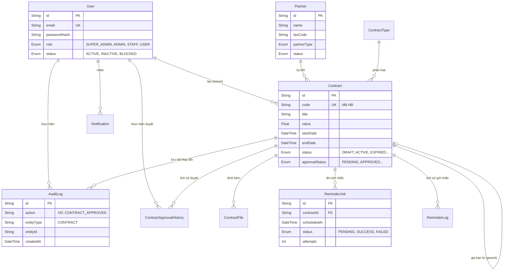

# BÁO CÁO TỔNG QUAN HỆ THỐNG QUẢN LÝ HỢP ĐỒNG ĐIỆN TỬ (E-CONTRACT MANAGEMENT SYSTEM)

**Phiên bản tài liệu:** 1.0 (Dành cho Báo cáo Công ty)
**Dự án:** Hệ thống quản lý hợp đồng điện tử và nhắc mốc gia hạn thông minh.
**Mục tiêu:** Số hoá toàn diện quy trình quản lý hợp đồng truyền thống, loại bỏ rủi ro thất lạc văn bản, tự động hoá quy trình phê duyệt đa cấp và giám sát chặt chẽ các mốc thời hạn quan trọng của hợp đồng.

---

## 1. TỔNG QUAN KIẾN TRÚC VÀ CÔNG NGHỆ (TECHNOLOGY STACK)

Dự án được xây dựng trên nền tảng kiến trúc **Monolithic Modern (Full-stack Framework)** mang lại sự đồng bộ cao giữa Frontend và Backend, dễ dàng bảo trì và triển khai.

### 1.1. Frontend (Giao diện người dùng)
- **Next.js 15 (App Router):** Framework React mạnh mẽ nhất hiện nay, hỗ trợ Server-Side Rendering (SSR) và tối ưu hoá SEO, tốc độ tải trang.
- **React 18:** Xây dựng giao diện dựa trên Component, xử lý luồng dữ liệu mượt mà.
- **SWR (Stale-While-Revalidate):** Quản lý trạng thái và bộ đệm (cache) phía client, tự động đồng bộ dữ liệu theo thời gian thực mà không làm giật lag giao diện.
- **Thiết kế UI/UX (Glassmorphism):** Sử dụng Pure CSS Variables và CSS Modules. Áp dụng phong cách thiết kế kính mờ (Glassmorphism) mang lại cảm giác hiện đại, sang trọng và không gian mở cho nền tảng doanh nghiệp.

### 1.2. Backend (Xử lý nghiệp vụ & API)
- **Next.js API Routes (Serverless-ready):** Toàn bộ API RESTful được xây dựng tích hợp ngay trong dự án. 
- **Kiến trúc Layered (Service-Oriented):** Tách biệt rõ ràng tầng Controller (API Routes) và tầng Business Logic (Services), giúp code dễ dàng viết Unit Test và tái sử dụng.
- **Background Worker & Cron Job (Giả lập):** Cơ chế chạy ngầm liên tục quét cơ sở dữ liệu để thực thi các tác vụ trễ như gửi Email nhắc hạn hợp đồng (hàng đợi Queue có cơ chế Retry khi lỗi).

### 1.3. Cơ sở dữ liệu & ORM (Database & Persistence)
- **Prisma ORM:** Cầu nối giao tiếp với cơ sở dữ liệu mạnh mẽ, hỗ trợ Type-safe 100% (kiểm soát kiểu dữ liệu chặt chẽ từ DB đến Frontend).
- **SQLite:** CSDL quan hệ nhẹ, tốc độ cao được dùng cho môi trường phát triển (Dễ dàng migrate đổi sang PostgreSQL/MySQL khi lên môi trường Production nhờ Prisma).

### 1.4. Bảo mật & Kiểm thử (Security & Testing)
- **Bảo mật Đa lớp:** 
  - **JWT (JSON Web Token):** Lưu trữ trong HttpOnly Cookie để chống tấn công XSS.
  - **CSRF Token:** Chống tấn công giả mạo request liên miền.
  - **RBAC (Role-based Access Control):** Phân quyền chặt chẽ từng endpoint.
- **Automation Testing:**
  - **Vitest:** Kiểm thử các hàm cốt lõi (Unit tests).
  - **Playwright:** Khung kiểm thử tự động toàn luồng giao diện (E2E Tests), đóng vai người dùng thật click/gõ phím để đảm bảo không vỡ luồng nghiệp vụ.

---

## 2. KIẾN TRÚC SƠ ĐỒ USE-CASE (USE-CASE DIAGRAM)

Hệ thống phân cấp quyền hạn thành 4 nhóm đối tượng chính, mỗi đối tượng có một giới hạn chức năng cụ thể nhằm đảm bảo tính bảo mật và tính chuyên trách của doanh nghiệp.

```mermaid
usecaseDiagram
    actor Hệ_thống_Tự_động as "Hệ Thống (Background Worker)"
    
    actor User as "User (Người dùng cơ bản)"
    actor Staff as "Staff (Nhân viên)"
    actor Admin as "Admin (Quản lý/Trưởng phòng)"
    actor SuperAdmin as "Super Admin (Quản trị hệ thống)"
    
    User <|-- Staff
    Staff <|-- Admin
    Admin <|-- SuperAdmin

    usecase "Đăng nhập / Đăng xuất" as UC_Auth
    usecase "Xem bảng tin (Dashboard) cá nhân" as UC_Dashboard
    usecase "Xem danh sách hợp đồng & Tải file" as UC_ViewContracts
    usecase "Nhận thông báo hệ thống" as UC_Notifications
    
    usecase "Tạo mới hợp đồng" as UC_CreateContract
    usecase "Chỉnh sửa hợp đồng (Bản nháp)" as UC_EditContract
    usecase "Gửi trình duyệt hợp đồng" as UC_Submit

    usecase "Phê duyệt / Từ chối (Hàng loạt)" as UC_Approve
    usecase "Xem báo cáo thống kê toàn cảnh" as UC_ViewReports
    usecase "Xuất báo cáo Excel/CSV" as UC_Export

    usecase "Quản lý Tài khoản (Thêm/Sửa/Khoá)" as UC_ManageUsers
    usecase "Phân quyền User" as UC_AssignRoles
    usecase "Tra cứu lịch sử kiểm toán (Audit Logs)" as UC_AuditLogs

    usecase "Quét hợp đồng sắp hết hạn" as UC_Scan
    usecase "Đẩy Job gửi Email nhắc nhở" as UC_SendEmail

    %% Kết nối Actor với Usecase
    User --> UC_Auth
    User --> UC_Dashboard
    User --> UC_ViewContracts
    User --> UC_Notifications

    Staff --> UC_CreateContract
    Staff --> UC_EditContract
    Staff --> UC_Submit

    Admin --> UC_Approve
    Admin --> UC_ViewReports
    Admin --> UC_Export

    SuperAdmin --> UC_ManageUsers
    SuperAdmin --> UC_AssignRoles
    SuperAdmin --> UC_AuditLogs

    Hệ_thống_Tự_động --> UC_Scan
    Hệ_thống_Tự_động --> UC_SendEmail
```

### Chi tiết các phân hệ:
1. **Quản lý hợp đồng:** Số hoá tệp tin đính kèm. Chuẩn hoá vòng đời: DRAFT (Nháp) ➔ PENDING (Chờ duyệt) ➔ APPROVED (Đã duyệt) ➔ ACTIVE (Đang chạy) ➔ EXPIRING (Sắp hết hạn) ➔ EXPIRED/TERMINATED.
2. **Luồng Phê duyệt:** Cấp lãnh đạo có thể phê duyệt hoặc từ chối kèm lý do. Hệ thống có cơ chế duyệt hàng loạt (Bulk Actions) để tối ưu thời gian.
3. **Nhắc mốc gia hạn:** Chạy hoàn toàn tự động phía sau server (Background Job). Tự động phân loại mốc 30-15-7 ngày và đẩy thông báo cho người chịu trách nhiệm.

---

## 3. MÔ HÌNH THỰC THỂ KẾT HỢP (ERD - ENTITY RELATIONSHIP DIAGRAM)

Sơ đồ thiết kế Cơ sở dữ liệu chuẩn hoá, tối ưu truy vấn và ràng buộc dữ liệu chặt chẽ.



---

## 4. CẤU TRÚC THƯ MỤC DỰ ÁN (PROJECT STRUCTURE)

Dự án được sắp xếp cực kỳ khoa học, tuân thủ nguyên tắc Domain-Driven Design (cơ bản) và Component-Based.

```text
E-CONTRACT-SYSTEM/
├── app/                        # [Nền tảng Next.js App Router]
│   ├── (dashboard)/            # Chứa toàn bộ giao diện sau đăng nhập (Bảo vệ bởi Middleware)
│   │   ├── admin/              # Màn hình quản trị (Chỉ ADMIN/SUPER_ADMIN thấy)
│   │   ├── contracts/          # Màn hình quản lý hợp đồng
│   │   ├── notifications/      # Trung tâm thông báo
│   │   └── settings/           # Cài đặt cấu hình cá nhân
│   ├── api/                    # [Backend] RESTful API endpoints
│   │   ├── admin/              # API phân quyền, báo cáo, duyệt hợp đồng
│   │   ├── auth/               # API xác thực JWT, Login, Logout
│   │   ├── contracts/          # API nghiệp vụ hợp đồng chính
│   │   └── reminders/          # API xử lý ngầm gửi thông báo
│   ├── login/                  # Giao diện đăng nhập tĩnh
│   └── globals.css             # Định nghĩa Design System (CSS Variables)
│
├── components/                 # [React UI Components] Modules tái sử dụng cao
│   ├── admin/                  # Bảng số liệu, Biểu đồ thống kê (Recharts)
│   ├── contracts/              # Form tạo mới, Form tìm kiếm hợp đồng
│   ├── layout/                 # Bộ khung (Sidebar, Header thông minh, Menu)
│   └── shared/                 # Thành phần vi mô (Nút bấm, Bảng dữ liệu, Popup cảnh báo)
│
├── lib/                        # [Core Libraries] Các tiện ích hệ thống cốt lõi
│   ├── auth.ts                 # Trái tim bảo mật (Mã hoá/Giải mã Token, phân quyền)
│   ├── csv.ts                  # Bộ nén và xuất file CSV (Chèn UTF-8 BOM chống lỗi font)
│   ├── api-client.ts           # Wrapper chuẩn hoá mọi Request lên server
│   └── prisma.ts               # Khởi tạo siêu kết nối đến CSDL
│
├── services/                   # [Business Logic Layer] Tầng xử lý nghiệp vụ nặng
│   ├── approval.service.ts     # Xử lý ma trận trạng thái duyệt
│   ├── contract.service.ts     # Thao tác CSDL (Tạo/Sửa/Xoá hợp đồng an toàn)
│   ├── dashboard.service.ts    # Tính toán, nhóm dữ liệu phục vụ biểu đồ KPI
│   └── reminder.service.ts     # Trái tim của hệ thống nhắc hạn ngầm
│
├── prisma/                     # [Database Configuration]
│   ├── schema.prisma           # Trực quan hoá toàn bộ CSDL (Mã nguồn duy nhất cho DB)
│   └── seed.ts                 # Script tự động sinh 1000+ dữ liệu giả lập để test hiệu năng
│
├── tests/                      # [Quality Assurance]
│   ├── e2e/                    # Chạy robot giả lập người dùng thao tác trên trình duyệt
│   └── unit/                   # Kiểm tra tính đúng đắn của từng hàm nhỏ (VD: Test BOM CSV)
│
└── docs/                       # Tài liệu lưu trữ vòng đời dự án (Báo cáo Audit, Bug log)
```

---

## 5. HƯỚNG DẪN TRIỂN KHAI VÀ VẬN HÀNH (DEPLOYMENT & SETUP)

### 5.1. Cài đặt Môi trường Phát triển (Local Setup)

```bash
# 1. Tải các gói thư viện phụ thuộc
npm install

# 2. Sinh mã kết nối cơ sở dữ liệu (Prisma Client)
npx prisma generate

# 3. Chạy Migration (Khởi tạo CSDL SQLite)
npx prisma migrate dev

# 4. Sinh dữ liệu mẫu (1000+ hợp đồng, phòng ban, người dùng)
npm run prisma:seed

# 5. Khởi động Web Server (Môi trường dev)
npm run dev
```

Truy cập hệ thống tại: `http://localhost:3000`

### 5.2. Chạy Kiểm thử (QA & Testing)

```bash
# Quét lỗi cú pháp và cảnh báo code smell
npm run lint          

# Chạy Unit Tests để đảm bảo logic cốt lõi không vỡ
npm run test          

# Chạy kịch bản người dùng thật (End-to-End Tests)
npm run test:e2e      
```

### 5.3. Tài khoản Trải nghiệm Hệ thống (Dữ liệu mẫu)
Mật khẩu chung cho mọi tài khoản: `Staff@12345`

1. **Super Admin:** `system@example.com` (Toàn quyền sinh sát, quản trị hệ thống)
2. **Admin:** `admin@example.com` (Trưởng phòng: Xem báo cáo, Duyệt hợp đồng hàng loạt)
3. **Staff:** `staff@example.com` (Nhân viên: Tạo hợp đồng, tải file PDF, gửi duyệt)
4. **User:** `john@example.com` (Khách/Thực tập sinh: Chỉ được xem)

---
*Tài liệu được trích xuất và bảo lưu từ quy trình phát triển chuyên nghiệp của Hệ thống Quản lý Hợp đồng.*
