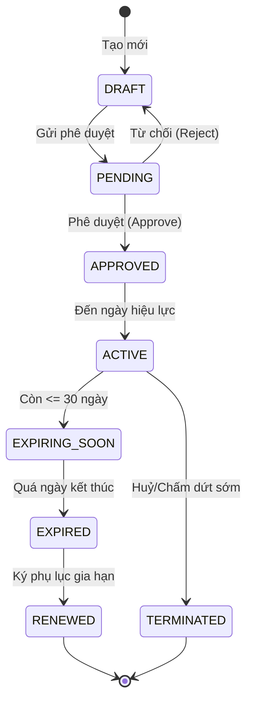
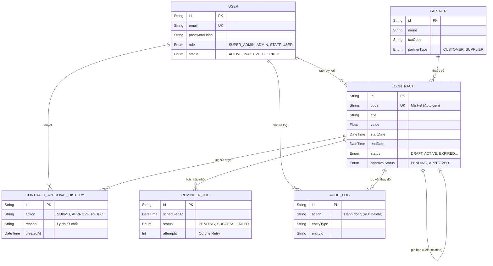

# BÁO CÁO KỸ THUẬT CHI TIẾT: HỆ THỐNG QUẢN LÝ HỢP ĐỒNG ĐIỆN TỬ VÀ NHẮC MỐC GIA HẠN
*(E-Contract Management & Automated Reminder System)*

**Phiên bản tài liệu:** 2.0 (Bản Báo Cáo Chuyên Sâu Cấp Doanh Nghiệp)  
**Mục tiêu nền tảng:** Số hoá toàn diện quy trình vòng đời hợp đồng, từ khâu khởi tạo, lưu trữ, trình duyệt đa cấp, đến tự động hoá cảnh báo nhắc mốc thời hạn. Giải pháp giúp doanh nghiệp loại bỏ hoàn toàn rủi ro phạt vi phạm do trễ hạn hợp đồng, chống thất lạc hồ sơ và tăng cường tính minh bạch (Audit Trail).

---

## 1. KIẾN TRÚC HỆ THỐNG TỔNG THỂ (SYSTEM ARCHITECTURE)

Hệ thống tuân thủ kiến trúc **Monolithic Service-Oriented (Nguyên khối hướng Dịch vụ)** kết hợp với Serverless API, giúp tối ưu hoá thời gian phản hồi và linh hoạt trong việc mở rộng (Scale).

```mermaid
flowchart TD
    subgraph Client [Client-Side (Trình duyệt)]
        UI[Giao diện Next.js / React]
        SWR[SWR Cache Management]
    end

    subgraph Server [Server-Side (Next.js API Routes)]
        MW[Auth & CSRF Middleware]
        Ctrl[API Controllers (Routes)]
        
        subgraph Services [Business Logic Layer]
            AuthSvc(Auth Service)
            ContractSvc(Contract Service)
            ApprovalSvc(Approval Service)
            ReminderSvc(Reminder/Cron Service)
            ReportSvc(Dashboard & Report)
        end
    end

    subgraph Persistence [Database Layer]
        ORM[Prisma ORM]
        DB[(SQLite / PostgreSQL DB)]
    end

    %% Luồng dữ liệu
    UI <-->|HTTP/REST| MW
    SWR -.->|Auto-fetch| UI
    MW -->|Validate Request| Ctrl
    Ctrl --> AuthSvc
    Ctrl --> ContractSvc
    Ctrl --> ApprovalSvc
    Ctrl --> ReminderSvc
    Ctrl --> ReportSvc
    
    AuthSvc --> ORM
    ContractSvc --> ORM
    ApprovalSvc --> ORM
    ReminderSvc --> ORM
    ReportSvc --> ORM
    
    ORM <--> DB
```

### 1.1. Chi Tiết Công Nghệ (Technology Stack)
- **Frontend (Tầng Hiển Thị):**
  - **Next.js 15 (App Router):** Xử lý Server-Side Rendering (SSR) hỗ trợ tải trang nhanh chóng và SEO. Phân tách ranh giới rõ ràng giữa Server Components và Client Components.
  - **React 18:** Kiến trúc Component-based.
  - **SWR (Stale-While-Revalidate):** Chiến lược cache dữ liệu thông minh, giúp UI luôn cập nhật realtime mà không cần spam API.
  - **CSS Modules & CSS Variables:** Thiết kế UI theo chuẩn Glassmorphism (Kính mờ) tạo sự chuyên nghiệp.
- **Backend (Tầng Nghiệp Vụ):**
  - **Next.js API (Serverless Routes):** Các RESTful endpoint xử lý logic nghiệp vụ.
  - **Zod:** Thư viện Validation siêu tốc, kiểm tra chặt chẽ cấu trúc dữ liệu Payload từ người dùng trước khi đưa vào CSDL.
  - **Bcrypt.js:** Mã hoá mật khẩu (Hashing) an toàn một chiều.
- **Cơ sở dữ liệu (Tầng Lưu Trữ):**
  - **Prisma ORM:** Framework tương tác CSDL kiểu an toàn (Type-safe), tự động sinh Typescript interface từ Schema.
  - **SQLite:** CSDL mặc định cho phát triển (Dev). Hoàn toàn tương thích chuyển đổi 1-1 sang PostgreSQL cho môi trường Production.

---

## 2. BIỂU ĐỒ USE-CASE CHI TIẾT (USE-CASE DIAGRAMS)

Hệ thống triển khai mô hình **RBAC (Role-Based Access Control)** với 4 cấp độ:
1. `USER`: Chỉ có quyền xem danh sách và chi tiết các hợp đồng được cấp phép.
2. `STAFF`: Quyền tạo hợp đồng nháp (Draft), chỉnh sửa hợp đồng của mình và gửi yêu cầu phê duyệt.
3. `ADMIN`: Quyền quản lý toàn bộ hợp đồng, phê duyệt/từ chối, xem báo cáo thống kê và xuất file.
4. `SUPER_ADMIN`: Toàn quyền hệ thống, quản trị phân quyền tài khoản và tra cứu lịch sử kiểm toán.

```mermaid
flowchart LR
    %% Định dạng Actors
    System(("Hệ Thống\n(Background Job)"))
    Staff(("Staff\n(Nhân viên)"))
    Admin(("Admin\n(Quản lý)"))
    SuperAdmin(("Super Admin\n(Quản trị)"))

    %% Nhóm Usecase Hợp đồng
    subgraph Quản Lý Hợp Đồng
        UC_Create([Tạo hợp đồng nháp])
        UC_Submit([Gửi trình duyệt])
        UC_Approve([Duyệt/Từ chối hàng loạt])
        UC_View([Xem danh sách & Tải PDF])
    end

    %% Nhóm Usecase Hệ thống & Báo cáo
    subgraph Báo Cáo & Quản Trị
        UC_Report([Xem Dashboard Thống kê])
        UC_Export([Xuất file CSV UTF-8])
        UC_Users([Quản lý Tài khoản])
        UC_Audit([Tra cứu Audit Logs])
    end

    %% Nhóm Usecase Tự động
    subgraph Tự Động Hoá (Cron)
        UC_Scan([Quét Hợp đồng hết hạn])
        UC_Queue([Đẩy Job vào Hàng đợi])
        UC_Mail([Gửi Email nhắc nhở])
    end

    %% Gán luồng
    Staff --> UC_Create
    Staff --> UC_Submit
    Staff --> UC_View

    Admin --> UC_Approve
    Admin --> UC_Report
    Admin --> UC_Export
    Admin --> UC_View

    SuperAdmin --> Admin
    SuperAdmin --> UC_Users
    SuperAdmin --> UC_Audit

    System --> UC_Scan
    System --> UC_Queue
    System --> UC_Mail
```

---

## 3. VÒNG ĐỜI TRẠNG THÁI HỢP ĐỒNG (STATE MACHINE DIAGRAM)

Hợp đồng trong hệ thống không thể bị thay đổi trạng thái một cách tuỳ tiện. Toàn bộ phải đi qua một luồng (Workflow) khép kín, đảm bảo tính pháp lý.



---

## 4. SƠ ĐỒ THỰC THỂ CƠ SỞ DỮ LIỆU (ERD - ENTITY RELATIONSHIP)

Cơ sở dữ liệu được thiết kế đạt chuẩn **Chuẩn hoá 3NF**, hạn chế tối đa dư thừa dữ liệu và đảm bảo toàn vẹn tham chiếu (Referential Integrity).



### Giải thích các Bảng trọng yếu:
- **Bảng `User` & `Partner`:** Quản lý danh tính và thông tin đối tác ký kết.
- **Bảng `Contract`:** Trái tim của hệ thống. Chứa toàn bộ Meta-data của hợp đồng.
- **Bảng `ContractApprovalHistory`:** Lưu trữ chặt chẽ ai đã duyệt, duyệt lúc nào, lý do từ chối là gì. Phục vụ truy vết.
- **Bảng `ReminderJob` & `ReminderLog`:** Triển khai cơ chế Hàng đợi (Queue) cho việc gửi Email. Tránh việc nghẽn Server khi phải gửi hàng ngàn Email cùng lúc.
- **Bảng `AuditLog`:** Tính năng cao cấp. Bất cứ hành động CRUD nào tác động lên DB đều được ghi lại (Kẻ xâm nhập không thể xoá không để lại dấu vết).

---

## 5. CƠ CHẾ BẢO MẬT & XỬ LÝ LỖI (SECURITY & ERROR HANDLING)

Hệ thống được lập trình với tư duy **Security-First (Bảo mật đặt lên hàng đầu)**:
1. **Chống XSS (Cross-Site Scripting):** Mọi Token đăng nhập (JWT) được lưu vào **HttpOnly Cookie**. JavaScript phía Client hoàn toàn không thể đánh cắp token này.
2. **Chống CSRF (Cross-Site Request Forgery):** Bổ sung custom header (`x-csrf-token`) bắt buộc ở mọi request thay đổi dữ liệu (POST, PUT, DELETE).
3. **Phân Quyền Tuyệt Đối (Server-Side Authorization):** Không chỉ ẩn nút bấm ở Frontend, hệ thống chặn trực tiếp các truy cập trái phép tại API bằng hàm `assertAdmin()` hoặc kiểm tra quyền sở hữu hợp đồng `contract.ownerId === user.id`.
4. **Data Validation (Zod):** Nếu người dùng cố tình gửi dữ liệu ngày bắt đầu lớn hơn ngày kết thúc (`startDate > endDate`), Backend sẽ huỷ Request ngay lập tức kèm mã lỗi 400 Bad Request.

---

## 6. CẤU TRÚC MÃ NGUỒN CHUYÊN SÂU (DIRECTORY STRUCTURE)

Dự án áp dụng cấu trúc thư mục quy chuẩn, tách biệt hoàn toàn Giao diện, Logic và CSDL.

```text
E-CONTRACT-SYSTEM/
├── app/                        # 1. Routing & API Controllers
│   ├── (dashboard)/            # Frontend Pages (Server Components + Client Components)
│   ├── api/                    # Backend API Endpoints (Nhận request, trả JSON)
│   └── globals.css             # Định nghĩa Design Tokens (Màu sắc, Font)
│
├── components/                 # 2. Reusable UI Components
│   ├── admin/                  # Các tổ hợp chức năng phức tạp (Bảng thống kê, Modal duyệt)
│   ├── dashboard/              # Các Widget thống kê thời gian thực
│   └── shared/                 # Thành phần nguyên tử (Button, Input, Alert, DataTable)
│
├── services/                   # 3. Core Business Logic (Tầng Cốt Lõi)
│   ├── approval.service.ts     # Trọng tài xử lý logic duyệt hợp đồng (Ma trận trạng thái)
│   ├── contract.service.ts     # Thao tác CSDL (Tạo/Sửa/Xoá hợp đồng)
│   ├── reminder.service.ts     # Công cụ rà quét hợp đồng cận date
│   └── admin.service.ts        # Quản trị hệ thống và người dùng
│
├── lib/                        # 4. Utilities & Configs
│   ├── api-client.ts           # Interceptor cho Frontend (Tự động gắn CSRF)
│   ├── auth.ts                 # Trình tạo và xác thực mã hoá JWT
│   ├── csv.ts                  # Bộ xử lý xuất CSV kèm mã BOM (Sửa lỗi font Excel)
│   └── permissions.ts          # Ma trận kiểm soát phân quyền hệ thống
│
├── prisma/                     # 5. Database Layer
│   ├── schema.prisma           # Trực quan hoá Entity (Sổ cái thiết kế DB)
│   └── seed.ts                 # Kịch bản rải 1000+ dữ liệu mẫu siêu tốc
│
├── tests/                      # 6. Quality Assurance (Tự động hoá kiểm thử)
│   ├── unit/                   # Vitest: Rà lỗi các hàm thuật toán độc lập
│   └── e2e/                    # Playwright: Robot giả lập thao tác người dùng thật
│
└── docs/                       # 7. Knowledge Base (Báo cáo kỹ thuật, API Specs)
```

---

## 7. HƯỚNG DẪN TRIỂN KHAI VÀ VẬN HÀNH (DEPLOYMENT)

### 7.1. Cài đặt Môi trường Cục bộ (Local Development)

```bash
# 1. Tải toàn bộ thư viện (Node.js v18+)
npm install

# 2. Đồng bộ Schema Prisma và sinh Typescript Interface
npx prisma generate

# 3. Chạy Migration (Khởi tạo Database SQLite)
npx prisma migrate dev

# 4. Bơm dữ liệu giả (Tạo ngay 1000 hợp đồng và người dùng)
npm run prisma:seed

# 5. Khởi động Web Server
npm run dev
```
Trình duyệt sẽ mở tại: `http://localhost:3000`

### 7.2. Bộ Công Cụ Giám Sát Mã Nguồn (Code Quality)
```bash
npm run lint          # Quét lỗi cú pháp, chuẩn hoá format
npm run typecheck     # Kiểm soát chặt chẽ lỗi Type Mismatch
npm run test          # Chạy toàn bộ Unit Tests
npm run test:e2e      # Chạy giả lập Playwright Testing
```

### 7.3. Triển khai Production (Vultr / AWS / Vercel)
```bash
npm run build         # Nén và tối ưu hoá mã nguồn (Minify & Tree-shaking)
npm start             # Khởi động Node Server ở chế độ hiệu năng cao
```

---

## 8. THÔNG TIN TRUY CẬP (DEMO ACCOUNTS)

Cơ sở dữ liệu mẫu (`seed.ts`) đã thiết lập sẵn các cấp bậc tài khoản để đánh giá nghiệp vụ.  
**Mật khẩu chung:** `Staff@12345`

| Vai trò (Role) | Email | Chức năng kiểm thử |
| :--- | :--- | :--- |
| **Super Admin** | `system@example.com` | Xoá người dùng, tra cứu Audit Logs toàn hệ thống. |
| **Admin** | `admin@example.com` | Duyệt hợp đồng hàng loạt, xem biểu đồ, xuất CSV. |
| **Staff** | `staff@example.com` | Soạn thảo hợp đồng, tạo mới đối tác, gửi yêu cầu duyệt. |
| **User** | `john@example.com` | Xem danh sách hợp đồng (Chỉ xem, không tác động). |

---
**Báo Cáo Kỹ Thuật được biên soạn bởi Nhóm Phát triển E-Contract System (Terence-0310).**
