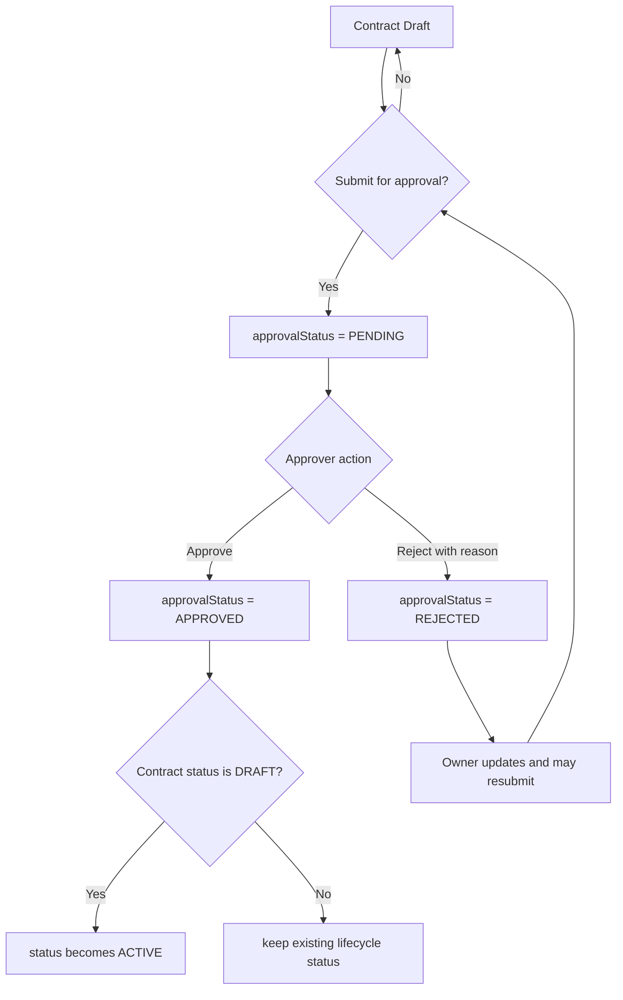

# Activity Flow: Contract Approval Lifecycle

## Business Guardrails

- Already `PENDING` contracts cannot be resubmitted.
- Already `APPROVED` contracts cannot be resubmitted.
- Only `PENDING` contracts can be approved or rejected.
- Rejection requires a reason.
