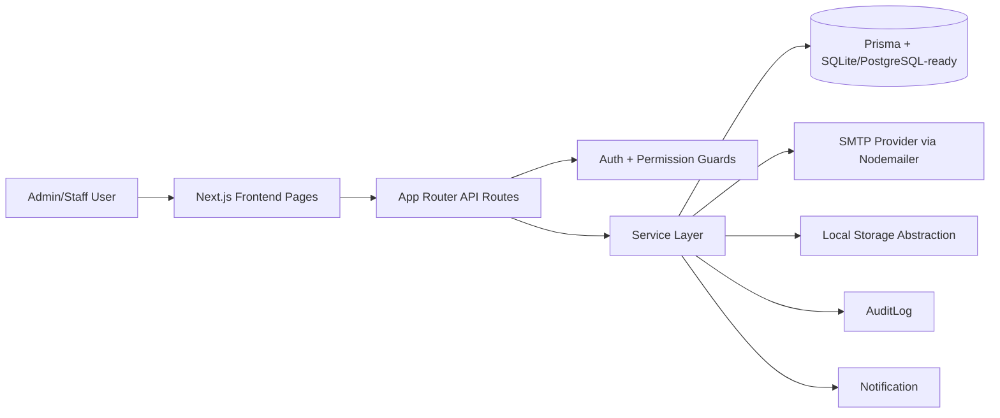

# System Architecture

## Overview

The system is built on Next.js App Router with a layered backend:

- `app/api/*`: HTTP boundary (request parsing, auth/permission guard, response shaping)
- `services/*`: business logic and workflow orchestration
- `lib/*`: shared infrastructure (auth, jwt, csv, storage, validators, date helpers)
- `prisma/*`: schema + migrations + seed
- `components/*`, `hooks/*`: frontend composition and state

## Component Diagram

## Module Responsibilities

- **Auth & Permission**
  - JWT cookie auth in `lib/auth.ts`, token helpers in `lib/jwt.ts`
  - Permission mapping in `lib/permissions.ts`
- **Contract Domain**
  - CRUD/list/detail in `services/contract.service.ts`
  - File upload flow in `services/upload.service.ts` + `lib/storage.ts`
  - Renewal flow in `services/contract-renewal.service.ts`
- **Approval Workflow**
  - submit/approve/reject transitions in `services/approval.service.ts`
- **Reminder Workflow**
  - candidate detection, dedupe, dispatch, logging in `services/reminder.service.ts`
- **Notification Center**
  - create/list/unread/read flows in `services/notification.service.ts`
- **Reporting**
  - summary/list/export in `services/report.service.ts`

## Frontend Structure

- `app/(dashboard)/*`: internal app layout and page routing
- `components/admin/*`: admin module views
- `components/notifications/*`: notification center views
- `components/shared/*`: reusable UI building blocks
- `hooks/use-current-user.ts`: auth session state hook
- `lib/api-client.ts`: centralized frontend API request helper
