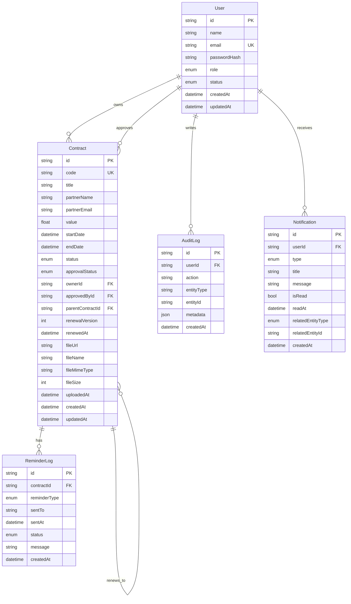

# ERD Overview

## Notes

- Contract lifecycle and approval are intentionally split (`status` vs `approvalStatus`) to avoid state conflicts.
- Renewal uses a self-relation strategy for historical traceability (`parentContractId` + `renewalVersion`).
