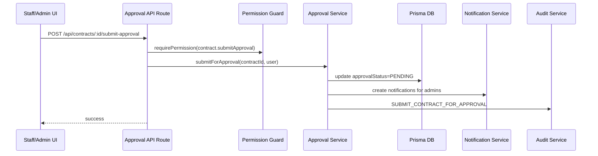
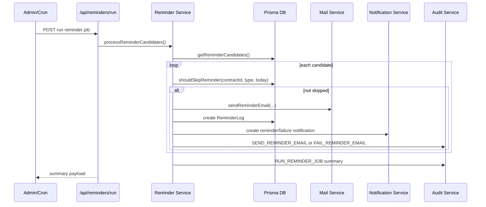
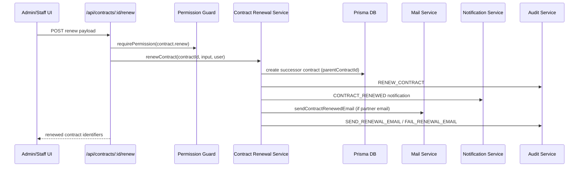

# Sequence Diagrams

## 1) Approval Flow (Submit -> Approve/Reject)

```mermaid
sequenceDiagram
  participant U as Staff/Admin UI
  participant API as Approval API Route
  participant AUTH as Permission Guard
  participant SVC as Approval Service
  participant DB as Prisma DB
  participant N as Notification Service
  participant A as Audit Service

  U->>API: POST /api/contracts/:id/submit-approval
  API->>AUTH: requirePermission(contract.submitApproval)
  API->>SVC: submitForApproval(contractId, user)
  SVC->>DB: update approvalStatus=PENDING
  SVC->>N: create notifications for admins
  SVC->>A: SUBMIT_CONTRACT_FOR_APPROVAL
  API-->>U: success
```

## 2) Reminder Job Flow

```mermaid
sequenceDiagram
  participant Trigger as Admin/Cron
  participant API as /api/reminders/run
  participant SVC as Reminder Service
  participant DB as Prisma DB
  participant Mail as Mail Service
  participant N as Notification Service
  participant A as Audit Service

  Trigger->>API: POST run reminder job
  API->>SVC: processReminderCandidates()
  SVC->>DB: getReminderCandidates()
  loop each candidate
    SVC->>DB: shouldSkipReminder(contractId, type, today)
    alt not skipped
      SVC->>Mail: sendReminderEmail(...)
      SVC->>DB: create ReminderLog
      SVC->>N: create reminder/failure notification
      SVC->>A: SEND_REMINDER_EMAIL or FAIL_REMINDER_EMAIL
    end
  end
  SVC->>A: RUN_REMINDER_JOB summary
  API-->>Trigger: summary payload
```

## 3) Renewal Workflow

```mermaid
sequenceDiagram
  participant U as Admin/Staff UI
  participant API as /api/contracts/:id/renew
  participant AUTH as Permission Guard
  participant SVC as Contract Renewal Service
  participant DB as Prisma DB
  participant Mail as Mail Service
  participant N as Notification Service
  participant A as Audit Service

  U->>API: POST renew payload
  API->>AUTH: requirePermission(contract.renew)
  API->>SVC: renewContract(contractId, input, user)
  SVC->>DB: create successor contract (parentContractId)
  SVC->>A: RENEW_CONTRACT
  SVC->>N: CONTRACT_RENEWED notification
  SVC->>Mail: sendContractRenewedEmail (if partner email)
  SVC->>A: SEND_RENEWAL_EMAIL / FAIL_RENEWAL_EMAIL
  API-->>U: renewed contract identifiers
```
