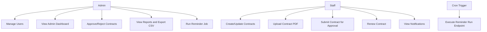

# Use Case Overview

## Actors

- **Admin**
  - Full admin CMS access, approval actions, report export, user management
- **Staff**
  - Contract operations in allowed scope, submit for approval, view notifications
- **Cron Trigger**
  - Runs reminder job via secret-authenticated endpoint

## High-Level Use Cases

## Scope Notes

- Frontend permission checks are UX-level only; backend permission guards are authoritative.
- Reminder dedupe prevents same contract + reminder type processing multiple times on the same UTC day.
